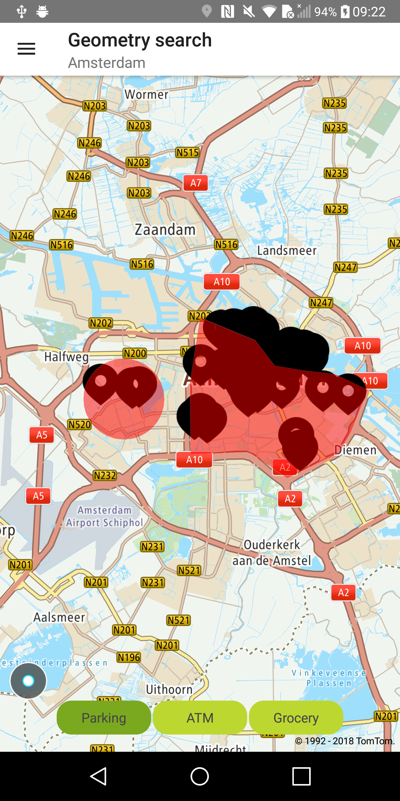
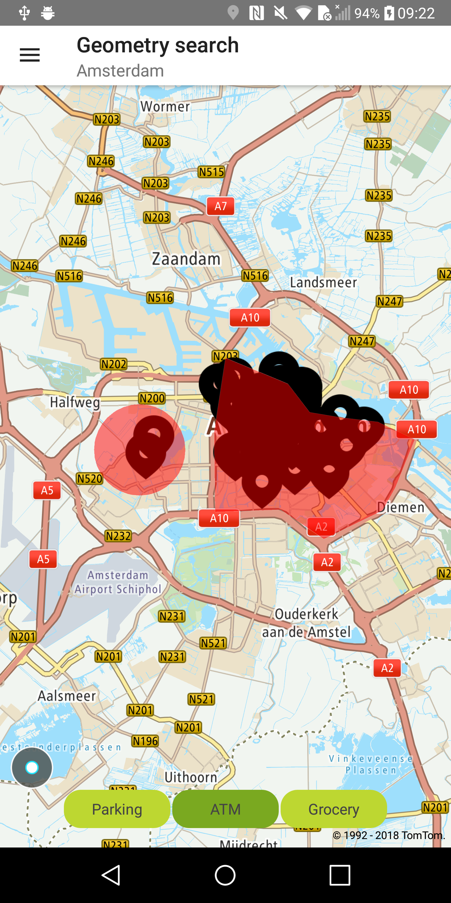

Allow your users to perform a free text search inside geometries specified by circles and/or
polygons.

**Sample use case:** You are planing to visit the area of Amsterdam. You need find a parking spot,
an ATM, and a grocery store in the city centre in Amsterdam and/or in the west part of the city.

Use the following code to try this in your app:

<Code>

```java
List<Geometry> geometries = new ArrayList<>()
geometries.add(new Geometry(new PolygonGeometry(DefaultGeometries.POLYGON_POINTS)));
geometries.add(new Geometry(new CircleGeometry(DefaultGeometries.CIRCLE_CENTER, DefaultGeometries.CIRCLE_RADIUS)));
```

```kotlin
val circleGeometry = createDefaultCircleGeometry()
val polygonGeometry = createDefaultPolygonGeometry()
val geometriesList = listOf(Geometry(circleGeometry), Geometry(polygonGeometry))

val query = GeometrySearchQueryBuilder.create(term, geometriesList)
    .withLimit(SEARCH_RESULTS_LIMIT)
    .build()
```

</Code>
<Code>

```java
GeometrySearchQuery query = new GeometrySearchQueryBuilder(term, geometries)
        .withLimit(SEARCH_RESULTS_LIMIT).build();

SearchApi searchAPI = OnlineSearchApi.create(context, BuildConfig.SEARCH_API_KEY);
searchAPI.geometrySearch(query, geometrySearchCallback);
```

```kotlin
searchApi.geometrySearch(geometryQuery)
```

</Code>

Sample views utilizing Geometry Search:

<table>
  <tbody>
    <tr>
      <td>
        <ContentWrapper maxWidth="350px" objectFit="contain">
          <p>
            
          </p>
        </ContentWrapper>
        <p>Geometry search with term: Parking</p>
      </td>
      <td>
        <ContentWrapper maxWidth="350px" objectFit="contain">
          <p>
            
          </p>
        </ContentWrapper>
        <p>Geometry search with term: ATM</p>
      </td>
    </tr>
  </tbody>
</table>