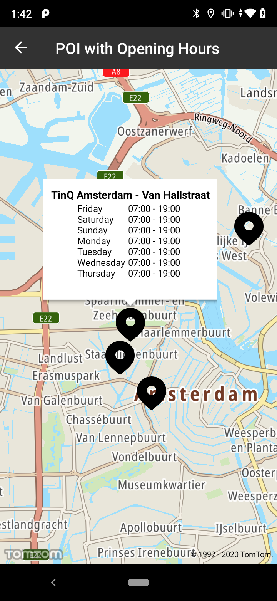

Represents information that states when a POI will be open during the next 7 days, starting with the
current day in the local time of the POI. It returns a list of strings that represent the opening
and closing hours in a
given [Response format](/search-api/documentation/search-service/points-of-interest-search#response-data).

**Sample use case 1:** You are searching for a specific store to visit but you don\`t know if it is
currently open. Through your app you query the opening shop times and the store working hours are
displayed on the screen.

**Sample use case 2:** A company is collating a report about the closing hours in a given city area
for grocery shops. Using the SDK services, all grocery shops in a given radius can be queried for
closing hours, allowing statistical analysis and other studies.

The opening hours data are available in the Search API.

Have a look at the detailed documentation for more information related to
the [Points of Interest Search](/search-api/documentation/search-service/points-of-interest-search)
and [Fuzzy Search](/search-api/documentation/search-service/fuzzy-search)

That parameter will be used for services where POIs are exposed, including:

- Category Search
- Along Route Search
- Geometry Search
- Fuzzy Search

Include "withOpeningHours" in the query builder as shown in the following code snippet:

<Code>

```java
TimeDescriptor timeDescriptor = new TimeDescriptor(OpeningHoursMode.NEXT_SEVEN_DAYS)

FuzzySearchEngineDescriptor fuzzySearchEngineDescriptor = new FuzzySearchEngineDescriptor.Builder()
        .language("en-GB")
        .build();

FuzzyLocationDescriptor fuzzyLocationDescriptor = new FuzzyLocationDescriptor.Builder()
        .positionBias(new LatLngBias(Locations.AMSTERDAM_LOCATION))
        .build();

FuzzySearchSpecification openingHoursSpecification = new FuzzySearchSpecification.Builder("Petrol station")
        .searchEngineDescriptor(fuzzySearchEngineDescriptor)
        .locationDescriptor(fuzzyLocationDescriptor)
        .timeDescriptor(timeDescriptor)
        .build();
searchAPI.search(openingHoursSpecification, fuzzyOutcomeCallback);
```

```kotlin
val timeDescriptor = TimeDescriptor(OpeningHoursMode.NEXT_SEVEN_DAYS)

val searchEngineDescriptor = FuzzySearchEngineDescriptor.Builder()
    .language("en-GB")
    .build()

val locationDescriptorBuilder = FuzzyLocationDescriptor.Builder()
    .positionBias(LatLngBias(Locations.AMSTERDAM))
    .build()

val openingHoursQuery = FuzzySearchSpecification.Builder("Petrol station")
    .searchEngineDescriptor(searchEngineDescriptor)
    .locationDescriptor(locationDescriptorBuilder)
    .timeDescriptor(timeDescriptor)
    .build()
```

</Code>

Screenshots:

<table>
  <tbody>
    <tr>
      <td>
        <ContentWrapper maxWidth="350px" objectFit="contain">
          <p>
            
          </p>
        </ContentWrapper>
        <p>Opening hours activated</p>
      </td>
    </tr>
  </tbody>
</table>