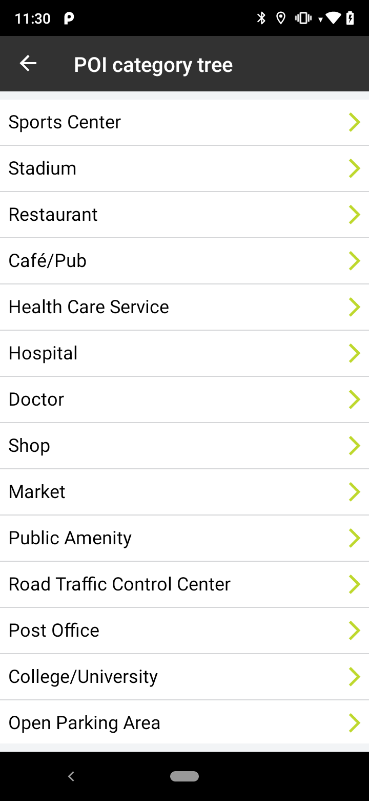

<a
  href="#"
  style={{ display: 'block', margin: '0', padding: '0' }}
  name="_poi_category_tree"
></a>

The Point of Interest (POI) Categories service endpoint provides the full list of POI categories and
subcategories together with their translations and synonyms available in Search API, see POI
Categories ([https://developer.New.com/search-api/documentation/poi-categories-service/poi-categories](https://developer.New.com/search-api/documentation/poi-categories-service/poi-categories))
for more information. Thanks to that list, you do not have to hardcode categories in your app as
they change dynamically. Once you have the POI Category ID, you can use it as a filter (categorySet)
in search quires.

Sample use case: You want to display a dynamic list of all available categories and subcategories
that can be used for a search combined with the appropriate filters.

Use the following code snippet to try this in your app:

<Code>

```java
PoiCategoriesSpecification poiCategoriesSpecification = new PoiCategoriesSpecification("en-GB")
searchAPI.poiCategoriesSearch(poiCategoriesSpecification, poiCategoriesCallback);
```

```kotlin
    val poiCategoriesSpecification = PoiCategoriesSpecification("en-GB")
searchApi.poiCategoriesSearch(poiCategoriesSpecification, callback)
```

</Code>

The following is an example application view utilizing POI Category Search.

<table>
  <tbody>
    <tr>
      <td>
        <ContentWrapper maxWidth="350px" objectFit="contain">
          <p>
            
          </p>
        </ContentWrapper>
        <p>List of categories.</p>
      </td>
      <td></td>
    </tr>
  </tbody>
</table>