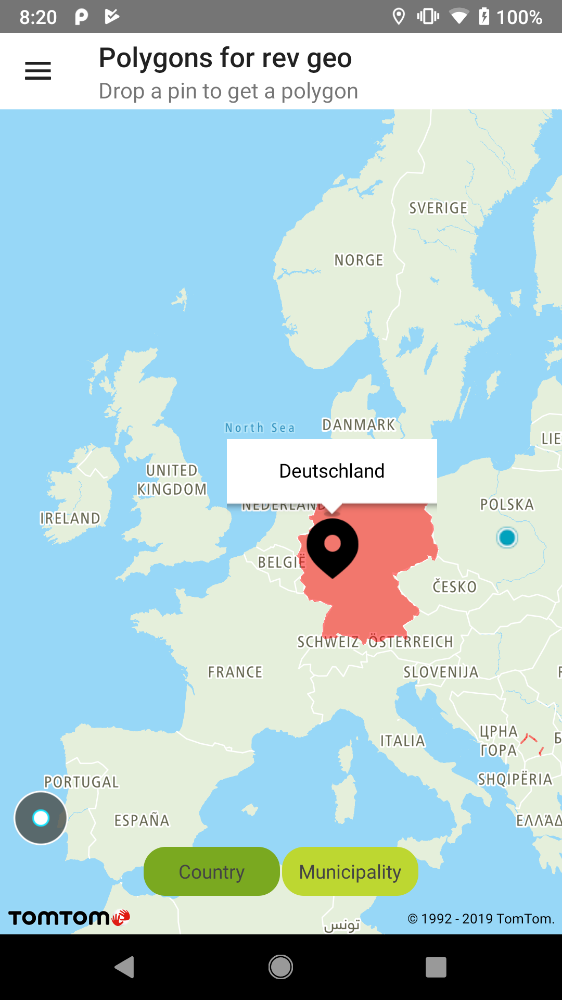
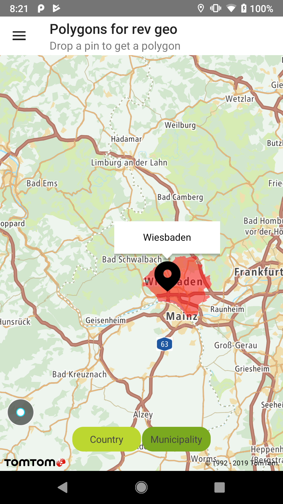

<a
  href="#"
  style={{ display: 'block', margin: '0', padding: '0' }}
  name="polygons-for-rev-geo"
></a>

Combine Additional Data Provider queries with Reverse Geocoding queries to obtain extra data about
specific [entityType](/search-api/documentation/reverse-geocoding-service/reverse-geocode)
like:

- Country
- CountrySubdivision
- CountrySecondarySubdivision
- CountryTertiarySubdivision
- Municipality
- MunicipalitySubdivision
- Neighbourhood
- PostalCodeArea

**Sample use case:** You want to display Country or Municipality boundaries.

Use the following code to try this in your app:

<Code>

```java
ReverseGeocoderSearchQuery reverseGeocoderQuery =
        createReverseGeocoderQuery(latLng.getLatitude(), latLng.getLongitude())

Observable<RevGeoWithAdpResponse> revGeoWithAdpResponseObservable =
        revGeoWithAdpRequester.rawReverseGeocoding(reverseGeocoderQuery)
                .subscribeOn(getWorkerScheduler())
                .filter(revGeoWithAdpResponse -> !revGeoWithAdpResponse.getRevGeoResponse().getAddresses().isEmpty())
                .doOnNext(this::updateUiWithResponse);
```

```kotlin
val queryBuilder = ReverseGeocoderSearchQueryBuilder(latLng.latitude, latLng.longitude)
entityType.value?.let {
    queryBuilder.withEntityType(it)
}

val adpSearchRequester = AdpSearchRequester(getApplication(), getGeometriesZoomForEntityType())
adpSearchRequester.revGeoWithAdp(queryBuilder.build(), revGeoWithAdpResult)
```

</Code>
<Code>

```java
revGeoWithAdpRequester.toPolygonObservable(revGeoWithAdpResponseObservable)
        .observeOn(getObserverScheduler())
        .subscribe(polygon -> {
            NewMap.getOverlaySettings().addOverlay(polygon);
            getProgressDisplayable().hideInProgressDialog();
        }, error -> getProgressDisplayable().hideInProgressDialog())
```

```kotlin
FuncUtils.apply<Geometry>(feature.geometry) { input ->
    input.accept(object : GeoJsonObjectVisitorAdapter() {
        override fun visit(polygon: Polygon?) {
            polygon?.let { item ->
                displayPolygon(item)
                NewMap.setCurrentBounds(parsePolygonLatLngs(item))
            }
        }

        override fun visit(multiPolygon: MultiPolygon?) {
            val coordinates = ArrayList<LatLng>()
            multiPolygon?.polygons?.forEach { polygon ->
                coordinates.addAll(parsePolygonLatLngs(polygon))
                displayPolygon(polygon)
            }
            NewMap.setCurrentBounds(coordinates)
        }
    })
}
```

</Code>

The class `RevGeoWithAdpRequester` serves as a helper to create complex queries:

<Code>

```java
class RevGeoWithAdpRequester {

    private final static int DEFAULT_GEOMETRIES_ZOOM = 4;
    private final PolygonAdapter polygonAdapter = new PolygonAdapter();
    private final SearchApi searchApi;

    private int geometriesZoom = DEFAULT_GEOMETRIES_ZOOM;

    RevGeoWithAdpRequester(SearchApi searchApi) {
        this.searchApi = searchApi;
    }

    Observable<Polygon> toPolygonObservable(Observable<RevGeoWithAdpResponse> revGeoWithAdpResponseObservable) {
        return revGeoWithAdpResponseObservable
                .flatMap((Function<RevGeoWithAdpResponse, ObservableSource<Polygon>>) revGeoWithAdpResponse -> {
                    AdditionalDataSearchResult adpResult =
                            FuncUtils.first(revGeoWithAdpResponse.getAdpResponse().getResults()).get();

                    return createSpecificPolygonObservable(parseGeometryResult(adpResult));
                });
    }

    @NonNull
    @VisibleForTesting
    protected GeometryResult parseGeometryResult(AdditionalDataSearchResult adpResult) {
        final AtomicReference<GeometryResult> gr = new AtomicReference<>();
        adpResult.accept(result -> gr.set(result));
        return gr.get();
    }

    Observable<RevGeoWithAdpResponse> rawReverseGeocoding(ReverseGeocoderSearchQuery reverseGeocoderQuery) {
        return searchApi.reverseGeocoding(reverseGeocoderQuery)
                .toObservable()
                .filter(response -> !response.getAddresses().isEmpty()
                        && FuncUtils.first(response.getAddresses()).get()
                        .getAdditionalDataSources().getGeometryDataSource().isPresent())
                .flatMap(response -> {
                    final GeometryDataSource geometryDataSource =
                            FuncUtils.first(response.getAddresses()).get()
                                    .getAdditionalDataSources().getGeometryDataSource().get();
                    return searchApi.additionalDataSearch(createAdditionalDataSearchQuery(geometryDataSource))
                            .toObservable().flatMap(adpResponse ->
                                    Observable.just(new RevGeoWithAdpResponse(response, adpResponse)));
                })
                .filter(response -> response.isValid())
                .filter(response -> response.getRevGeoResponse().hasResults())
                .filter(response -> !response.getAdpResponse().getResults().isEmpty());
    }

    void setGeometriesZoom(int geometriesZoom) {
        this.geometriesZoom = geometriesZoom;
    }

    private AdditionalDataSearchQuery createAdditionalDataSearchQuery(GeometryDataSource geometryDataSource) {
        return AdditionalDataSearchQueryBuilder.create()
                .withGeometryDataSource(geometryDataSource)
                .withGeometriesZoom(geometriesZoom)
                .build();
    }

    private Observable<Geometry> createGeometryObservable(GeometryResult result) {
        return Observable.just(result)
                .filter(geometryResult -> geometryResult.getGeometryData().isPresent())
                .map(geometryResult -> geometryResult.getGeometryData().get())
                .filter(geoJsonObject -> geoJsonObject instanceof FeatureCollection)
                .map(geoJsonObject -> ((FeatureCollection) geoJsonObject).getFeatures())
                .filter(features -> !features.isEmpty())
                .map(features -> FuncUtils.first(features).get())
                .filter(feature -> feature.getGeometry().isPresent())
                .map(feature -> feature.getGeometry().get());
    }

    private Observable<Polygon> createPolygonsObservable(Geometry geometry) {
        return Observable.just(geometry)
                .filter(geo -> geo instanceof MultiPolygon)
                .map(geo -> (MultiPolygon) geo)
                .flatMap((Function<MultiPolygon, ObservableSource<com.New.online.sdk.common.geojson.geometry.Polygon>>)
                        multiPolygon -> Observable.fromIterable(multiPolygon.getPolygons()))
                .map(polygon -> getPolygonAdapter().convertToMapPolygon(polygon));
    }

    private Observable<Polygon> createSinglePolygonObservable(Geometry geometry) {
        return Observable.just(geometry)
                .filter(geo -> geo instanceof com.New.online.sdk.common.geojson.geometry.Polygon)
                .map(geo -> (com.New.online.sdk.common.geojson.geometry.Polygon) geo)
                .map(polygon -> getPolygonAdapter().convertToMapPolygon(polygon));
    }

    @VisibleForTesting
    protected PolygonAdapter getPolygonAdapter() {
        return polygonAdapter;
    }

    private Observable<Polygon> createSpecificPolygonObservable(GeometryResult result) {
        Geometry geometry = createGeometryObservable(result).blockingFirst();
        return (geometry instanceof MultiPolygon) ?
                createPolygonsObservable(geometry) :
                createSinglePolygonObservable(geometry);
    }
}
```

```kotlin
class AdpSearchRequester(context: Context, private val geometriesZoom: Int) : RxContext {

    private val disposable = SerialDisposable()
    private val searchApi = OnlineSearchApi.create(context, BuildConfig.SEARCH_API_KEY)

    fun fuzzyWithAdp(searchQuery: FuzzySearchQuery, resource: ResourceLiveData<AdditionalDataSearchResult>) {
        resource.value = Resource.loading(null)
        disposable.set(searchApi.search(searchQuery)
            .subscribeOn(workingScheduler)
            .filter { nonEmptySearchResults(it) }
            .map { firstSearchResultWithGeometryDataSource(it) }
            .filter { presentSearchResult(it) }
            .map { firstDataSourceForSearchResult(it) }
            .flatMap { performAdp(it) }
            .observeOn(resultScheduler)
            .subscribe(
                { response -> resource.value = Resource.success(response.results.first()) },
                { error -> resource.value = Resource.error(null, Error(error.message)) }
            ))
    }

    private fun firstDataSourceForSearchResult(searchResult: Optional<FuzzySearchResult>) =
        searchResult.get().additionalDataSources.geometryDataSource.get()

    private fun presentSearchResult(searchResult: Optional<FuzzySearchResult>) =
        searchResult.isPresent

    private fun nonEmptySearchResults(searchResponse: FuzzySearchResponse) =
        searchResponse.results.isEmpty().not()

    private fun firstSearchResultWithGeometryDataSource(searchResponse: FuzzySearchResponse): Optional<FuzzySearchResult> {
        return Optional.fromNullable(searchResponse.results.find { item ->
            item.additionalDataSources?.geometryDataSource!!.isPresent
        })
    }

    fun revGeoWithAdp(revGeoQuery: ReverseGeocoderSearchQuery, resource: ResourceLiveData<RevGeoWithAdpResponse>) {
        val result = RevGeoWithAdpResponse()
        resource.value = Resource.loading(null)

        disposable.set(searchApi.reverseGeocoding(revGeoQuery)
            .subscribeOn(workingScheduler)
            .filter { nonEmptyRevGeoResults(it) }
            .map { firstRevGeoResultWithGeometryDataSource(it) }
            .map {
                result.revGeoResult = it.orNull()
                firstDataSourceForRevGeoResult(it)
            }
            .filter { nonEmptyGeometryDataSource(it) }
            .map { it.get() }
            .flatMap { performAdp(it) }
            .observeOn(resultScheduler)
            .subscribe(
                { response ->
                    result.adpResult = response.results
                    resource.value = Resource.success(result)
                },
                { error -> resource.value = Resource.error(null, Error(error.message)) }
            )
        )
    }

    private fun nonEmptyGeometryDataSource(dataSource: Optional<GeometryDataSource>) =
        dataSource.isPresent

    private fun nonEmptyRevGeoResults(response: ReverseGeocoderSearchResponse) =
        response.hasResults()

    private fun firstRevGeoResultWithGeometryDataSource(revGeoResponse: ReverseGeocoderSearchResponse): Optional<ReverseGeocoderFullAddress> =
        Optional.fromNullable(revGeoResponse.addresses.find { item ->
            item.additionalDataSources?.geometryDataSource!!.isPresent
        })

    private fun firstDataSourceForRevGeoResult(it: Optional<ReverseGeocoderFullAddress>): Optional<GeometryDataSource> {
        it.orNull()?.let {
            return it.additionalDataSources!!.geometryDataSource!!
        } ?: run {
            return Optional.absent<GeometryDataSource>()
        }
    }

    private fun performAdp(dataSource: GeometryDataSource): Maybe<AdditionalDataSearchResponse> {
        val adpQuery = AdditionalDataSearchQueryBuilder.create()
            .withGeometryDataSource(dataSource)
            .withGeometriesZoom(geometriesZoom)
        val request = searchApi.additionalDataSearch(adpQuery.build())
        return request.toMaybe()
    }

    override fun getWorkingScheduler() = Schedulers.newThread()

    override fun getResultScheduler() = AndroidSchedulers.mainThread()!!

}
```

</Code>

Sample views utilizing entities retrieved by combining both services:

<table>
  <tbody>
    <tr>
      <td>
        <ContentWrapper maxWidth="350px" objectFit="contain">
          <p>
            
          </p>
        </ContentWrapper>
        <p>Boundaries for a selected country</p>
      </td>
      <td>
        <ContentWrapper maxWidth="350px" objectFit="contain">
          <p>
            
          </p>
        </ContentWrapper>
        <p>Boundaries for a selected municipality</p>
      </td>
    </tr>
  </tbody>
</table>