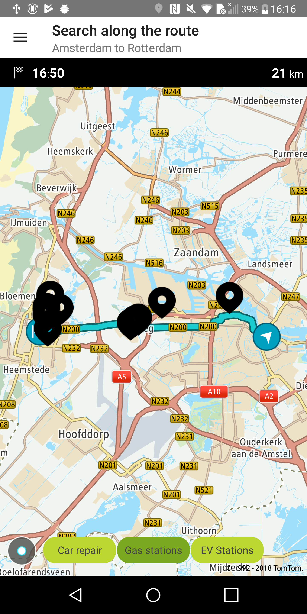
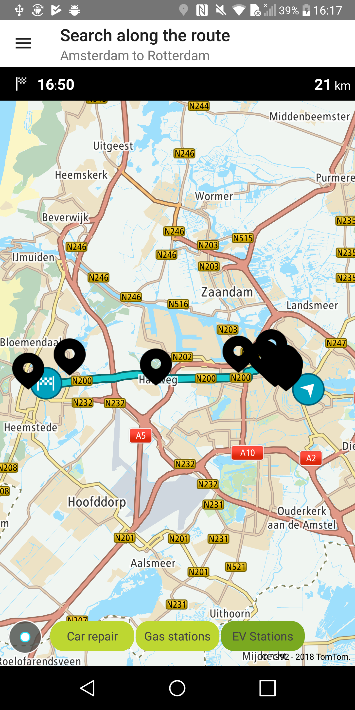

Allow your users to search for POIs (Points of Interest) along a planned route so they can optimally
add places to their rides. This search is constrained by specifying the detour time and limiting the
number of results. The minimum number of route points is 2.

**Sample use case 1:** You are driving from Amsterdam to Haarlem and you would like to find a gas
station or an EV station to fuel or charge your car during your drive.

**Sample use case 2:** When planning your next trip, you would like to add a car repair station so
you can fix and safely drive your vehicle.

Use the following code to try this in your app:

<Code>

```java
AlongRouteSearchQueryBuilder query = new AlongRouteSearchQueryBuilder(
        term,
        route.getCoordinates(),
        SEARCH_MAX_DETOUR_TIME)

query.withLimit(SEARCH_MAX_LIMIT);

SearchApi searchAPI = OnlineSearchApi.create(context, BuildConfig.SEARCH_API_KEY);
searchAPI.alongRouteSearch(query.build(), alongRouteSearchCallback);
```

```kotlin
val query = AlongRouteSearchQueryBuilder(
    term,
    route.getCoordinates(),
    SEARCH_MAX_DETOUR_TIME
)
    .withLimit(SEARCH_MAX_LIMIT)
    .build()
```

</Code>

```kotlin
searchApi.alongRouteSearch(query)
```

Sample views utilizing Search Along Route:

<table>
  <tbody>
    <tr>
      <td>
        <ContentWrapper maxWidth="350px" objectFit="contain">
          <p>
            
          </p>
        </ContentWrapper>
        <p>With term "PETROL_STATION"</p>
      </td>
      <td>
        <ContentWrapper maxWidth="350px" objectFit="contain">
          <p>
            
          </p>
        </ContentWrapper>
        <p>With term "ELECTRIC_VEHICLE_STATION"</p>
      </td>
    </tr>
  </tbody>
</table>