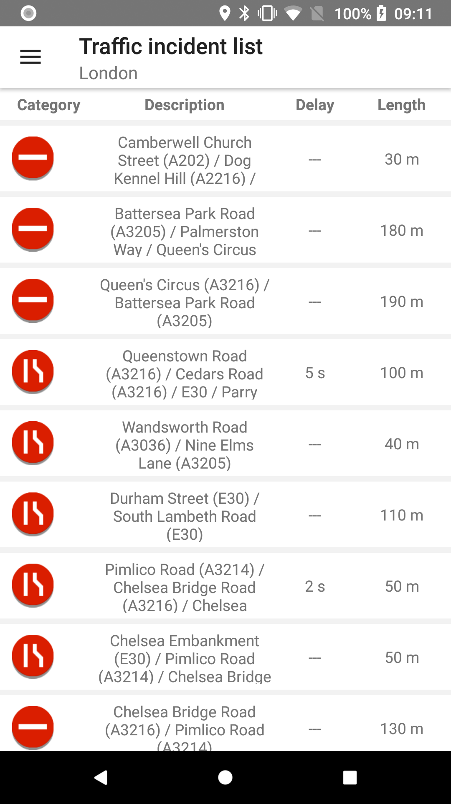

<a
  href="#"
  style={{ display: 'block', margin: '0', padding: '0' }}
  name="traffic-incidents-list"
></a>

Give your users information about traffic incidents so they can adjust their commute according to
the traffic situation.

**Sample use case:** You are about to drive and you want to avoid roads with traffic incidents on
your way. Use the traffic incident list to have an overview of which streets might be blocked or
congested due to accidents, road works, or possible rain, ice, flooding, etc.

Use the following code snippet to try this in your app.

<Code>

```java
return IncidentDetailsQueryBuilder.create(IncidentStyle.S1, LONDON_BOUNDING_BOX, DEFAULT_ZOOM_LEVEL_FOR_EXAMPLE, "-1")
        .withExpandCluster(true)
        .build()
```

```kotlin
IncidentDetailsQueryBuilder.create(IncidentStyle.S1, LONDON_BOUNDING_BOX, DEFAULT_ZOOM_LEVEL_FOR_EXAMPLE, TRAFFIC_MODEL_ID)
        .withExpandCluster(true)
        .build()
```

</Code>

An example implementation of a listener to the response from the traffic incident details service:

<Code>

```java
private IncidentDetailsResultListener incidentDetailsResultListener = new IncidentDetailsResultListener() {
    @Override
    public void onTrafficIncidentDetailsResult(IncidentDetailsResponse result) {

        final List<TrafficIncidentItem> items = new ArrayList<>();

        TrafficIncidentVisitor visitor = new TrafficIncidentVisitor() {
            @Override
            public void visit(TrafficIncidentCluster cluster) {
                items.add(incidentItemCreator.createClusterOfIncidents(cluster));
            }

            @Override
            public void visit(TrafficIncident incident) {
                items.add(incidentItemCreator.createSingleIncident(incident));
            }
        };

        for (BaseTrafficIncident incident : result.getIncidents()) {
            incident.accept(visitor);
        }

        view.updateTrafficIncidentsList(items);
    }

    @Override
    public void onTrafficIncidentDetailsError(Throwable error) {
        Toast.makeText(view.getContext(), error.getMessage(), Toast.LENGTH_SHORT).show();
    }
};
```

```kotlin
private val incidentDetailsResultListener = object : IncidentDetailsResultListener {
    override fun onTrafficIncidentDetailsResult(result: IncidentDetailsResponse) {
        listOfIncidents.clear()

        context?.let { ctx ->
            trafficIncidentItemCreator = TrafficIncidentItemCreator(ctx)

            result.incidents.forEach { incident ->
                incident.accept(trafficVisitor)
            }

            trafficIncidentAdapter.updateData(listOfIncidents)
        }
    }

    override fun onTrafficIncidentDetailsError(error: Throwable) {
        Toast.makeText(view?.context, error.message, Toast.LENGTH_SHORT).show()
    }
}
```

</Code>

```kotlin
private val trafficVisitor = object : TrafficIncidentVisitor {

    override fun visit(cluster: TrafficIncidentCluster) {
        listOfIncidents.add(trafficIncidentItemCreator.createClusterOfIncidents(cluster))
    }

    override fun visit(incident: TrafficIncident) {
        listOfIncidents.add(trafficIncidentItemCreator.createSingleIncident(incident))
    }
}
```

It is also possible to obtain drawable for every traffic incident. It can be done via '
TrafficIncidentIconProvider' object.

<Code>

```java
TrafficIncidentIconProvider provider = new TrafficIncidentIconProvider(incident);
Drawable incidentDrawable = provider.getIcon(context, TrafficIncidentIconProvider.IconSize.LARGE);
```

```kotlin
val provider = TrafficIncidentIconProvider(incident)
val incidentDrawable = provider.getIcon(context, TrafficIncidentIconProvider.IconSize.LARGE)
```

</Code>

<table>
  <tbody>
    <tr>
      <td>
        <ContentWrapper maxWidth="350px" objectFit="contain">
          <p>
            
          </p>
        </ContentWrapper>
        <p>Incidents list</p>
      </td>
      <td>
        <ContentWrapper maxWidth="350px" objectFit="contain">
          <p>
            
          </p>
        </ContentWrapper>
        <p>Incidents list with clusters</p>
      </td>
    </tr>
  </tbody>
</table>