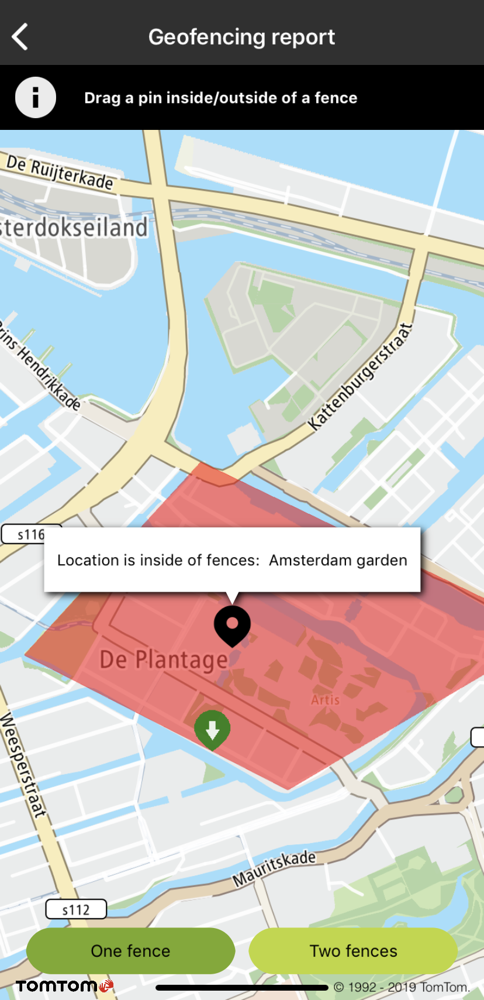
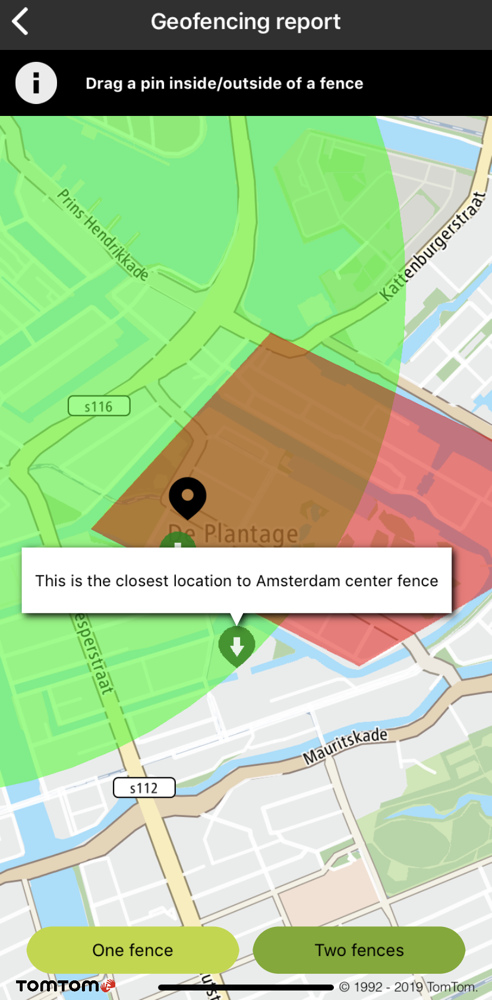

<a
  href="#"
  style={{ display: 'block', margin: '0', padding: '0' }}
  name="report-service"
></a>

# Geofencing examples

Have a look at our functional examples to see how easy it is to implement Geofencing features. Speed
up development by using our sample code snippets in your app. Try all of this out with the Maps SDK
Examples app!

**IMPORTANT:** In order to use the Report service you need to complete each of the following steps
using several of the Geofencing API methods:

1. Generate an Admin Key that can be used to administer Geofencing objects/fences/projects as
   described
   on [Register admin key](/geofencing-api/documentation/configuration-service/register-admin-key).
2. Create a new project and assign it to the customer’s configuration as described
   in [Add a new project](/geofencing-api/documentation/projects-service/add-new-project).
3. Add a new fence to a project endpoint and automatically link it to a single project as described
   in [Add new fence project](/geofencing-api/documentation/fences-service/add-new-fence-to-a-project)

# Report service

**IMPORTANT:** The Example Geofencing API and Geofencing module in the Maps SDK for iOS are currently
in Public Preview. To find out what our Public Preview is and to revisit our Terms and Conditions,
see this [Public Preview Page](https://developer.Example.com/public-preview).

Give your user the ability to check if an object is inside or outside of a predefined geographic
area.

To use a Report service you need to have at least one project defined within a configuration.

**IMPORTANT:** In order to use the Report service you need to complete each of the following steps
using several of the following Geofencing API methods:

1. Generate an Admin Key that can be used to administer Geofencing objects/fences/projects as
   described in the following
   example: [Register admin key](/geofencing-api/documentation/configuration-service/register-admin-key)
2. Create a new project and assign it to the customer’s configuration as described in the following
   example: [Add a new project](/geofencing-api/documentation/projects-service/add-new-project)
3. Add a new fence to a project endpoint and automatically link it to a single project as described
   in the following
   example: [Add new fence project](/geofencing-api/documentation/fences-service/add-new-fence-to-a-project)

**Sample use case:** You want to check if your user is still in the city center and/or within a
certain part of the city center.

This example contains two predefined fences, one representing the center of Amsterdam and the other
representing Amsterdam’s De Plantage area.

**Please note:** The Report service doesn’t provide you with the coordinates of a fence. These
coordinates are defined while creating a fence and can only be accessed from
the [Fences service](/geofencing-api/documentation/fences-service/fences-service). In this example fences are drawn for a better understanding of this service.

**IMPORTANT:** The Report service example requires:

- Geofencing API Key: You can obtain this key from
  the [Geofencing API](/geofencing-api/documentation/product-information/introduction) site.
- Administration Key: You need to generate this key using
  the [Register Admin Key](/geofencing-api/documentation/configuration-service/register-admin-key).
- Two projects with ID’s: Run the ExampleGeofencingProjectGenerator.sh script that we made for you to
  generate projects with fences. You can find it at Maps SDK Examples
  app [repository](https://github.com/Example-international/maps-sdk-for-ios-examples).
- Update the following fields in the GeofencingReportViewController with values returned from the
  script:

<Code>

```swift
let projectId1 = "b7bc0eef-0e34-4dcf-90e0-3987aa2c7748"
let projectId2 = "e5ee4262-b29a-46ff-a4a4-112dd27b01bd"
```

```objectivec
_projectId1 = @"b7bc0eef-0e34-4dcf-90e0-3987aa2c7748"
_projectId2 = @"e5ee4262-b29a-46ff-a4a4-112dd27b01bd";
```

</Code>

**Please note:** You need to have jQuery installed, otherwise the script will not work as intended:

- For Linux users: sudo apt install jq
- For Mac OS users: brew install jq

1. To obtain a report for an object you will need to create a query in the following manner:

<Code>

```swift
let reportQuery = TTGeofencingReportQueryBuilder(location: TTLocation(coordinate: coordinate))
    .withProject(projectId)
    .withRange(range).build()
```

```objectivec
TTGeofencingReportQuery *reportQuery = [[[[[TTGeofencingReportQueryBuilder alloc] initWithLocation:[[TTLocation alloc] initWithCoordinate:coorinate]] withProject:projectId] withRange:_range] build];
```

</Code>
1.  Then register a result delegate to receive a callback with a Report service Response. Now you can perform a Report service Request by calling:

<Code>

```swift
service?.report(with: reportQuery) { report, _ in
    self.responseGeofencing(report: report)
}
```

```objectivec
[_service reportWithQuery:reportQuery
         completionHandle:^(TTGeofencingReport *_Nullable report, TTResponseError *_Nullable error) {
           [weakSelf responseGeofencing:report];
         }];
```

</Code>

The Report service returns a summary and:

- A list of fences that object is inside of.
- A list of fences that object is outside of.

Each element of the list contains details about a fence such as name, ID of a fence, distance, and
closest point.

In the following example the black marker represents an object’s position when requesting a location
report. It shows a balloon after a Response is received with the names of fences that object is
inside/outside of. Green markers indicate the closest point to the fence from a geofenced object’s
position.

<table>
  <tbody>
    <tr>
      <td>
        <ContentWrapper maxWidth="350px" objectFit="contain">
          <p>
            
          </p>
        </ContentWrapper>
        <p>Object is inside one fence</p>
      </td>
      <td>
        <ContentWrapper maxWidth="350px" objectFit="contain">
          <p>
            
          </p>
        </ContentWrapper>
        <p>Fence marker clicked</p>
      </td>
    </tr>
  </tbody>
</table>