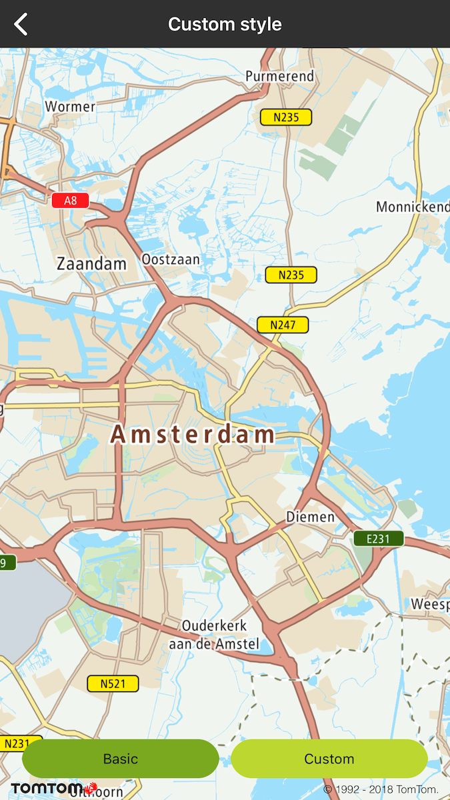
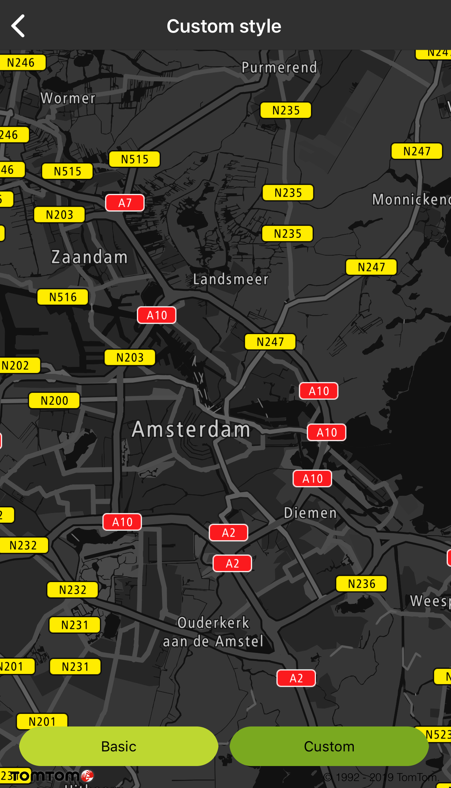

<a
  href="#"
  style={{ display: 'block', margin: '0', padding: '0' }}
  name="_custom_style"
></a>

<a
  href="#"
  style={{ display: 'block', margin: '0', padding: '0' }}
  name="_custom_style_2"
></a>

# Custom style

You can change the appearance of the map by providing a JSON file (style) defining the sources of
data to be shown on the map and its appearance. A style has to:

- Include all mandatory layer sets (see Table 1).
- Contain Maps SDK-specific tags.
- More information about Example styles is available in
  the [Map Styles Specification](/map-display-api/documentation/mapstyles/map-style-specification).

A basic style is provided as a part of the http\[Custom Style Resources\] package.

Styles compliant with the Map Styles Specification can be edited
using [Map Styler](/map-display-api/documentation/mapstyles/map-styler-documentation). Before a style can be edited
in Map Styler:

- Service key placeholders have to be replaced with actual service keys.
- All service keys included in the style must be valid for the Map Display API product.
- Sprite and glyph locations have to be replaced by ones that can be reached by Map Styler. If
  service key is needed to access these resources, it must be included.
- Maps SDK-specific tags have to be removed from tile source links or replaced with default values.
- (Optional) Visibility of layers can be altered to your preferences.

All these changes, with the exception of layer visibility, have to be reverted before the modified
style can be used with the SDK. Custom Style Resources contain a Python script - convertStyle.py -
which simplifies this process. Detailed usage instructions can be found in the following dedicated
section.

## Layer sets

The SDK uses the concept of a layer set to refer to a group of layers. A layer set consists of all
layers using the same source. Layer sets listed in Table 1 are required for the SDK to function. If
any of these layer sets are absent or do not meet the requirements mentioned below, they will be
replaced with default layer sets created at runtime.

<table>
  <tbody>
    <tr>
      <td>Map view element</td>
      <td>Default source name</td>
      <td>Required layer type</td>
      <td>Required layer count</td>
      <td>Source type</td>
    </tr>
    <tr>
      <td>
        <p>Route polyline</p>
      </td>
      <td>
        <p>Example-active-route</p>
      </td>
      <td>
        <p>line</p>
      </td>
      <td>
        <p>2</p>
      </td>
      <td>
        <p>GeoJSON</p>
      </td>
    </tr>
    <tr>
      <td>
        <p>Route start icon</p>
      </td>
      <td>
        <p>Example-start-route</p>
      </td>
      <td>
        <p>symbol</p>
      </td>
      <td>
        <p>1</p>
      </td>
      <td>
        <p>GeoJSON</p>
      </td>
    </tr>
    <tr>
      <td>
        <p>Route end icon</p>
      </td>
      <td>
        <p>Example-end-route</p>
      </td>
      <td>
        <p>symbol</p>
      </td>
      <td>
        <p>1</p>
      </td>
      <td>
        <p>GeoJSON</p>
      </td>
    </tr>
    <tr>
      <td>
        <p>GPS inaccuracy radius</p>
      </td>
      <td>
        <p>Example-gpsradius</p>
      </td>
      <td>
        <p>circle</p>
      </td>
      <td>
        <p>1</p>
      </td>
      <td>
        <p>GeoJSON</p>
      </td>
    </tr>
    <tr>
      <td>
        <p>Position indicator</p>
      </td>
      <td>
        <p>Example-position</p>
      </td>
      <td>
        <p>symbol</p>
      </td>
      <td>
        <p>1</p>
      </td>
      <td>
        <p>GeoJSON</p>
      </td>
    </tr>
    <tr>
      <td>
        <p>Vehicle icon</p>
      </td>
      <td>
        <p>Example-chevron</p>
      </td>
      <td>
        <p>symbol</p>
      </td>
      <td>
        <p>1</p>
      </td>
      <td>
        <p>GeoJSON</p>
      </td>
    </tr>
  </tbody>
</table>

Two layers for route polyline define the outline and fill styles. Two layers for chevron, GPS radius
and position define the styles of two versions of associated objects - normal (active) and dimmed (
inactive).

There is a number of layer sets that are important, but not strictly required. They are responsible
for providing style and data sources for maps - vector and raster, traffic flow and incidents as
well as hybrid overlay. These sets will not be replaced by default ones at runtime.

<Blockquote type="announcement" hasIcon>

Source URIs for map layer sets have a fixed format - they contain placeholders for API keys and
optional parameters. It is not recommended to change them.

</Blockquote>

<a
  href="#"
  style={{ display: 'block', margin: '0', padding: '0' }}
  name="_raster_tile_size"
></a>

## Raster tile size

The SDK offers 256x256 px and 512x512 px raster tiles. By default, the larger tiles are used. The
size of tiles can be modified by setting the `tileSize` parameter in the url of raster sources to
either 256 or 512.

<a
  href="#"
  style={{ display: 'block', margin: '0', padding: '0' }}
  name="_style_api"
></a>

## Style API

When your custom style is ready, you can use it in your application in a number of ways:

- Provide the URI to a location accessible by your application in _setStylePath(…​)_.
- Replace the default style:
  - Create a data/style directory in your project’s root.
  - Rename your file to style.json and place it in data/style.
  - Copy glyph and sprite folders from framework to data/style.

**Sample use case:** You want to display a night-themed map at night or while in a tunnel.

<Blockquote type="announcement" hasIcon>

Even though online style locations are supported, glyphs and sprites have to be stored locally.

</Blockquote>

<table>
  <tbody>
    <tr>
      <td>
        <ContentWrapper maxWidth="350px" objectFit="contain">
          <p>
            
          </p>
        </ContentWrapper>
        <p>Basic style</p>
      </td>
      <td>
        <ContentWrapper maxWidth="350px" objectFit="contain">
          <p>
            
          </p>
        </ContentWrapper>
        <p>Night custom style</p>
      </td>
    </tr>
  </tbody>
</table>

<a
  href="#"
  style={{ display: 'block', margin: '0', padding: '0' }}
  name="_using_convertstyle_py"
></a>

## Using convertStyle.py

The convertStyle.py script is distributed as a part of the http\[Custom Style Resources\] bundle. It
can be executed with one of two commands: 'mapstyler' and 'mapssdk'. When executed with the '
mapstyler' command, it replaces Maps SDK-specific elements of the base style (-b|--base parameter)
with values provided in script’s parameters or in Info.plist or AndroiManifest.xml. When executed
with the 'mapssdk' command, it reverts changes related to Maps SDK-specific elements while leaving
user’s modification intact. Because of Map Styler requirement, API key contained in field "
OnlineTraffic.key" of Info.plist or AndroidManifest.xml must be valid also for Map Display API
product.

<Blockquote type="announcement" hasIcon>

For the script to work properly, the same base file has to be used for both conversions.

</Blockquote>

```bash
python2 convertStyle.py <common parameters> <command=mapstyler|mapssdk> <command-specific parameters>

# All parameters are required unless specified otherwise

common parameters:
  -w WDIR, --wdir WDIR  Working directory. Root of relative paths.
                        [optional, default = "."]
  -S, --silent          Silent mode. No messages will be printed.
  -b BASE, --base BASE  Path to the base for the new style.
  -o OUTPUT, --output OUTPUT
                        Path to the output file.

commands:
    mapstyler           Convert a base style so that it can be edited in
                        Map Styler.
    mapssdk             Convert a style edited in Map Styler so that it works
                        with your application using Maps SDK.

mapstyler parameters:
  -k KEYS, --keys KEYS  Path to Info.plist or AndroiManifest.xml.
  -s SPRITES, --sprites SPRITES
                        Online location of sprites.
  -g GLYPHS, --glyphs GLYPHS
                        Online location of glyphs.
  -v {all,none,intact,predefined}, --visibility {all,none,intact,predefined}
                        Change visibility of layers. 'intact' leaves the base
                        style's settings intact, 'predefined' makes vector
                        layers visible and all other layers invisible.
                        [optional, default = "predefined"]

mapssdk parameters:
  -e EDITED, --edited EDITED
                        Path to the style edited in Map Styler.
```

<a
  href="#"
  style={{ display: 'block', margin: '0', padding: '0' }}
  name="_sample_workflow"
></a>

### Sample workflow

1. Upload glyphs and sprites to an online location accessible by Map Styler.
2. Use convertStyle.py to create a style that can be edited in Map Styler.
   ```bash
   python2 convertStyle.py -b mapssdk-default-style.json -o my_style_prepared_for_mapstyler.json mapstyler -k path/to/app/AndroiManifest.xml -g http://link.to.glyphs.com -s http://link.to.sprites.com
   ```
3. Upload my_style_prepared_for_mapstyler.json to Map Styler.
4. Edit the style in Map Styler.
5. Export the style in Map Styler, saving it as my_style_exported_from_mapstyler.json.
6. Use convertStyle.py to prepare the style edited in Map Styler to for use with Maps SDK.
   ```bash
   python2 convertStyle.py -b mapssdk-default-style.json -o my_style_prepared_for_sdk.json mapssdk -e my_style_exported_from_mapstyler.json
   ```