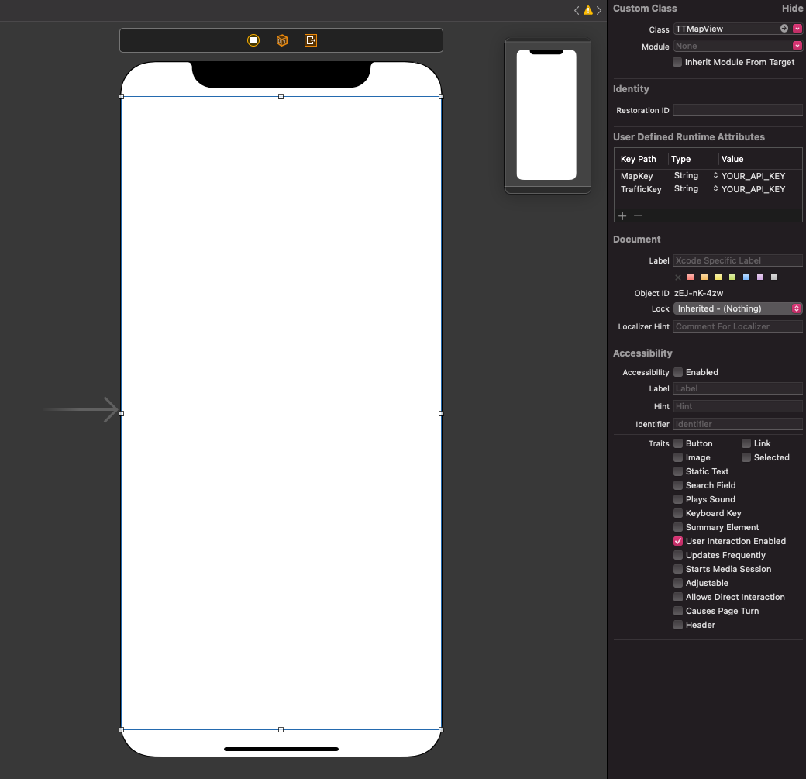

<a
  href="#"
  style={{ display: 'block', margin: '0', padding: '0' }}
  name="_map_initialization"
></a>

You can initiate the map in two ways with the Maps SDK:

1. Map initialization using Storyboard – allows you to visualize/prototype the map display in the
   user interface of your app with Storyboards.
2. Map initialization from the code using TTMapConfiguration – makes it possible to set the map
   configuration options from the code. Also, the Example logo placement can only be defined with
   TTMapConfiguration.

You can find both ways described in this page.

**1. Map initialization using Storyboard**

The main class that represents a Map is a `TTMapView`. The `TTMapView` is an interactive world map
that pans and zooms in response to gestures. Use its methods to receive map-related update messages
in your application as long as they conform to the TTMapViewDelegate protocol.

To initialize a map using storyboards:

1. Drop the `UIView` object from the Library into your storyboard.
2. In the Class field, set the class to `TTMapView`.
3. Add the values `MapKey` and `TrafficKey` to the User Defined Runtime `Key path` attributes.
4. Set the value type for these keys as String.
5. Enter your service keys into the fields.

<table>
  <tbody>
    <tr>
      <td>
        <ContentWrapper maxWidth="700px" objectFit="contain">
          <p>
            
          </p>
        </ContentWrapper>
        <p>Map initialization using Storyboard</p>
      </td>
    </tr>
  </tbody>
</table>

**2. Map initialization using TTMapConfigurationBuilder**

The basic steps for adding a map are:

1. Set up your project as it is described in DOWNLOADS.
2. Create the object 'TTMapView'.
3. Obtain the keys to the constructor class.
4. Use the 'TTMapView' object to set the map properties.

<Code>

```swift
let builder = TTMapConfigurationBuilder.create()
let style = TTMapStyleDefaultConfiguration()
let config = builder.withMapStyleConfiguration(style).build()
let mapview = TTMapView(mapConfiguration: config)
```

```objectivec
TTMapConfigurationBuilder *builder = [TTMapConfigurationBuilder createBuilder]
TTMapStyleDefaultConfiguration *style = [[TTMapStyleDefaultConfiguration alloc] init];
TTMapConfiguration *configuration = [[builder withMapStyleConfiguration:style] build];
TTMapView *mapView = [[TTMapView alloc] initWithMapConfiguration:configuration];
```

</Code>

\[Optional\] Create the TTMapConfiguration object and pass it to the MapView init method. The
TTMapConfiguration object allows you to configure the initial viewport and Example logo position.

**TTMapConfiguration**

Map configuration is an extra parameter that can be used to init a 'TTMapView'.

<Code>

```swift
let mapview = TTMapView(mapConfiguration: config)
```

```objectivec
TTMapView *mapView = [[TTMapView alloc] initWithMapConfiguration:configuration];
```

</Code>

**Example Keys**

The service key is added by entering it into the class constructor.

<Code>

```swift
let mapConfig = TTMapConfigurationBuilder.create().withMapKey(<Key>).withTrafficKey(<Key>).build()
self.mapView = TTMapView(frame: view.bounds, mapConfiguration: mapConfig)
```

```objectivec
TTMapConfiguration *mapConfig = [[[[[TTMapConfigurationBuilder createBuilder] withMapKey:<Key>] withTrafficKey:<Key>] build];
self.mapView = [[TTMapView alloc] initWithFrame:self.view.bounds mapConfiguration:mapConfig];
```

</Code>

**Example Logo**

When using the Maps SDK for iOS, it is required that the Example logo is always visible. By default,
the Example logo is located at the bottom-left corner of the map. However, you can easily customize
its position to meet your app design by passing the TTLogoPosition object to your map configuration
object.

<Code>

```swift
let logoPosition = TTLogoPosition(verticalPosition: .bottom, horizontalPosition: .right)
let mapConfig = TTMapConfigurationBuilder.create().withExampleLogoPosition(logoPosition).build()
let mapview = TTMapView(mapConfiguration: mapConfig)
```

```objectivec
TTLogoPosition *logoPosition = [[TTLogoPosition alloc] initWithVerticalPosition:bottom horizontalPosition:left];
TTMapConfiguration *mapConfig = [[[[TTMapConfigurationBuilder createBuilder] withViewportTransform:viewportTransform] withExampleLogoPosition:logoPosition] build];
TTMapView *mapView = [[TTMapView alloc] initWithMapConfiguration:mapConfig];
```

</Code>

**ViewportTransform**

If you want to init a 'TTMapView' centered on specific place with a custom bearing and pitch, you
should check the TTViewportTransform param of TTMapConfiguration.

<Code>

```swift
let viewportTransform = TTCenterOnGeometryBuilder.create(withGeometry: [
        .init(latitude: 52.3274167028, longitude: 4.72924173),
        .init(latitude: 52.43106373, longitude: 5.0310596876),
        .init(latitude: 52.43106373, longitude: 4.72924173),
        .init(latitude: 52.3274167028, longitude: 4.72924173),
    ], withPadding: .zero)
        .withPitch(30)
        .withBearing(-90)
        .build()
let mapConfig = TTMapConfigurationBuilder.create().withViewportTransform(viewportTransform).build()
self.mapView = TTMapView(frame: view.bounds, mapConfiguration: mapConfig)
```

```objectivec
NSArray<CLLocation *> *geometry = @[[[CLLocation alloc] initWithLatitude:52.3274167028 longitude:4.72924173], [[CLLocation alloc] initWithLatitude:52.43106373 longitude:5.0310596876], [[CLLocation alloc] initWithLatitude:52.43106373 longitude:4.72924173],[[CLLocation alloc] initWithLatitude:52.3274167028 longitude:4.72924173]];
TTCenterOnGeometry *viewportTransform = [[[[TTCenterOnGeometryBuilder createWithGeometry:geometry withPadding:UIEdgeInsetsZero] withPitch:30] withBearing:-90] build];
TTMapConfiguration *mapConfig = [[[[TTMapConfigurationBuilder createBuilder] withViewportTransform:viewportTransform] build];
TTMapView *mapView = [[TTMapView alloc] initWithMapConfiguration:mapConfig];
```

</Code>

OnMapReadyCompletion:

<Code>

```swift
self.mapView.onMapReadyCompletion {
    //
}
```

```objectivec
[self.mapView onMapReadyCompletion:^{
    //
}];
```

</Code>