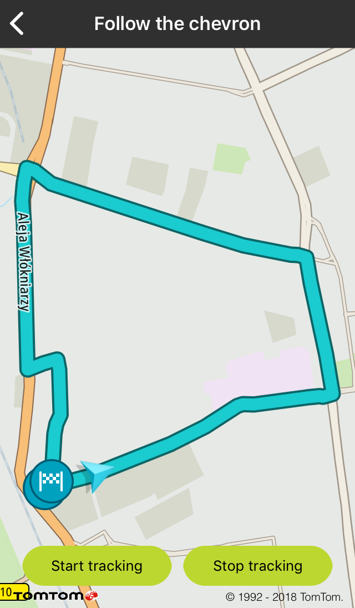

<a
  href="#"
  style={{ display: 'block', margin: '0', padding: '0' }}
  name="follow-chevron"
></a>

Allow your users to follow their changing positions on the map e.g., when driving. When a new
location is set, the animation moves the chevron to the new position.

**Sample use case 1:** You want to show your user position when driving.

<a
  href="#"
  style={{ display: 'block', margin: '0', padding: '0' }}
  name="_custom_chevron_indicator"
></a>

# Custom chevron indicator

You can set a custom icon for the chevron indicator.

To create a custom chevron:

<Code>

```swift
let animation = TTChevronAnimationOptionsBuilder.create(withAnimatedCornerRounding: false).build()
chevron = TTChevronObject(normalImage: TTChevronObject.defaultNormalImage(), withDimmedImage: TTChevronObject.defaultDimmedImage(), with: animation)
```

```objectivec
TTChevronAnimationOptions *animation = [[TTChevronAnimationOptionsBuilder createWithAnimatedCornerRounding:true] build]
self.chevron = [[TTChevronObject alloc] initWithNormalImage:[TTChevronObject defaultNormalImage] withDimmedImage:[TTChevronObject defaultDimmedImage] withChevronAnimationOptions:animation];
```

</Code>

<a
  href="#"
  style={{ display: 'block', margin: '0', padding: '0' }}
  name="_chevron_tracking_mode"
></a>

# Chevron tracking mode

Additionally, it is possible to track the chevron. It means that the camera/map and the chevron move
when a new location is received so that the map is always centered on the chevron with the bearing
of the drive. In the tracking mode, rotate and pan gestures are blocked. The user can only change
the zoom level, while the map camera is automatically adjusted to follow the chevron.

To start tracking a selected chevron:

<Code>

```swift
mapView.trackingManager.start(chevron)
```

```objectivec
[self.mapView.trackingManager startTrackingObject:self.chevron];
```

</Code>

To stop tracking a selected chevron:

<Code>

```swift
mapView.trackingManager.stop(chevron!)
```

```objectivec
[self.mapView.trackingManager stopTrackingObject:self.chevron];
```

</Code>

To add route to the chevron source:

<Code>

```swift
let mapRoute = TTMapRoute(coordinatesData: plannedRoute,
                          with: TTMapRouteStyle.defaultActive(),
                          imageStart: TTMapRoute.defaultImageDeparture(),
                          imageEnd: TTMapRoute.defaultImageDestination())
source = MapFollowTheChevronSource(trackingManager: mapView.trackingManager, routeManager: mapView.routeManager, trackingObject: chevron, route: mapRoute)
source?.activate()
```

```objectivec
TTMapRoute *mapRoute = [TTMapRoute routeWithCoordinatesData:result.routes.firstObject withRouteStyle:TTMapRouteStyle.defaultActiveStyle imageStart:TTMapRoute.defaultImageDeparture imageEnd:TTMapRoute.defaultImageDestination];
self.source = [[MapFollowTheChevronSource alloc] initWithTrackingManager:self.mapView.trackingManager routeManager:self.mapView.routeManager trackingObject:self.chevron route:mapRoute];
[self.source activate];
```

</Code>

To set the chevron position on the screen:

<Code>

```swift
mapView.trackingManager.setTrackingScreenCoordinates(CGPoint(x: 200, y: 500))
```

```objectivec
[self.mapView.trackingManager setTrackingScreenCoordinates:CGPointMake(200, 500)];
```

</Code>

<table>
  <tbody>
    <tr>
      <td>
        <ContentWrapper maxWidth="350px" objectFit="contain">
          <p>
            
          </p>
        </ContentWrapper>
        <p>Chevron overview</p>
      </td>
      <td>
        <ContentWrapper maxWidth="350px" objectFit="contain">
          <p>
            
          </p>
        </ContentWrapper>
        <p>Chevron tracking</p>
      </td>
    </tr>
  </tbody>
</table>