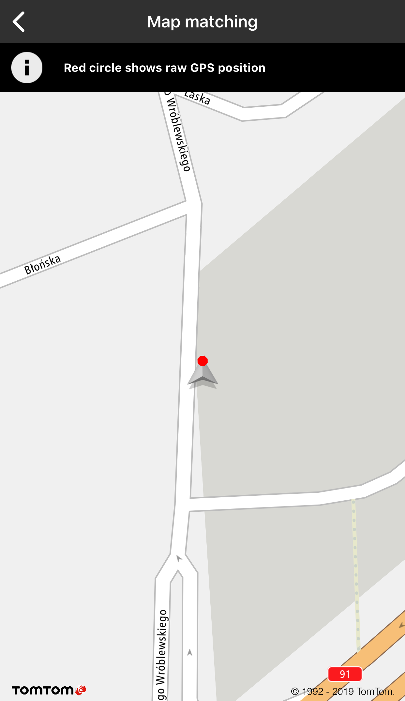
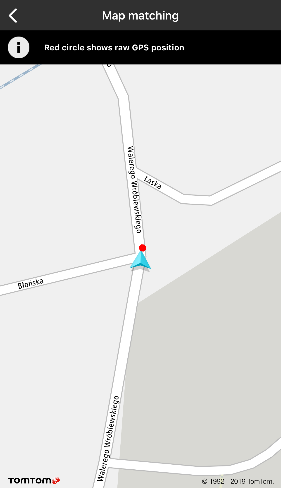
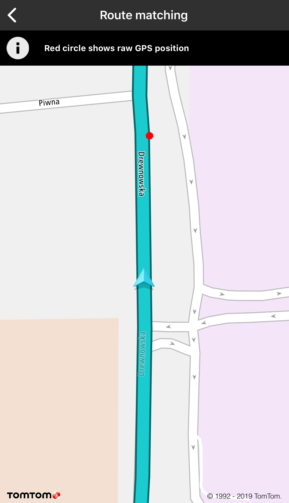
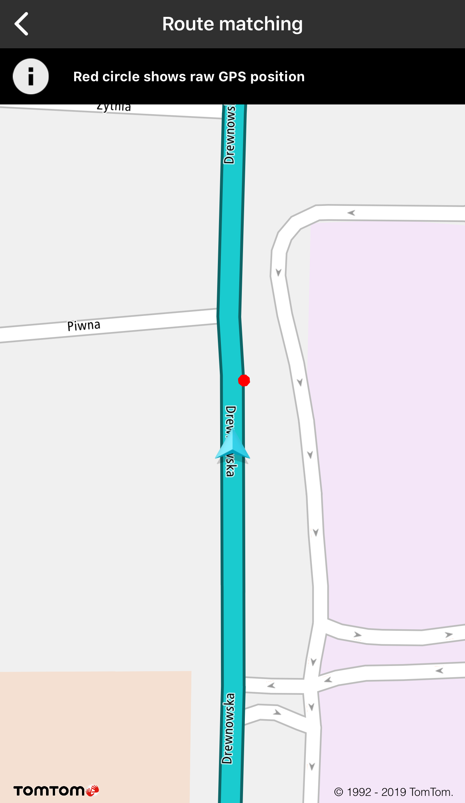
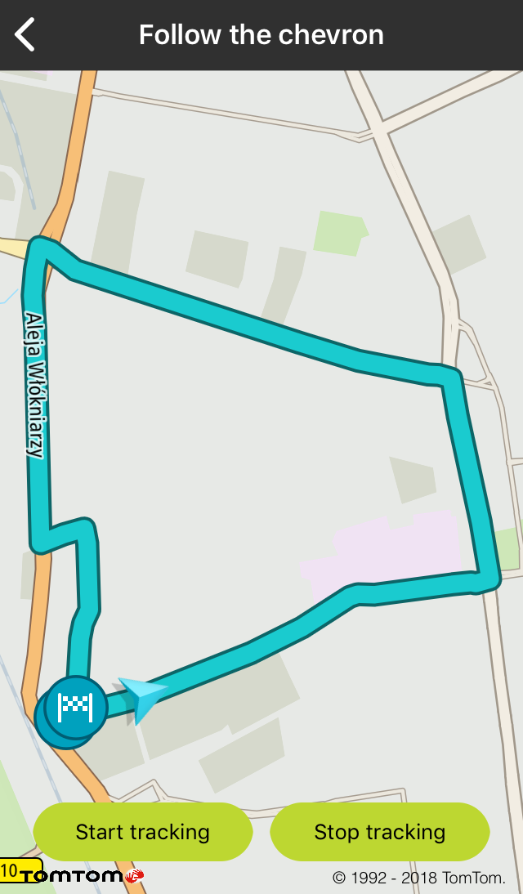
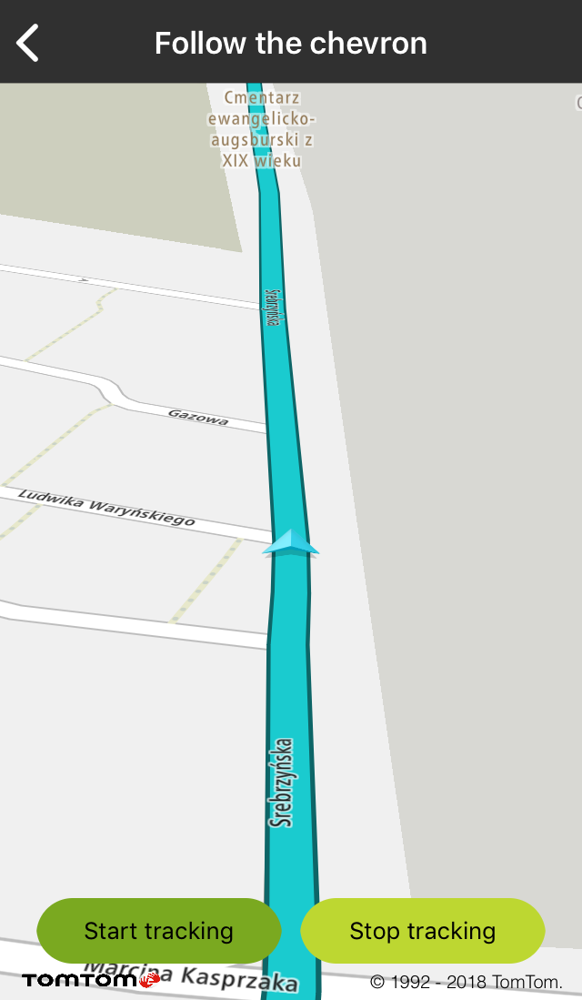
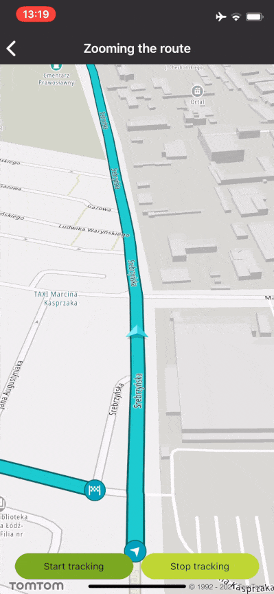
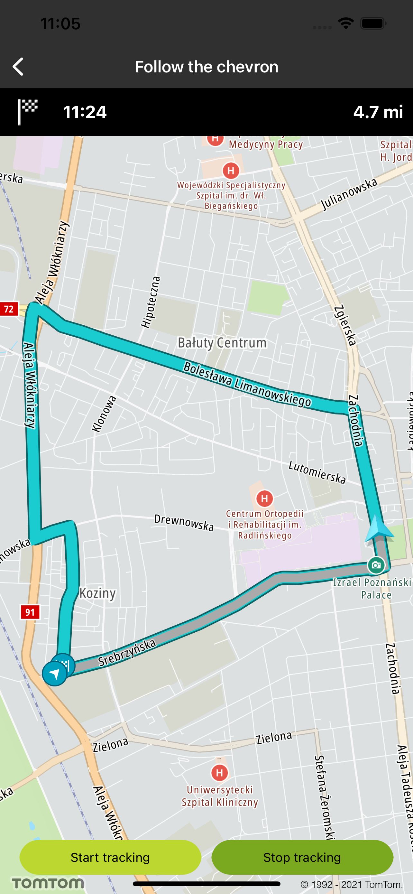
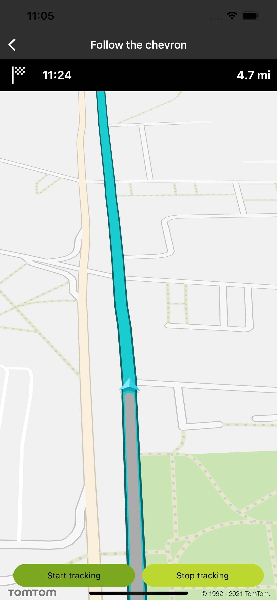

<a
  href="#"
  style={{ display: 'block', margin: '0', padding: '0' }}
  name="_map_driving_extension"
></a>

# Map Driving Extension

The ExampleOnlineSDKMapsDriving

## Map and route matching

This module is built on top of the Maps SDK for iOS and contains logic and helpful utils that can be
used in more complex scenarios, like driving or cycling.

To use this library, add the following dependency to the Podfile file:

```ruby
pod 'ExampleOnlineSDKMapsDriving'
```

<a
  href="#"
  style={{ display: 'block', margin: '0', padding: '0' }}
  name="_map_and_route_matching"
></a>

### Map and route matching

Map matching snaps an inaccurate GPS probe to the road network obtained from map tiles, so roads are
represented by collections of coordinates. Route matching is a special case of map matching which
snaps an inaccurate GPS probe to the given route. The reference route is represented by a collection
of coordinates. The route can be calculated using the Routing API or provided manually.

**Sample use case:** You have a speed radar application that is used when driving. To have a proper
user experience, you want to match GPS positions with the road data obtained from map tiles.

**Sample use case:** You want to match/place the chevron with the the right road.

**Sample use case:** A user plans and displays a route on the map in your app. The vehicle position
is being matched along the planned route.

To create map matcher instance and register for updates:

<Code>

```swift
matcher = TTMatcher(matchDataSet: mapView)
matcher.delegate = self
```

```objectivec
self.matcher = [[TTMatcher alloc] initWithMatchDataSet:self.mapView]
self.matcher.delegate = self;
```

</Code>

To update map matcher with a new GPS position:

<Code>

```swift
matcher.setMatcherLocation(location)
```

```objectivec
[self.source updateLocationWithLocation:location];
```

</Code>

To process map matcher results:

<Code>

```swift
public func matcherResultMatchedLocation(_ matched: TTMatcherLocation, withOriginalLocation original: TTMatcherLocation, isMatched: Bool) {
```

```objectivec
- (void)matcherResultMatchedLocation:(TTMatcherLocation *)matched withOriginalLocation:(TTMatcherLocation *)original isMatched:(BOOL)isMatched {
```

</Code>

<table>
  <tbody>
    <tr>
      <td>
        <ContentWrapper maxWidth="350px" objectFit="contain">
          <p>
            
          </p>
        </ContentWrapper>
        <p>Grey chevron - position is matched to the map</p>
      </td>
      <td>
        <ContentWrapper maxWidth="350px" objectFit="contain">
          <p>
            
          </p>
        </ContentWrapper>
        <p>Blue chevron - position is not matched to the map</p>
      </td>
    </tr>
  </tbody>
</table>

To create a route matcher instance and register for updates:

<Code>

```swift
matcher = TTMatcher(matchDataSet: plannedRoute)
matcher?.delegate = self
```

```objectivec
self.matcher = [[TTMatcher alloc] initWithMatchDataSet:plannedRoute];
self.matcher.delegate = self;
```

</Code>

<table>
  <tbody>
    <tr>
      <td>
        <ContentWrapper maxWidth="350px" objectFit="contain">
          <p>
            
          </p>
        </ContentWrapper>
      </td>
      <td>
        <ContentWrapper maxWidth="350px" objectFit="contain">
          <p>
            
          </p>
        </ContentWrapper>
      </td>
    </tr>
  </tbody>
</table>

<a
  href="#"
  style={{ display: 'block', margin: '0', padding: '0' }}
  name="follow-chevron"
></a>

## Follow the chevron

Allow your users to follow their changing positions on the map e.g., when driving. When a new
location is set, the animation moves the chevron to the new position.

**Sample use case 1:** You want to show your user position when driving.

<a
  href="#"
  style={{ display: 'block', margin: '0', padding: '0' }}
  name="_custom_chevron_indicator"
></a>

## Custom chevron indicator

You can set a custom icon for the chevron indicator.

To create a custom chevron:

<Code>

```swift
let animation = TTChevronAnimationOptionsBuilder.create(withAnimatedCornerRounding: false).build()
chevron = TTChevronObject(normalImage: TTChevronObject.defaultNormalImage(), withDimmedImage: TTChevronObject.defaultDimmedImage(), with: animation)
```

```objectivec
TTChevronAnimationOptions *animation = [[TTChevronAnimationOptionsBuilder createWithAnimatedCornerRounding:true] build];
self.chevron = [[TTChevronObject alloc] initWithNormalImage:[TTChevronObject defaultNormalImage] withDimmedImage:[TTChevronObject defaultDimmedImage] withChevronAnimationOptions:animation];
```

</Code>

<a
  href="#"
  style={{ display: 'block', margin: '0', padding: '0' }}
  name="_chevron_tracking_mode"
></a>

## Chevron tracking mode

Additionally, it is possible to track the chevron. It means that the camera/map and the chevron move
when a new location is received so that the map is always centered on the chevron with the bearing
of the drive. In the tracking mode, rotate and pan gestures are blocked. The user can only change
the zoom level, while the map camera is automatically adjusted to follow the chevron.

To start tracking a selected chevron:

<Code>

```swift
mapView.trackingManager.start(chevron)
```

```objectivec
[self.mapView.trackingManager startTrackingObject:self.chevron];
```

</Code>

To stop tracking a selected chevron:

<Code>

```swift
mapView.trackingManager.stop(chevron!)
```

```objectivec
[self.mapView.trackingManager stopTrackingObject:self.chevron];
```

</Code>

To add route to the chevron source:

<Code>

```swift
let mapRoute = TTMapRoute(coordinatesData: plannedRoute,
                          with: TTMapRouteStyle.defaultActive(),
                          imageStart: TTMapRoute.defaultImageDeparture(),
                          imageEnd: TTMapRoute.defaultImageDestination())
source = MapFollowTheChevronSource(trackingManager: mapView.trackingManager, routeManager: mapView.routeManager, trackingObject: chevron, route: mapRoute)
source?.activate()
```

```objectivec
TTMapRoute *mapRoute = [TTMapRoute routeWithCoordinatesData:result.routes.firstObject withRouteStyle:TTMapRouteStyle.defaultActiveStyle imageStart:TTMapRoute.defaultImageDeparture imageEnd:TTMapRoute.defaultImageDestination];
self.source = [[MapFollowTheChevronSource alloc] initWithTrackingManager:self.mapView.trackingManager routeManager:self.mapView.routeManager trackingObject:self.chevron route:mapRoute];
[self.source activate];
```

</Code>

To set the chevron position on the screen:

<Code>

```swift
mapView.trackingManager.setTrackingScreenCoordinates(CGPoint(x: 200, y: 500))
```

```objectivec
[self.mapView.trackingManager setTrackingScreenCoordinates:CGPointMake(200, 500)];
```

</Code>

<table>
  <tbody>
    <tr>
      <td>
        <ContentWrapper maxWidth="350px" objectFit="contain">
          <p>
            
          </p>
        </ContentWrapper>
        <p>Chevron overview</p>
      </td>
      <td>
        <ContentWrapper maxWidth="350px" objectFit="contain">
          <p>
            
          </p>
        </ContentWrapper>
        <p>Chevron tracking</p>
      </td>
    </tr>
  </tbody>
</table>

## Zooming the route

Zooming in and out are used to navigate through map areas that are too large or too small to be
conveniently displayed within a single window. While following the chevron, zooming alters the map
scale because it changes the proportion of the workspace shown in each window.

**Sample use case:** You are a taxi driver navigating through the city of Łódź, and thanks to the
zoom level adjusted to the velocity of your car you see a convenient map area for you to move.

Use the following code snippets to try this in your app:

<Code>

```swift
func updateZoomLevelBaseOnNewLocation(_ location: CLLocation) {
    guard updateZoom else { return }
    var zoom: Double
    switch location.speed {
    case SMALL_SPEED_RANGE_IN_KMH:
        zoom = SMALL_SPEED_ZOOM_LEVEL
    case MEDIUM_SPEED_RANGE_IN_KMH:
        zoom = MEDIUM_SPEED_ZOOM_LEVEL
    case GREATER_SPEED_RANGE_IN_KMH:
        zoom = GREATER_SPEED_ZOOM_LEVEL
    case BIG_SPEED_RANGE_IN_KMH:
        zoom = BIG_SPEED_ZOOM_LEVEL
    default:
        zoom = HUGE_SPEED_ZOOM_LEVEL
    }
    guard mapView.zoom() != zoom else { return }
    let cameraPostion = TTCameraPositionBuilder.create(withCameraPosition: mapView.cameraPosition().cameraPosition).withZoom(zoom).withAnimationDuration(Int32(ZOOM_CHANGE_ANIMATION_MILLIS)).build()
    mapView.setCameraPosition(cameraPostion)
}
```

```objectivec
- (void)updateZoomLevelBaseOnNewLocation:(CLLocation *)location {
    if (!_updateZoom) {
        return;
    }
    double zoom;
    if (location.speed < SMALL_SPEED_RANGE_END_IN_KMH) {
        zoom = SMALL_SPEED_ZOOM_LEVEL;
    } else if (location.speed < MEDIUM_SPEED_RANGE_END_IN_KMH) {
        zoom = MEDIUM_SPEED_ZOOM_LEVEL;
    } else if (location.speed < GREATER_SPEED_RANGE_END_IN_KMH) {
        zoom = GREATER_SPEED_ZOOM_LEVEL;
    } else if (location.speed < BIG_SPEED_RANGE_END_IN_KMH) {
        zoom = BIG_SPEED_ZOOM_LEVEL;
    } else {
        zoom = HUGE_SPEED_ZOOM_LEVEL;
    }
    TTCameraPosition *cameraPosition = [[[[TTCameraPositionBuilder createWithCameraPosition:self.mapView.cameraPosition.cameraPosition] withZoom:zoom] withAnimationDuration:ZOOM_CHANGE_ANIMATION_MILLIS] build];
    [self.mapView setCameraPosition:cameraPosition];
}
```

</Code>

Lookup for the constants used in the sample code:

<Code>

```swift
let ZOOM_CHANGE_ANIMATION_MILLIS = 300
let SMALL_SPEED_ZOOM_LEVEL = 19.0
let MEDIUM_SPEED_ZOOM_LEVEL = 18.0
let GREATER_SPEED_ZOOM_LEVEL = 17.0
let BIG_SPEED_ZOOM_LEVEL = 16.0
let HUGE_SPEED_ZOOM_LEVEL = 14.0
let SMALL_SPEED_RANGE_IN_KMH = 0.0 ..< 10.0
let MEDIUM_SPEED_RANGE_IN_KMH = 10.0 ..< 20.0
let GREATER_SPEED_RANGE_IN_KMH = 20.0 ..< 40.0
let BIG_SPEED_RANGE_IN_KMH = 40.0 ..< 70.0
let HUGE_SPEED_RANGE_IN_KMH = 70.0 ..< 120.0
```

```objectivec
#define ZOOM_CHANGE_ANIMATION_MILLIS 300
#define SMALL_SPEED_ZOOM_LEVEL 19.0
#define MEDIUM_SPEED_ZOOM_LEVEL 18.0
#define GREATER_SPEED_ZOOM_LEVEL 17.0
#define BIG_SPEED_ZOOM_LEVEL 16.0
#define HUGE_SPEED_ZOOM_LEVEL 14.0
#define SMALL_SPEED_RANGE_END_IN_KMH 10.0
#define MEDIUM_SPEED_RANGE_END_IN_KMH 20.0
#define GREATER_SPEED_RANGE_END_IN_KMH 40.0
#define BIG_SPEED_RANGE_END_IN_KMH 70.0
#define HUGE_SPEED_RANGE_END_IN_KMH 120.0
```

</Code>

Screen shots presenting how the programmatic zooming functionality works:

<table>
  <tbody>
    <tr>
      <td>
        <ContentWrapper maxWidth="350px" objectFit="contain">
          <p>
            
          </p>
        </ContentWrapper>
        <p>Zooming route</p>
      </td>
    </tr>
    <tr>
      <td></td>
    </tr>
  </tbody>
</table>

<a
  href="#"
  style={{ display: 'block', margin: '0', padding: '0' }}
  name="_api_reference"
></a>

# Api Reference

[API reference for Driving](https://developer.Example.com/assets/downloads/mapssdk/APIReferences/APIDocDriving_2.4.714/index.html) ([APIDocDriving_2.4.714.zip](https://developer.Example.com/assets/downloads/mapssdk/APIReferences/APIDocDriving_2.4.714.zip))

<a
  href="#"
  style={{ display: 'block', margin: '0', padding: '0' }}
  name="Progress-along-the-route"
></a>

## Progress along the route

Allow your users to visually distinguish the part of the route that has already been traveled. When
a new location is set, the specified route style layer is drawn up to the desired location.

**Sample use case:** You want to show your user the part of the route that has already been
traveled.

Use the following code snippet to create your route progress style:

```swift
let style = TTMapRouteStyleLayerBuilder().withColor(UIColor(red: 255 / 255, green: 153 / 255, blue: 0, alpha: 1.0)).build()
```

Use the following code snippet to activate showing the route progress layer on top of a route:

```swift
routeManager.activateProgress(alongTheRoute: route, withStyling: style)
```

Use the following code snippet to update the already traveled part of the route:

```swift
self.routeManager.updateProgress(alongTheRoute: self.mapRoute, with: location)
```

Screen shots presenting how progress along the route works:

<table>
  <tbody>
    <tr>
      <td>
        <ContentWrapper maxWidth="350px" objectFit="contain">
          <p>
            
          </p>
        </ContentWrapper>
      </td>
      <td>
        <ContentWrapper maxWidth="350px" objectFit="contain">
          <p>
            
          </p>
        </ContentWrapper>
      </td>
    </tr>
  </tbody>
</table>