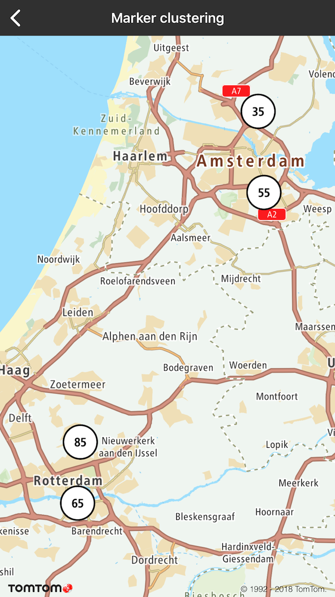
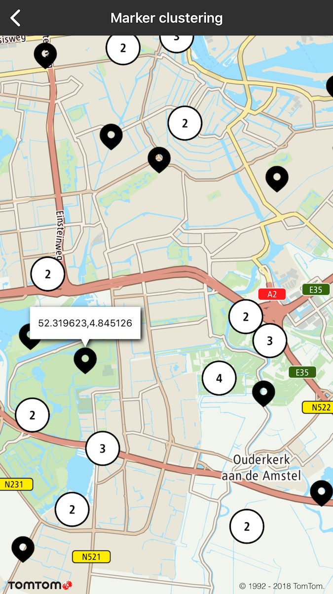

Allow your users to cluster annotations for better visualization. By default, annotations clustering
is disabled. You can decide per each marker if it should be included in the clustering process or
not (e.g., you want to have a few annotations that are never clustered). To manipulate marker
clustering, use `TTAnnotationManager` obtained from `TTMapView`.

**Sample use case:** You want to display the distribution of parking spots across the city.
Individual parking spots are shown only at higher zoom levels, otherwise data is clustered for
better visualization.

To enable annotations clustering:

<Code>

```swift
mapView.annotationManager.clustering = true
```

```objectivec
self.mapView.annotationManager.clustering = YES
```

</Code>

To flag a marker indicating that it should be clustered:

<Code>

```swift
annotation.shouldCluster = true
```

```objectivec
annotation.shouldCluster = YES;
```

</Code>

Examples are shown below:

<table>
  <tbody>
    <tr>
      <td>
        <ContentWrapper maxWidth="350px" objectFit="contain">
          <p>
            
          </p>
        </ContentWrapper>
        <p>Lower zoom level</p>
      </td>
      <td>
        <ContentWrapper maxWidth="350px" objectFit="contain">
          <p>
            
          </p>
        </ContentWrapper>
        <p>Higher zoom level</p>
      </td>
    </tr>
  </tbody>
</table>