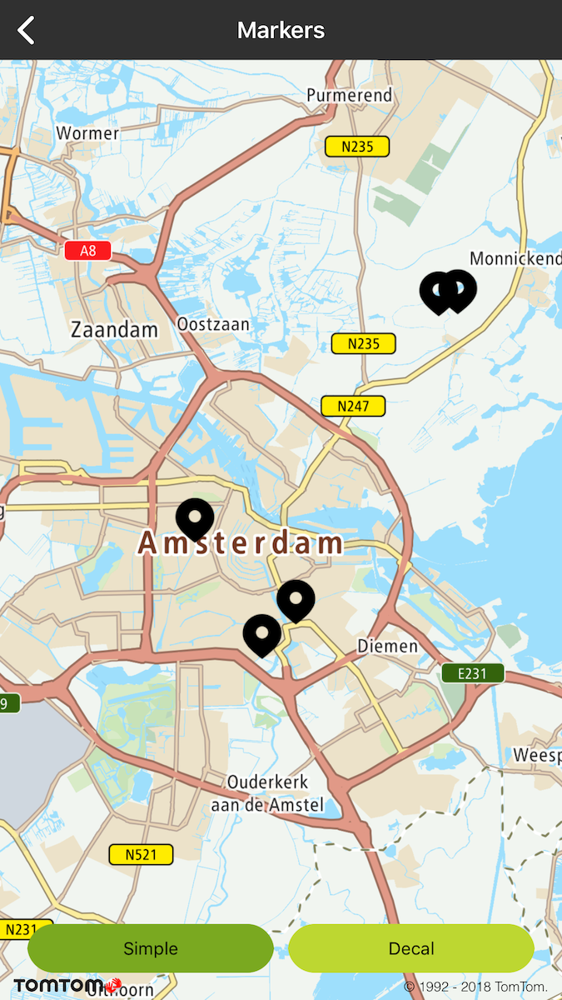
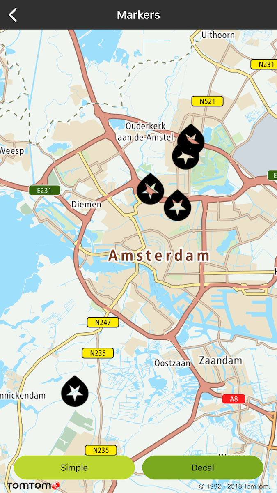

You can place custom images on the map using **TTAnnotation**. You can do that with a **
TTAnnotationManager** which can be obtained from **TTMapView**. Use one of factory methods from **
TTAnnotation** to create an annotation, then pass it to manager.

You can display icons using two different types:

- Focal (default): Where the icon always stands vertically even when the map is rotated. All nine
  callout anchor points are supported with this annotation type.
- Decal: Where an icon sticks to the map even when the map is rotated. Only one callout anchor point
  is supported for decal **TTAnnotationAnchorBottom**.
- Draggable markers: Allow your users to drag and drop a marker around the map.

Mixing icons of focal and decal modes is generally unsupported and advised against, as there are
unresolvable depth-sorting issues and the results will not always look correct. It is safe to mix
some modes, however, such as either of the decal modes with any of the standing modes. For
performance purposes, it is recommended to use the same tag for the same images so they can be
reused from cache.

**Sample use case**: In your app, you want to display a number of annotations to mark places on the
map. Use the following code snippet to display a single annotation at specific coordinates on the
map.

<table>
  <tbody>
    <tr>
      <td>
        <ContentWrapper maxWidth="350px" objectFit="contain">
          <p>
            
          </p>
        </ContentWrapper>
        <p>Focal annotations examples</p>
      </td>
      <td>
        <ContentWrapper maxWidth="350px" objectFit="contain">
          <p>
            
          </p>
        </ContentWrapper>
        <p>Decal annotations examples</p>
      </td>
    </tr>
  </tbody>
</table>

<Code>

```swift
let annotation = TTAnnotation(coordinate: cooridnate)
mapView.annotationManager.add(annotation)
```

```objectivec
TTAnnotation *annotation = [TTAnnotation annotationWithCoordinate:coordinate]
[self.mapView.annotationManager addAnnotation:annotation];
```

</Code>
<Code>

```swift
let annotation = TTAnnotation(coordinate: cooridnate)
annotation.selectable = false
annotation.isDraggable = true
mapView.annotationManager.add(annotation)
```

```objectivec
TTAnnotation *annotation = [TTAnnotation annotationWithCoordinate:coordinate];
annotation.selectable = NO;
annotation.isDraggable = YES;
[self.mapView.annotationManager addAnnotation:annotation];
```

</Code>

<a
  href="#"
  style={{ display: 'block', margin: '0', padding: '0' }}
  name="_animated_markers"
></a>

# Animated markers

Thanks to this feature you can use GIFs as marker icons. For this purpose, you need to place your
images in the assets folder and then use them in the following way:

<Code>

```swift
let customIcon = TTAnnotationImage.createGIF(withName: "gif_annotation")!
let annotation = TTAnnotation(coordinate: cooridnate, annotationImage: customIcon, anchor: .bottom, type: .decal)
annotation.selectable = false
mapView.annotationManager.add(annotation)
```

```objectivec
TTAnnotationImage *customIcon = [TTAnnotationImage createGIFWithName:@"gif_annotation"];
TTAnnotation *annotation = [TTAnnotation annotationWithCoordinate:coordinate annotationImage:customIcon anchor:TTAnnotationAnchorBottom type:TTAnnotationTypeDecal];
annotation.selectable = NO;
[self.mapView.annotationManager addAnnotation:annotation];
```

</Code>

# Annotation anchor

You can change the anchoring point for your icon. The anchor specifies which point of an annotation
image is attached to the map. The annotation will rotate around this anchoring point when rotating
the map. You can use the default image representation of an annotation which is attached to the
bottom height center width. You can change this behavior by **TTAnnotationAnchor** enumeration. For
example, if you want to use a crosshair annotation image, you should set the anchor to **
TTAnnotationAnchorCenter**

# Annotation selected

You can implement an observable of the annotation selected event. You can do that with the global
delegate **TTAnnotationDelegate** for all annotations that have to be registered on **
TTAnnotationManager** as in the following example:

<a
  href="#"
  style={{ display: 'block', margin: '0', padding: '0' }}
  name="marker-click-listener"
></a>

# Annotation click listener

The Maps SDK allows you to observe an annotation selected event. There is one global delegate **
TTAnnotationDelegate** for all annotations that has to be registered on **TTAnnotationManager** as
shown in the following example:

<Code>

```swift
mapView.annotationManager.delegate = self
```

```objectivec
self.mapView.annotationManager.delegate = self;
```

</Code>
<Code>

```swift
func annotationManager(_: TTAnnotationManager, annotationSelected _: TTAnnotation) {
    // handle annotation selected event
}
```

```objectivec
- (void)annotationManager:(id<TTAnnotationManager>)annotationManager annotationSelected:(TTAnnotation *)annotation {
    // handle annotation selected event
}
```

</Code>