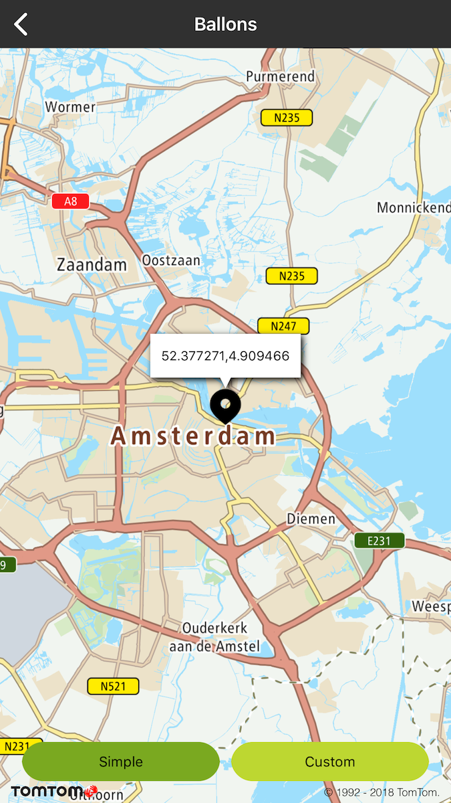
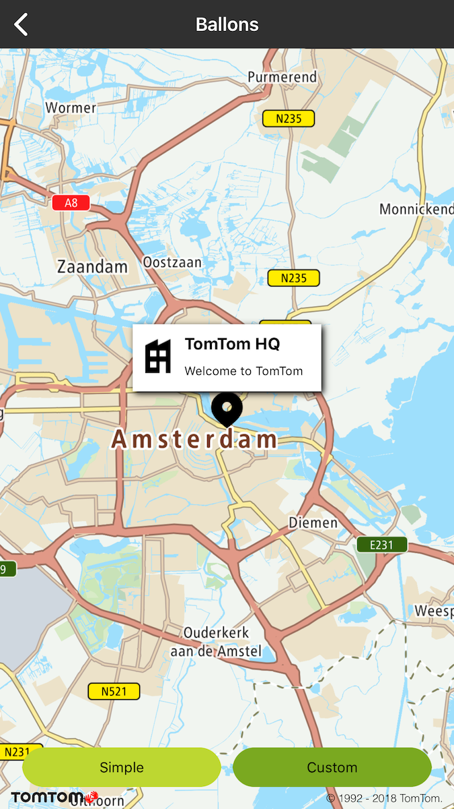

Allow your users to display and customize balloons in a few lines of code.

**Sample use case**: You would like to learn more about a place on the map. Depending on the
selected location, the app displays a balloon containing either text or additional information such
as icons or pictures.

To display a balloon, attach a callout to a TTAnnotation. The map can display only one annotation at
a time.

A callout can be triggered in two ways:

- Automatically, if the annotation is tapped on the map.
- Calling TTAnnotationManager:selectAnnotation.

There can be only one selected annotation on the map at a time.

A callout can be closed in the following ways:

- Automatically, if a user taps on the map.
- Automatically, if a user taps on another annotation.
- Calling TTAnnotationManager:deselectAnnotation if the annotation is attached to the map, it is
  removed from the map.

A callout is an instance of UIView that implements the TTCalloutView protocol. You can use one of
the built-in callout views, such as the default TTCalloutViewSimple, or make your own custom
balloon.

# Default Balloons

The default behavior for an annotation is to display an instance of TTCalloutViewSimple containing
the annotation’s coordinates. You can change the following properties:

- TTAnnotation:canShowCallout determines if the annotation can display a callout. The default value
  is YES. If it is set to NO, the annotation can still be selected but no callout will appear.
- TTAnnotation:selectable: determines if the annotation can be selected at all. The default value is
  YES. If it is set to NO, then no callout will be displayed.

To change the default text of a simple callout, register your delegate on the annotation manager and
override the viewForSelectedAnnotation method:

<Code>

```swift
mapView.annotationManager.delegate = self
```

```objectivec
self.mapView.annotationManager.delegate = self
```

</Code>
<Code>

```swift
func annotationManager(_: TTAnnotationManager, viewForSelectedAnnotation selectedAnnotation: TTAnnotation) -> UIView & TTCalloutView {
        return TTCalloutOutlineView(text: "\(selectedAnnotation.coordinate.latitude),\(selectedAnnotation.coordinate.longitude)")
}
```

```objectivec
- (UIView<TTCalloutView> *)annotationManager:(id<TTAnnotationManager>)manager viewForSelectedAnnotation:(TTAnnotation *)selectedAnnotation {
        return [[TTCalloutOutlineView alloc] initWithText:[NSString stringWithFormat:@"%f,%f", selectedAnnotation.coordinate.latitude, selectedAnnotation.coordinate.longitude]];
}
```

</Code>
<ContentWrapper maxWidth="350px" objectFit="contain">



</ContentWrapper>

# Custom Balloons

Although you can use default callouts, the SDK also allows you to create fully customizable ones. A
callout is nothing more than a Cocoa UIView implementing the TTCalloutView protocol. Callouts can be
built by either Interface Builder or programmatically.

This is an example of a custom callout:

<Code>

```swift
mapView.annotationManager.delegate = self
```

```objectivec
self.mapView.annotationManager.delegate = self;
```

</Code>
<Code>

```swift
var customAnnotation: TTAnnotation?
```

```objectivec
@interface MapBallonsViewController () <TTAnnotationDelegate>
@property(nonatomic, strong) TTAnnotation *customAnnotation;
@end
```

</Code>
<Code>

```swift
func annotationManager(_: TTAnnotationManager, viewForSelectedAnnotation selectedAnnotation: TTAnnotation) -> UIView & TTCalloutView {
        return CustomCallout(frame: CGRect.zero)
}
```

```objectivec
- (UIView<TTCalloutView> *)annotationManager:(id<TTAnnotationManager>)manager viewForSelectedAnnotation:(TTAnnotation *)selectedAnnotation {
        return [[CustomCallout alloc] initWithFrame:CGRectZero];
}
```

</Code>
<ContentWrapper maxWidth="350px" objectFit="contain">



</ContentWrapper>