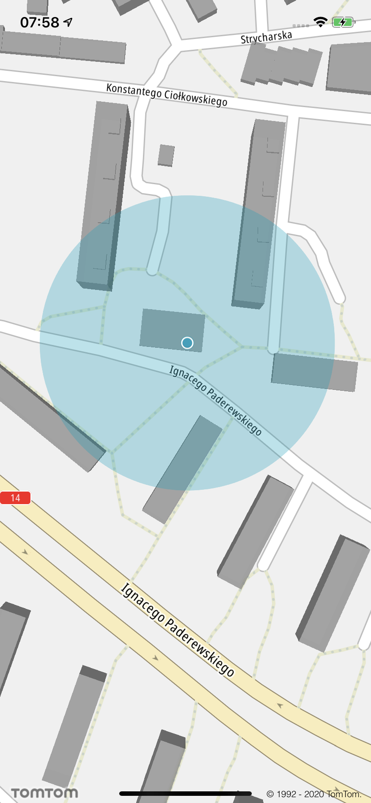
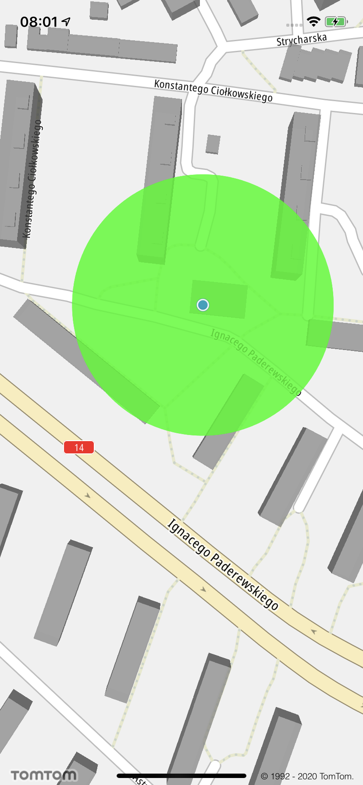
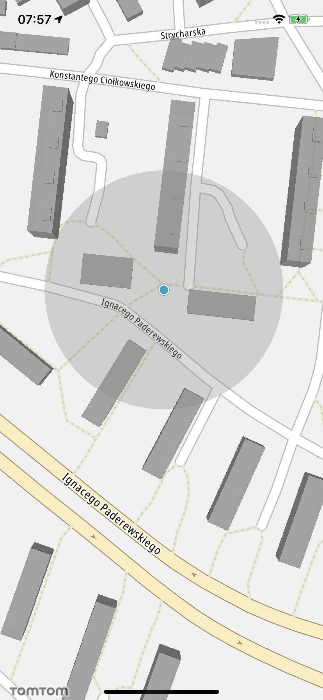
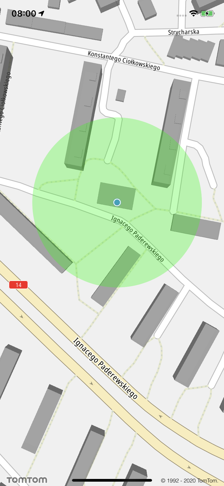

<a
  href="#"
  style={{ display: 'block', margin: '0', padding: '0' }}
  name="_custom_gps_indicator"
></a>

The Maps SDK provides the ability to change the `GPS Indicator` inaccuracy area color at runtime.
Default behavior of the indicator consists of two states: active, when GPS signal is accurate, and
inactive (dimmed).

To change both radius colors, first you need to obtain the current `GPS Indicator` by using the
following method:

<Code>

```swift
let gpsIndicator = mapview.trackingManager.currentPosition as? TTCurrentPositionTrackingObject
```

```objectivec
TTCurrentPositionTrackingObject *gpsIndicator = self.mapView.trackingManager.currentPosition
```

</Code>

Use the following code to adjust a color of the active GPS indicator:

<Code>

```swift
gpsIndicator.setInaccuracyAreaColor(GPS_ACTIVE_RADIUS_COLOR)
```

```objectivec
[gpsIndicator setInaccuracyAreaColor:GPS_ACTIVE_RADIUS_COLOR];
```

</Code>

<table>
  <tbody>
    <tr>
      <td>
        <ContentWrapper maxWidth="350px" objectFit="contain">
          <p>
            
          </p>
        </ContentWrapper>
        <p>Default GPS indicator active</p>
      </td>
      <td>
        <ContentWrapper maxWidth="350px" objectFit="contain">
          <p>
            
          </p>
        </ContentWrapper>
        <p>Custom GPS indicator active</p>
      </td>
    </tr>
  </tbody>
</table>

Use the following code to adjust a color of the inactive GPS indicator:

<Code>

```swift
gpsIndicator.setDimmedInaccuracyAreaColor(GPS_INACTIVE_RADIUS_COLOR)
```

```objectivec
[gpsIndicator setDimmedInaccuracyAreaColor:GPS_INACTIVE_RADIUS_COLOR];
```

</Code>

<table>
  <tbody>
    <tr>
      <td>
        <ContentWrapper maxWidth="350px" objectFit="contain">
          <p>
            
          </p>
        </ContentWrapper>
        <p>Default GPS indicator inactive</p>
      </td>
      <td>
        <ContentWrapper maxWidth="350px" objectFit="contain">
          <p>
            
          </p>
        </ContentWrapper>
        <p>Custom GPS indicator inactive</p>
      </td>
    </tr>
  </tbody>
</table>

Use the following code to set the GPS indicator to inactive:

<Code>

```swift
gpsIndicator.setDimmed(true)
```

```objectivec
[gpsIndicator setDimmed:YES];
```

</Code>