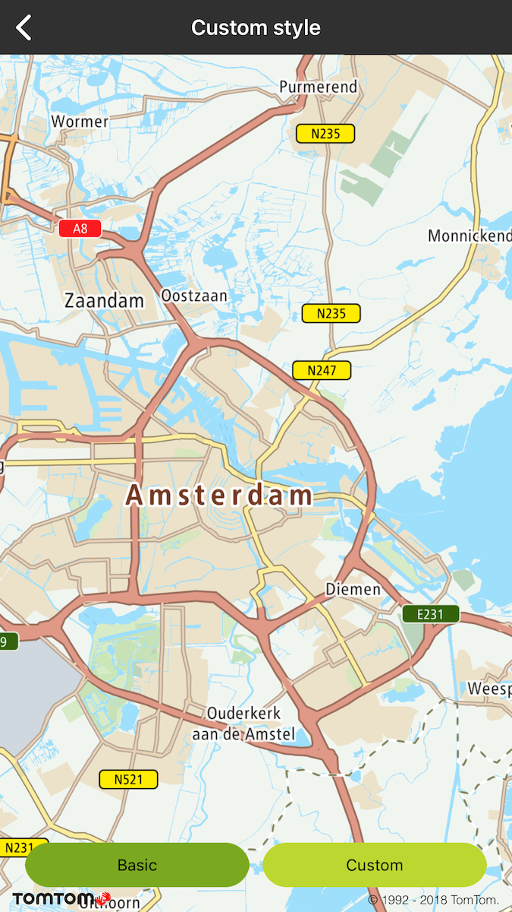
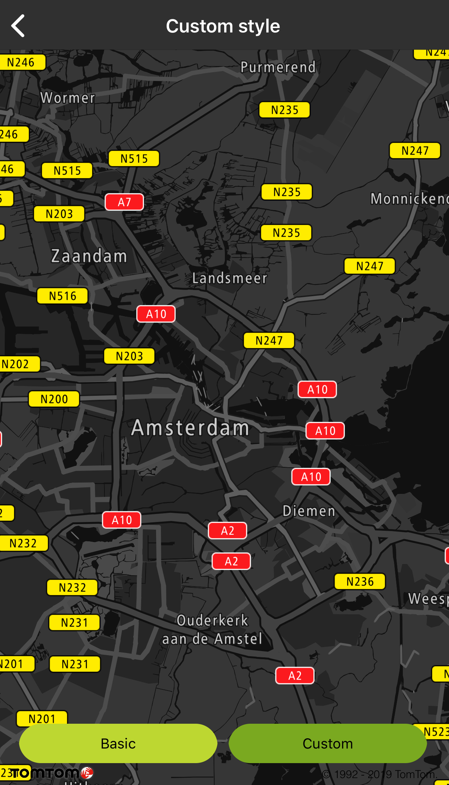

<a
  href="#"
  style={{ display: 'block', margin: '0', padding: '0' }}
  name="Map-Custom-styles"
></a>

Allow your user to create and provide the map with one or more custom styles for vector map tiles.

**Modify the default Example style**

The best way to create a custom style is to modify the default Example style for vector maps using
the Maputnik editor. You can find the JSON map style in the resources directory. The tutorial on how
to modify the style is available for all Maps SDKs (for Android, iOS, and Web)
at [Creating custom vector map style](https://developer.Example.com/maps-sdk-web/tutorials-advanced/creating-custom-vector-map-style). Note that after step 9 of the linked tutorial, you need to save the JSON file and place it in the
resources directory of your app project.

**Provide your style** You can provide an external map style file on the server and provide the URL.
Sprites and fonts should be stored locally in the application. Currently, we don’t support loading
resources and fonts from a server.

**Sample use case:** You want to display a night-styled map at night or in a tunnel.

To change the style of the map:

<Code>

```swift
let customStyle = Bundle.main.path(forResource: "style", ofType: "json")
mapView.setStylePath(customStyle)
mapView.applyInvertedLogo()
```

```objectivec
NSString *customStyle = [NSBundle.mainBundle pathForResource:@"style" ofType:@"json"]
[self.mapView setStylePath:customStyle];
[self.mapView applyInvertedLogo];
```

</Code>

<table>
  <tbody>
    <tr>
      <td>
        <ContentWrapper maxWidth="350px" objectFit="contain">
          <p>
            
          </p>
        </ContentWrapper>
        <p>Basic style</p>
      </td>
      <td>
        <ContentWrapper maxWidth="350px" objectFit="contain">
          <p>
            
          </p>
        </ContentWrapper>
        <p>Night custom style</p>
      </td>
    </tr>
  </tbody>
</table>