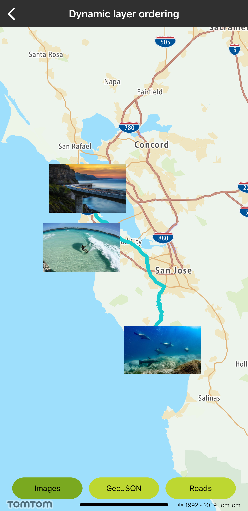
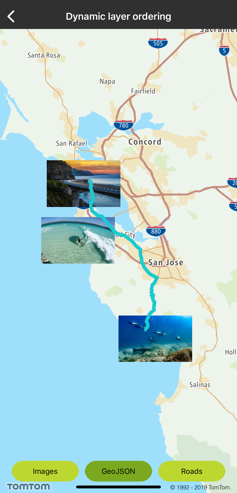
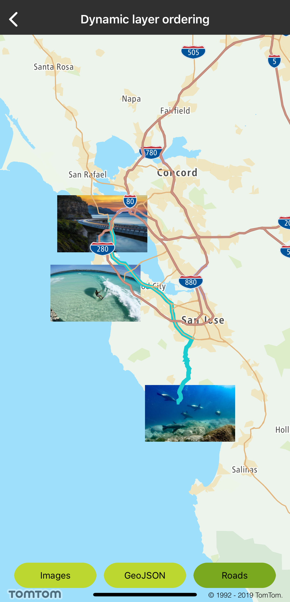

You can dynamically change the z-order of the layers on the map to make the layers important to your
use case visible on top of other layers.

**Sample use case :** You placed images on the map in your app but your users can bring the route
and the road network on top of the images to see what the route looks like in detail.

<table>
  <tbody>
    <tr>
      <td>
        <ContentWrapper maxWidth="350px" objectFit="contain">
          

            
          

        </ContentWrapper>
        
Images

        <Code>
          <pre class="swift">
            <code class="language-swift">
              {`let layersImages = currentStyle.getLayersByRegex("img-id.*")
layersImages.forEach &#123; currentStyle.moveLayer(toFront: sh) &#125;`}
            </code>
          </pre>
          <pre class="obj-c">
            <code class="language-obj-c">
              {`NSArray&lt;TTMapLayer *&gt; *layersImages = [self.currentStyle getLayersByRegex:@"img-id.*"]; for (TTMapLayer *layer in layersImages) &#123;
[self.currentStyle moveLayerToFront:layer]; &#125;`}
            </code>
          </pre>
        </Code>
      </td>
    </tr>
    <tr>
      <td>
        <ContentWrapper maxWidth="350px" objectFit="contain">
          

            
          

        </ContentWrapper>
        
GeoJSON

        <Code>
          <pre class="swift">
            <code class="language-swift">
              {`let layerRoute = currentStyle.getLayerByID("layer-line-id")
currentStyle.moveLayer(toFront: layerRoute!)`}
            </code>
          </pre>
          <pre class="obj-c">
            <code class="language-obj-c">
              {`TTMapLayer *layerRoute = [self.currentStyle getLayerByID:@"layer-line-id"];
[self.currentStyle moveLayerToFront:layerRoute]; break;`}
            </code>
          </pre>
        </Code>
      </td>
    </tr>
    <tr>
      <td>
        <ContentWrapper maxWidth="350px" objectFit="contain">
          

            
          

        </ContentWrapper>
        
Roads

        <Code>
          <pre class="swift">
            <code class="language-swift">
              {`let layersRoads = currentStyle.getLayersBySourceLayerRegexs([".*[rR]oad.*", ".*[mM]otorway.*"])
layersRoads.forEach &#123; currentStyle.moveLayer(toFront: sh) &#125;`}
            </code>
          </pre>
          <pre class="obj-c">
            <code class="language-obj-c">
              {`NSArray&lt;TTMapLayer *&gt; *layersRoads = [self.currentStyle getLayersBySourceLayerRegexs:[NSArray arrayWithObjects:@".*[rR]oad.*", @".*[mM]otorway.*", nil]]; for (TTMapLayer *layer in layersRoads) &#123;
[self.currentStyle moveLayerToFront:layer]; &#125;`}
            </code>
          </pre>
        </Code>
      </td>
    </tr>
    <tr>
      <td></td>
    </tr>
  </tbody>
</table>