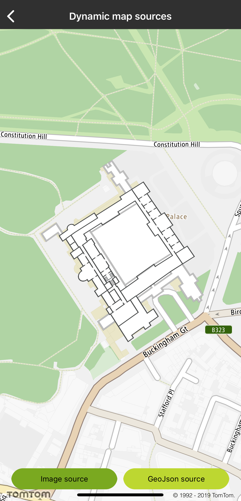
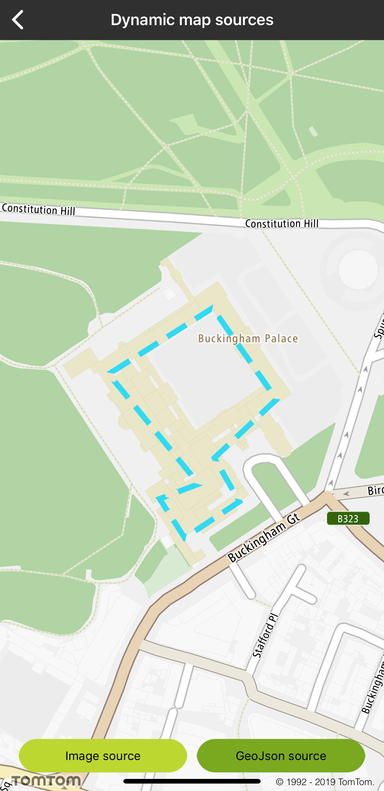

Add layers and sources (e.g., GeoJSON, images) to the map in real time. This will allow you to
dynamically change a map’s style in response to user interaction and context.

**Sample use case 1:** You want to add extra layers with building plans from your custom source.

**Sample use case 2:** You want to dynamically modify source parameters (e.g., the URL).

The Maps SDK for iOS allows you to create a layer and dynamically add it to the style, as shown in
the following examples:

<Code>

```swift
let layerMap = TTMapLayer.create(withStyleJSON: layerJSON, withMap: mapView)
currentStyle.add(layerMap!)
```

```objectivec
TTMapLayer *layerMap = [TTMapLayer createWithStyleJSON:layerJSON withMap:self.mapView]
[self.currentStyle addLayer:layerMap];
```

</Code>

To create an Image source:

```swift
let image = UIImage(named: "buckingham_palace")
let quad = TTLatLngQuad(topLeft: TTCoordinate.BUCKINGHAM_PALACE_TOP_LEFT(),
                        withTopRight: TTCoordinate.BUCKINGHAM_PALACE_TOP_RIGHT(),
                        withBottomRight: TTCoordinate.BUCKINGHAM_PALACE_BOTTOM_LEFT(),
                        withBottomLeft: TTCoordinate.BUCKINGHAM_PALACE_BOTTOM_RIGHT())
let sourceMap = TTMapImageSource.create(withID: IMG_SOURCE, image: image!, coordinates: quad)
currentStyle.add(sourceMap)
```

    let path = Bundle.main.path(forResource: "layer_raster", ofType: "json")
    let layerJSON = try! String(contentsOfFile: path!, encoding: .utf8)
    let layerMap = TTMapLayer.create(withStyleJSON: layerJSON, withMap: mapView)
    currentStyle.add(layerMap!)

```objectivec
UIImage *image = [UIImage imageNamed:@"buckingham_palace"];
TTLatLngQuad *quad = [[TTLatLngQuad alloc] initWithTopLeft:TTCoordinate.BUCKINGHAM_PALACE_TOP_LEFT withTopRight:TTCoordinate.BUCKINGHAM_PALACE_TOP_RIGHT withBottomRight:TTCoordinate.BUCKINGHAM_PALACE_BOTTOM_LEFT withBottomLeft:TTCoordinate.BUCKINGHAM_PALACE_BOTTOM_RIGHT];
TTMapImageSource *sourceMap = [TTMapImageSource createWithID:IMG_SOURCE image:image coordinates:quad];
[self.currentStyle addSource:sourceMap];
```

    NSString *path = [[NSBundle mainBundle] pathForResource:@"layer_raster" ofType:@"json"];
    NSString *layerJSON = [NSString stringWithContentsOfFile:path encoding:NSUTF8StringEncoding error:nil];
    TTMapLayer *layerMap = [TTMapLayer createWithStyleJSON:layerJSON withMap:self.mapView];
    [self.currentStyle addLayer:layerMap];

To hide a source or a layer from the style:

<Code>

```swift
let layerMap = TTMapLayer.create(withStyleJSON: layerJSON, withMap: mapView)
currentStyle.add(layerMap!)
```

```objectivec
TTMapLayer *layerMap = [TTMapLayer createWithStyleJSON:layerJSON withMap:self.mapView];
[self.currentStyle addLayer:layerMap];
```

</Code>

The Maps SDK for iOS makes it possible to select a visible feature within a GeoJSON layer. As a
result you will get an object feature’s collection.

<Code>

```swift
let geoJSONFeatures = mapView.features(at: tap, inStyleLayerIdentifiers: [GEO_LAYER_ID])
```

```objectivec
NSArray *geoJSONFeatures = [self.mapView featuresAtPoint:tap inStyleLayerIdentifiers:[NSSet setWithObject:GEO_LAYER_ID]].features;
```

</Code>

<table>
  <tbody>
    <tr>
      <td>
        <ContentWrapper maxWidth="350px" objectFit="contain">
          <p>
            
          </p>
        </ContentWrapper>
        <p>Custom image source</p>
      </td>
      <td>
        <ContentWrapper maxWidth="350px" objectFit="contain">
          <p>
            
          </p>
        </ContentWrapper>
        <p>Custom GeoJSON source</p>
      </td>
    </tr>
  </tbody>
</table>