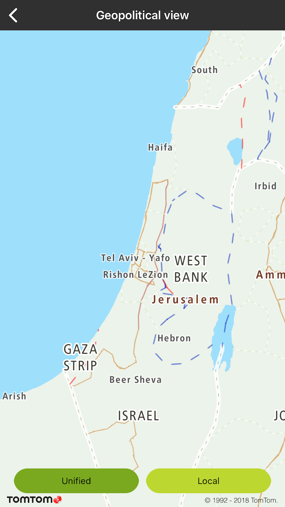
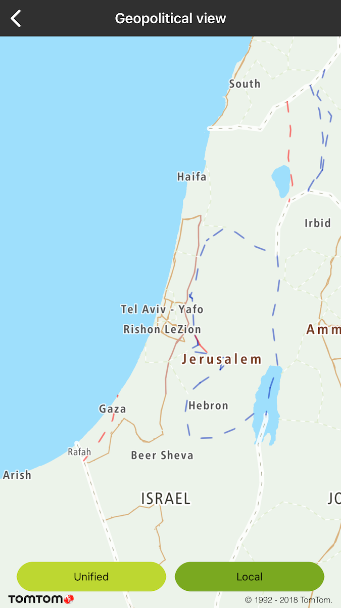

Allow your user to see the map boundaries based on international or local country views. The local
view is available for a particular area of the world that is considered as disputed by two or more
countries. As a result, each country can show this area as a part of his country. List of the
supported views can be found
at [Default View Mapping](/map-display-api/documentation/vector/tile#default-view-mapping).

**Sample use case:** You want to display the local map view for Israel.

To change the geopolitical view for the map:

<table>
  <tbody>
    <tr>
      <td>
        <ContentWrapper maxWidth="350px" objectFit="contain">
          

            
          

        </ContentWrapper>
        
Israel international view

        <Code>
          <pre class="swift">
            <code class="language-swift">{'mapView.setGeopoliticalViewLocal("Unified")'}</code>
          </pre>
          <pre class="obj-c">
            <code class="language-obj-c">
              {'[self.mapView setGeopoliticalViewLocal:@"Unified"]'}
            </code>
          </pre>
        </Code>
      </td>
      <td>
        <ContentWrapper maxWidth="350px" objectFit="contain">
          

            
          

        </ContentWrapper>
        
Israel local view

        <Code>
          <pre class="swift">
            <code class="language-swift">{'mapView.setGeopoliticalViewLocal("IL")'}</code>
          </pre>
          <pre class="obj-c">
            <code class="language-obj-c">{'[self.mapView setGeopoliticalViewLocal:@"IL"];'}</code>
          </pre>
        </Code>
      </td>
    </tr>
  </tbody>
</table>