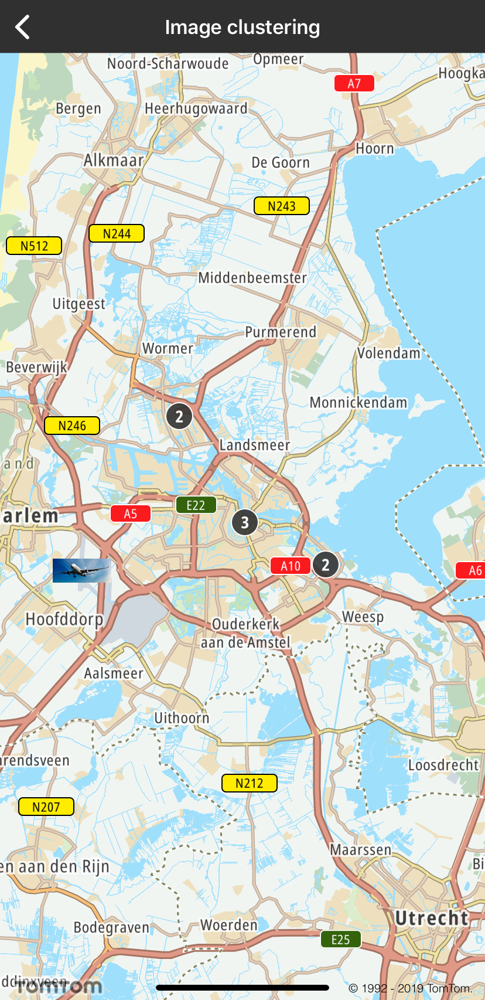

<a
  href="#"
  style={{ display: 'block', margin: '0', padding: '0' }}
  name="annotations-clustering"
></a>

Allow your users to cluster image annotations for better visualization. By default, clustering is
disabled.

**Sample use case:** You want to cluster images in the `FeatureCollection` type provided in GeoJSON.

To enable clustering you need to set:

- `"cluster": true`

and set the desired cluster radius:

- `"clusterRadius": 70`

Here you can see what the `TTMapSource` GeoJSON style file with enabled clustering looks like:

```shell
"IC-app-test-source": {
    "type": "geojson",
    "cluster": true,
    "clusterRadius": 70,
    "data": {
        "type": "FeatureCollection",
        "features": [
            {
                "type": "Feature",
                "geometry": {
                    "type": "Point",
                    "coordinates": [
                        4.710759,
                        52.340415
                    ]
                },
                "properties": {
                    "icon": "jet_airplane_landing"
                }
            }
        ]
    }
}
```

You also need to add the new `TTMapStyle` to the current style, that defines the behaviour when your
features do not fulfill clustering contraints.

```shell
{
    "id": "IC-app-test-layer",
    "filter": [
        "!has",
        "point_count"
    ],
    "type": "symbol",
    "layout": {
        "icon-image": "{icon}",
        "icon-allow-overlap": true
    },
    "source": "IC-app-test-source"
}
```

Please also remember if the feature `"properties": {"icon": "jet_airplane_landing"}` is set, you
need to add the image to `TTMapStyle` as follows:

<Code>

```swift
let jetAirPlainLanding = UIImage(named: "jet_airplane_landing")
currentStyle.add(jetAirPlainLanding!, withID: "jet_airplane_landing")
```

```objectivec
UIImage *jetAirPlainLanding = [UIImage imageNamed:@"jet_airplane_landing"]
[self.currentStyle addImage:jetAirPlainLanding withID:@"jet_airplane_landing"];
```

</Code>

**Sample use case:** You want to add a background overlay under the cluster size.

You need to create `TTMapLayer` with the given content:

```shell
{
    "id": "IC-app-test-layer-cluster",
    "filter": [
        "has",
        "point_count"
    ],
    "type": "symbol",
    "layout": {
        "icon-image": "ic_cluster",
        "icon-allow-overlap": true,
        "icon-ignore-placement": true
    },
    "source": "IC-app-test-source"
}
```

and add it to current map style.

**Sample use case:** You want to customize the cluster symbol text color, text size, and offset.

You need to define `TTMapLayer` with the given JSON content:

```shell
{
    "filter": [
        "has",
        "point_count"
    ],
    "id": "IC-app-test-layer-symbol-count",
    "source": "IC-app-test-source",
    "type": "symbol",
    "layout": {
        "text-field": "{point_count}",
        "text-font": [
            "Noto-Bold"
        ],
        "text-size": 14,
        "text-offset": [
            0.0,
            0.0
        ]
    },
    "paint": {
        "text-color": "#FFFFFF"
    }
}
```

and add it to current map style.

<a
  href="#"
  style={{ display: 'block', margin: '0', padding: '0' }}
  name="_code_example"
></a>

## Code Example

Here you can check what an example implementation may look like:

- Adding a map source

<Code>

```swift
let path = Bundle.main.path(forResource: "ic_app_test_source", ofType: "json")
let geojsonJSON = try! String(contentsOfFile: path!, encoding: .utf8)
let sourceMap = TTMapSource.create(withSourceJSON: geojsonJSON)
currentStyle.add(sourceMap!)
```

```objectivec
NSString *path = [[NSBundle mainBundle] pathForResource:@"ic_app_test_source" ofType:@"json"];
NSString *geojsonJSON = [NSString stringWithContentsOfFile:path encoding:NSUTF8StringEncoding error:nil];
TTMapSource *sourceMap = [TTMapSource createWithSourceJSON:geojsonJSON];
[self.currentStyle addSource:sourceMap];
```

</Code>

- Adding a map layer with a given file name

<Code>

```swift
guard let path = Bundle.main.path(forResource: jsonStyleName, ofType: "json") else {
    print("Failed to find path for name: \(jsonStyleName).json")
    return
}
guard let layerContentJSONString = try? String(contentsOfFile: path, encoding: .utf8) else {
    print("Failed to read file at path: \(path)")
    return
}
guard let mapLayer = TTMapLayer.create(withStyleJSON: layerContentJSONString, withMap: map) else {
    print("Failed to create TTMapLayer from: \(layerContentJSONString)")
    return
}
style.add(mapLayer)
```

```objectivec
NSString *path = [[NSBundle mainBundle] pathForResource:jsonStyleName ofType:@"json"];
NSString *layerContentJSONString = [NSString stringWithContentsOfFile:path encoding:NSUTF8StringEncoding error:nil];
TTMapLayer *mapLayer = [TTMapLayer createWithStyleJSON:layerContentJSONString withMap:map];
[style addLayer:mapLayer];
```

</Code>

<table>
  <tbody>
    <tr>
      <td>
        <ContentWrapper maxWidth="350px" objectFit="contain">
          <p>
            
          </p>
        </ContentWrapper>
        <p>Clusters and images</p>
      </td>
    </tr>
    <tr>
      <td></td>
    </tr>
  </tbody>
</table>