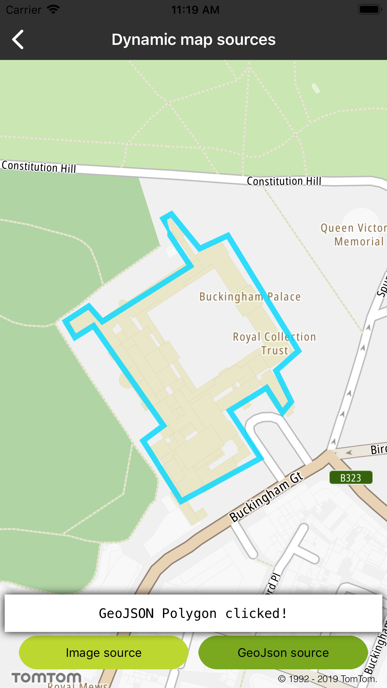

Retrieve data of a feature (e.g., ID, geometry) from layers in the style by querying for rendered
features at a screen point, coordinates, or the screen rect within a specified layer in the style.

**Sample use case 1:** You want to display information if the user clicks on a layer that you added.

**Sample use case 2:** You want to return all visible features in a viewport.

To create a layer and dynamically add it to the style:

<Code>

```swift
let layerMap = TTMapLayer.create(withStyleJSON: layerJSON, withMap: mapView)
currentStyle.add(layerMap!)
```

```objectivec
TTMapLayer *layerMap = [TTMapLayer createWithStyleJSON:layerJSON withMap:self.mapView]
[self.currentStyle addLayer:layerMap];
```

</Code>

To query the style for specific layer features at a given coordinates call:

<Code>

```swift
let geoJSONFeatures = mapView.features(atCoordinates: coordinate, inStyleLayerIdentifiers: ["IL-test-layer-outline"])
```

```objectivec
TTGeoJSONFeatureCollection *geoJSONFeatures = [self.mapView featuresAtCoordinates:coordinate inStyleLayerIdentifiers:[NSSet setWithObject:@"IL-test-layer-outline"]];
```

</Code>

To query the style for specific layer features in a given screen rect e.g., viewport:

<Code>

```swift
let geoJSONFeatures = mapView.features(atScreenRect: mapView.bounds, inStyleLayerIdentifiers: ["IL-test-layer-outline"])
```

```objectivec
TTGeoJSONFeatureCollection *geoJSONFeatures = [self.mapView featuresAtScreenRect:self.mapView.bounds inStyleLayerIdentifiers:[NSSet setWithObject:@"IL-test-layer-outline"]];
```

</Code>

<table>
  <tbody>
    <tr>
      <td>
        <ContentWrapper maxWidth="350px" objectFit="contain">
          <p>
            
          </p>
        </ContentWrapper>
        <p>GeoJSON polygon clicked</p>
      </td>
      <td>
        <ContentWrapper maxWidth="350px" objectFit="contain">
          <p>
            
          </p>
        </ContentWrapper>
        <p>Features in viewport</p>
      </td>
    </tr>
  </tbody>
</table>