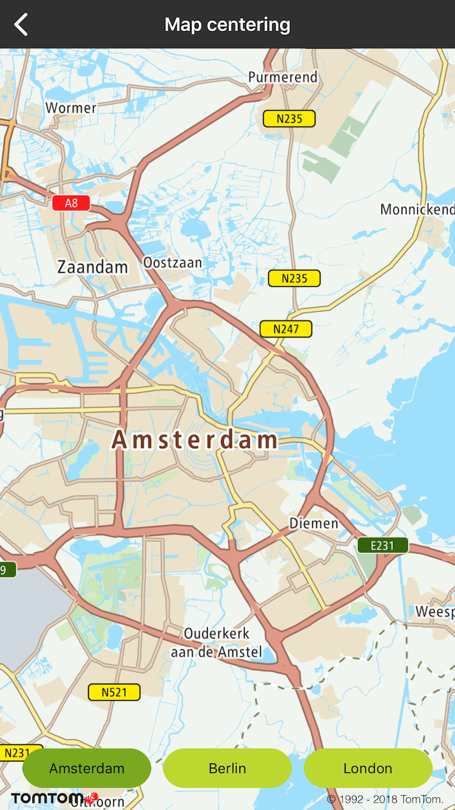
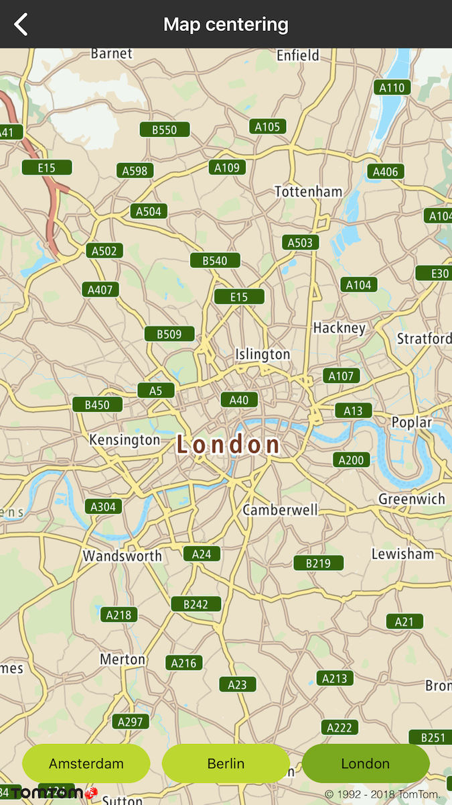

Center the map in your mobile app either at the current coordinates or any other location at the
zoom level of your choice.

**Sample use case**: You want to display the maps for selected cities in specific zoom levels. Your
users should be able to easily switch between different locations.

Use the following code snippets in your app to display maps of different locations (in this case,
the current location and the Example offices in Amsterdam and Berlin).

The example shows how to center the map on Amsterdam using `TTCameraPositionBuilder` and
its `create` method:

<Code>

```swift
let cameraPosition = TTCameraPositionBuilder.create(withCameraPosition: TTCoordinate.AMSTERDAM()).withZoom(10).build()
mapView.setCameraPosition(cameraPosition)
```

```objectivec
TTCameraPosition *cameraPosition = [[[TTCameraPositionBuilder createWithCameraPosition:[TTCoordinate AMSTERDAM]] withZoom:10] build]
[self.mapView setCameraPosition:cameraPosition];
```

</Code>

The example shows how to center the map on Amsterdam using `TTCameraBoundingBoxBuilder` and
its `create` method:

<Code>

```swift
let boundingBox = TTBoundingBox(topLeft: TTCoordinate.AMSTERDAM_BOUNDINGBOX_LT(), withBottomRight: TTCoordinate.AMSTERDAM_BOUNDINGBOX_RB())
let cameraPosition = TTCameraBoundingBoxBuilder.create(with: boundingBox!).build()
mapView.setCameraPosition(cameraPosition)
```

```objectivec
TTBoundingBox *boundingBox = [[TTBoundingBox alloc] initWithTopLeft:[TTCoordinate AMSTERDAM_BOUNDINGBOX_LT] withBottomRight:[TTCoordinate AMSTERDAM_BOUNDINGBOX_RB]];
TTCameraBoundingBox *cameraPosition = [[TTCameraBoundingBoxBuilder createWithBoundingBox:boundingBox] build];
[self.mapView setCameraPosition:cameraPosition];
```

</Code>

<table>
  <tbody>
    <tr>
      <td>
        <ContentWrapper maxWidth="350px" objectFit="contain">
          <p>
            
          </p>
        </ContentWrapper>
        <p>Map centered on Amsterdam with 10 zoom level</p>
      </td>
      <td>
        <ContentWrapper maxWidth="350px" objectFit="contain">
          <p>
            
          </p>
        </ContentWrapper>
        <p>Map centered on GPS with 10 zoom level</p>
      </td>
    </tr>
  </tbody>
</table>