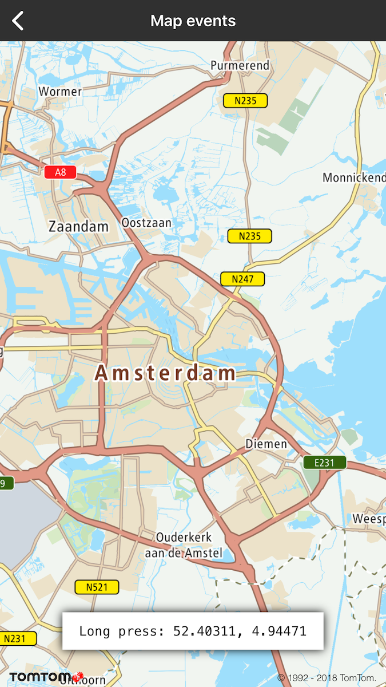
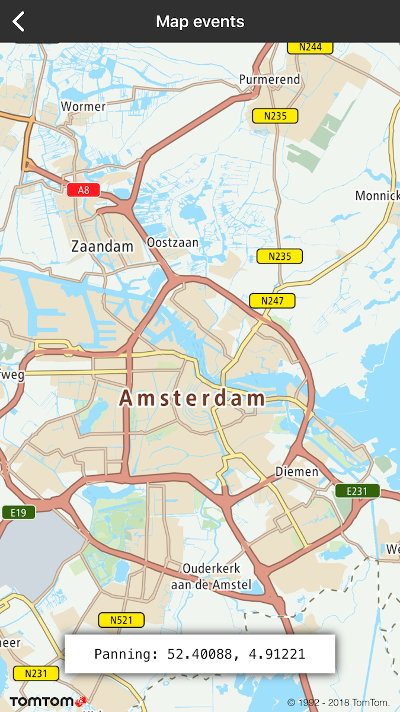

Implement any action you need to be triggered on one of the following map events:

- Panning
- Single press
- Double press
- Long press

To receive events you need to register **id&ltTTMapViewDelegate&gt;** on map.

**Sample use case**: In your app, users invoke one behavior with a single press and another with a
long press.

Use the following code snippets in your app to catch map events. In this example, the action is
simply to display a toast with latitude and longitude on each map event. Of course, you can
implement other cool features instead.

<Code>

```swift
func mapView(_: TTMapView, didDoubleTap coordinate: CLLocationCoordinate2D) {
```

```objectivec
- (void)mapView:(TTMapView *)mapView didDoubleTap:(CLLocationCoordinate2D)coordinate {
```

</Code>
<Code>

```swift
func mapView(_: TTMapView, didSingleTap coordinate: CLLocationCoordinate2D) {
```

```objectivec
- (void)mapView:(TTMapView *)mapView didSingleTap:(CLLocationCoordinate2D)coordinate {
```

</Code>
<Code>

```swift
func mapView(_: TTMapView, didLongPress coordinate: CLLocationCoordinate2D) {
```

```objectivec
- (void)mapView:(TTMapView *)mapView didLongPress:(CLLocationCoordinate2D)coordinate {
```

</Code>
<Code>

```swift
func mapView(_: TTMapView, didPanning coordinate: CLLocationCoordinate2D, in state: TTMapPanningState) {
```

```objectivec
- (void)mapView:(TTMapView *)mapView didPanning:(CLLocationCoordinate2D)coordinate inState:(TTMapPanningState)state {
```

</Code>
<Code>

```swift
func mapView(_: TTMapView, onCenterStatusChanged _: TTMapCenteredState) {
```

```objectivec
- (void)mapView:(TTMapView *)mapView onCenterStatusChanged:(TTMapCenteredState)centeredState {
```

</Code>
<Code>

```swift
func mapView(_: TTMapView, onCameraChanged _: TTCameraPosition, with _: TTMapCameraChangeState) {
```

```objectivec
- (void)mapView:(TTMapView *)mapView onCameraChanged:(TTCameraPosition *)cameraPosition withState:(TTMapCameraChangeState)state {
```

</Code>

In this example you will see that a Toast with the latitude and longitude of a point that was
clicked on the map, but you can utilize this information in your own manner.

<table>
  <tbody>
    <tr>
      <td>
        <ContentWrapper maxWidth="350px" objectFit="contain">
          <p>
            
          </p>
        </ContentWrapper>
        <p>Receive callbacks after the map panning</p>
      </td>
      <td>
        <ContentWrapper maxWidth="350px" objectFit="contain">
          <p>
            
          </p>
        </ContentWrapper>
        <p>Receive callbacks after the map panning</p>
      </td>
    </tr>
    <tr>
      <td>
        <ContentWrapper maxWidth="350px" objectFit="contain">
          <p>
            
          </p>
        </ContentWrapper>
        <p>Receive callbacks after the map panning</p>
      </td>
      <td></td>
    </tr>
  </tbody>
</table>

**Enable and disable gestures**

You can disable gestures such as zooming, scrolling, and rotating in your application by setting up
an integer mask on properties as shown in the following examples:

Disable zooming gesture

<Code>

```swift
self.mapView.disableGesturesMask = TTOptionGesturesDisableZoom;
```

```objectivec
self.mapView.disableGesturesMask = .zoom;
```

</Code>

Disable the rotating gesture

<Code>

```swift
self.mapView.disableGesturesMask = .rotate;
```

```objectivec
self.mapView.disableGesturesMask = TTOptionGesturesDisableRotate;
```

</Code>

Disable the scrolling gesture

<Code>

```swift
self.mapView.disableGesturesMask = .scroll;
```

```objectivec
self.mapView.disableGesturesMask = TTOptionGesturesDisableScroll;
```

</Code>

You can turn off more than one gesture by setting up the mask on properties as shown in the
following examples:

<Code>

```swift
self.mapView.disableGesturesMask = [.scroll, .zoom]
```

```objectivec
self.mapView.disableGesturesMask = TTOptionGesturesDisableScroll | TTOptionGesturesDisableZoom;
```

</Code>

If you want to enable gestures, setup the integer mask on a property as shown in the following
examples:

<Code>

```swift
self.mapView.disableGesturesMask = .none;
```

```objectivec
self.mapView.disableGesturesMask = TTOptionGesturesDisableNone;
```

</Code>