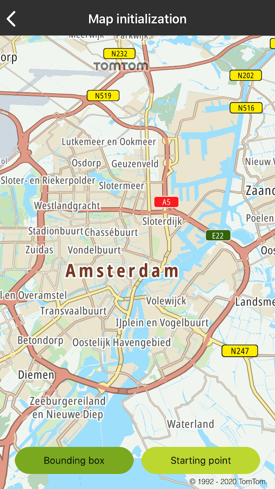
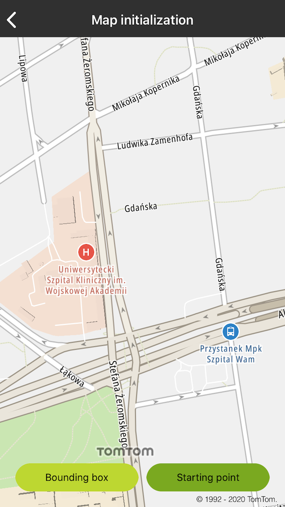

<a
  href="#"
  style={{ display: 'block', margin: '0', padding: '0' }}
  name="map-with-configuration"
></a>

The Maps SDK for iOS allows you to initialize the map with a previously setup configuration. For
this purpose, use the init method `TTMapView` with frame and mapConfiguration.
The `TTMapConfiguration` object allows you to set initial map values with the following method:

- viewportTransform: The `TTViewportTransform` object allows you to set an initial viewport
  transform for the map configuration.
- mapStyleConfiguration: The `TTStyleConfiguration` object allows you to add your own style
  configuration.
- ExampleLogoPosition: The `TTLogoPosition` object allows you to place the logo on the map where you
  wish by using enumerations containing positions and Offset information.

Use the following code snippets in your app to display maps of different locations (in this case,
the current location by placing a bounding box on Amsterdam and by centering the point to the Example
office in Łódź).

Centering the map on load using bounding box:

<Code>

```swift
let transform = TTCenterOnGeometryBuilder.create(withGeometry: [
    .init(TTCoordinate.AMSTERDAM_BOUNDINGBOX_LT()),
    .init(TTCoordinate.AMSTERDAM_BOUNDINGBOX_RT()),
    .init(TTCoordinate.AMSTERDAM_BOUNDINGBOX_LB()),
    .init(TTCoordinate.AMSTERDAM_BOUNDINGBOX_RB()),
], withPadding: .zero)
    .withPitch(30)
    .withBearing(-90)
    .build()
let config = TTMapConfigurationBuilder.create().withViewportTransform(transform).withMapKey(Key.Map).withTrafficKey(Key.Traffic)
```

```objectivec
NSArray *arrayCoordinates = [NSArray
    arrayWithObjects:[[CLLocation alloc] init:[TTCoordinate AMSTERDAM_BOUNDINGBOX_LT]], [[CLLocation alloc] init:[TTCoordinate AMSTERDAM_BOUNDINGBOX_RT]], [[CLLocation alloc] init:[TTCoordinate AMSTERDAM_BOUNDINGBOX_LB]], [[CLLocation alloc] init:[TTCoordinate AMSTERDAM_BOUNDINGBOX_RB]], nil]
TTCenterOnGeometry *transform = [[[[TTCenterOnGeometryBuilder createWithGeometry:arrayCoordinates withPadding:UIEdgeInsetsZero] withPitch:30] withBearing:-90] build];
TTMapConfigurationBuilder *config = [[[[TTMapConfigurationBuilder createBuilder] withViewportTransform:transform] withMapKey:Key.Map] withTrafficKey:Key.Traffic];
```

</Code>

Centering the map on load using center on point:

<Code>

```swift
let builder = TTMapConfigurationBuilder.create().withTrafficKey(Key.Traffic).withMapKey(Key.Map)
let transform = TTCenterOnPointBuilder.create(withCenter: TTCoordinate.LODZ_ZEROMSKIEGO()).withZoom(15).build()
let config = builder.withViewportTransform(transform)
```

```objectivec
TTCenterOnPoint *transform = [[[TTCenterOnPointBuilder createWithCenter:[TTCoordinate LODZ_ZEROMSKIEGO]] withZoom:15] build];
TTMapConfigurationBuilder *config = [[[[TTMapConfigurationBuilder createBuilder] withViewportTransform:transform] withMapKey:Key.Map] withTrafficKey:Key.Traffic];
```

</Code>

You can also set the positions of the Example logo, but remember that the logo must fully fit into
the bounds of mapview. Otherwise there is an exception due to an error in displaying the logo on the
map.

<Code>

```swift
let position = TTLogoPosition(verticalPosition: .bottom, horizontalPosition: .right, verticalOffset: -65, horizontalOffset: -170)
config.withExampleLogoPosition(position)
```

```objectivec
TTLogoPosition *position = [[TTLogoPosition alloc] initWithVerticalPosition:bottom horizontalPosition:right verticalOffset:-65 horizontalOffset:-170];
[config withExampleLogoPosition:position];
```

</Code>

Use the configuration object to initialize the map with the following code:

<Code>

```swift
let style = TTMapStyleDefaultConfiguration()
config.withMapStyleConfiguration(style)
map = TTMapView(mapConfiguration: config.build())
```

```objectivec
TTMapStyleDefaultConfiguration *style = [[TTMapStyleDefaultConfiguration alloc] init];
[config withMapStyleConfiguration:style];
self.map = [[TTMapView alloc] initWithMapConfiguration:[config build]];
```

</Code>

<table>
  <tbody>
    <tr>
      <td>
        <ContentWrapper maxWidth="350px" objectFit="contain">
          <p>
            
          </p>
        </ContentWrapper>
        <p>Bounding Box</p>
      </td>
      <td>
        <ContentWrapper maxWidth="350px" objectFit="contain">
          <p>
            
          </p>
        </ContentWrapper>
        <p>Starting point</p>
      </td>
    </tr>
  </tbody>
</table>