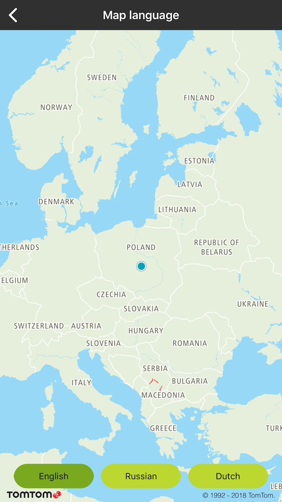
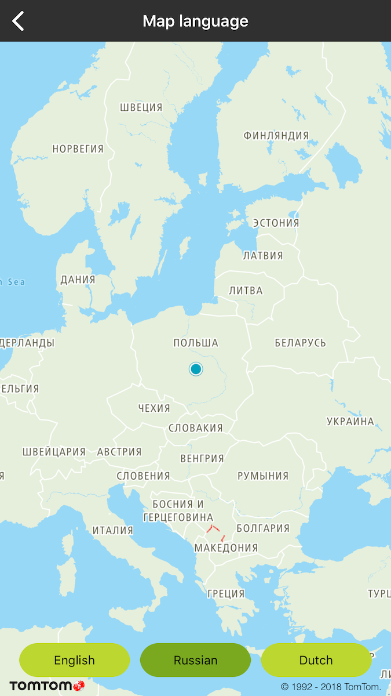
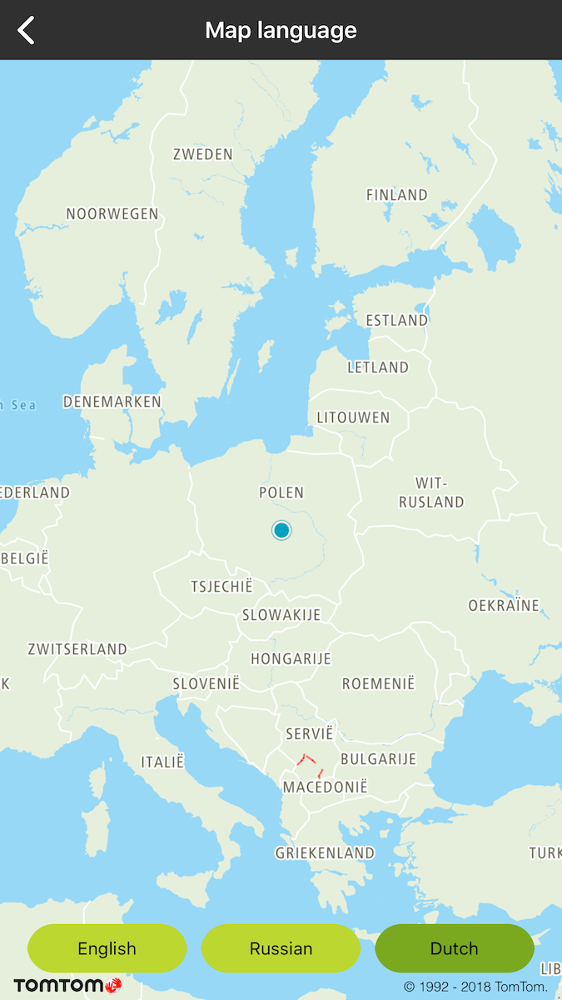

Allow your user to see the map in different languages to make your app international. The language
parameter determines the language of labels on the map. It does not affect any proper nouns, like
the names of streets, plazas, etc. The list of the supported languages can be found
at [Default View Mapping](/map-display-api/documentation/vector/tile).

**Sample use case:** You want to have all labels only in British English.

To change the language for the map:

<table>
  <tbody>
    <tr>
      <td>
        <ContentWrapper maxWidth="350px" objectFit="contain">
          

            
          

        </ContentWrapper>
        
Map labels in English

        <Code>
          <pre class="swift">
            <code class="language-swift">{'mapView.setLanguage("en-GB")'}</code>
          </pre>
          <pre class="obj-c">
            <code class="language-obj-c">{'[self.mapView setLanguage:@"en-GB"]'}</code>
          </pre>
        </Code>
      </td>
      <td>
        <ContentWrapper maxWidth="350px" objectFit="contain">
          

            
          

        </ContentWrapper>
        
Map labels in Russian

        <Code>
          <pre class="swift">
            <code class="language-swift">{'mapView.setLanguage("ru-RU")'}</code>
          </pre>
          <pre class="obj-c">
            <code class="language-obj-c">
              {'[self.mapView setLanguage:@"ru-RU"]; -- &#123;nbsp&#125;'}
            </code>
          </pre>
        </Code>
      </td>
    </tr>
    <tr>
      <td>
        <ContentWrapper maxWidth="350px" objectFit="contain">
          

            
          

        </ContentWrapper>
        
Map labels in Dutch

        <Code>
          <pre class="swift">
            <code class="language-swift">{'mapView.setLanguage("nl-NL")'}</code>
          </pre>
          <pre class="obj-c">
            <code class="language-obj-c">
              {'[self.mapView setLanguage:@"nl-NL"]; -- &#123;nbsp&#125;'}
            </code>
          </pre>
        </Code>
      </td>
      <td></td>
    </tr>
  </tbody>
</table>