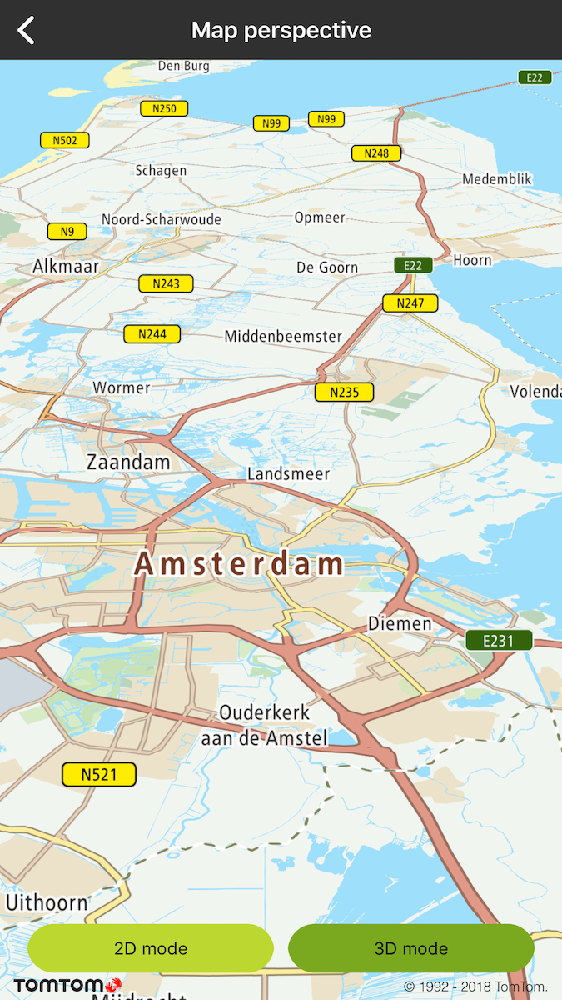
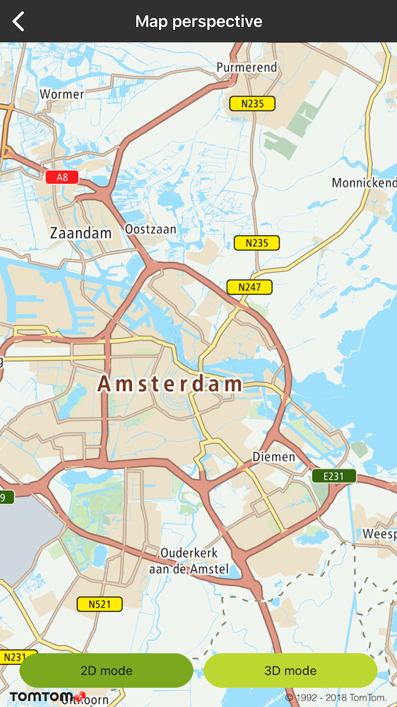

Set either 2D map perspective for typical map view mode, or 2.5D map perspective for custom
scenarios such as moving the map.

**Sample use case**: You want to switch from 2D to 2.5D modes to support and follow the moving of
the location in your app. Use the following code snippets in your app to switch between
perspectives.

Note that switching between 2D and 3D mode only changes the perspective. The zoom level and map
orientation are set with the methods described in the "Map centering" example.

Perspective ratio can be changed in value: false to true.

<Code>

```swift
mapView.setPerspective3D(true)
```

```objectivec
[self.mapView setPerspective3D:YES]
```

</Code>

<table>
  <tbody>
    <tr>
      <td>
        <ContentWrapper maxWidth="350px" objectFit="contain">
          <p>
            
          </p>
        </ContentWrapper>
        <p>3D map perspective</p>
      </td>
      <td>
        <ContentWrapper maxWidth="350px" objectFit="contain">
          <p>
            
          </p>
        </ContentWrapper>
        <p>2D map perspective</p>
      </td>
    </tr>
  </tbody>
</table>