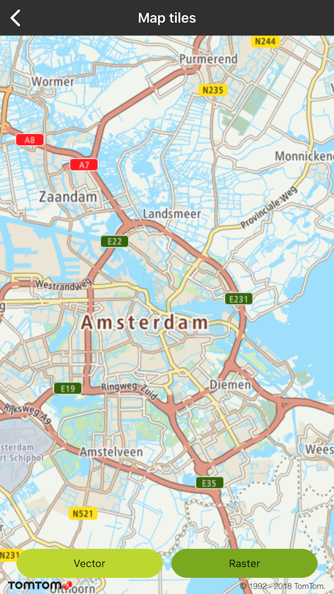
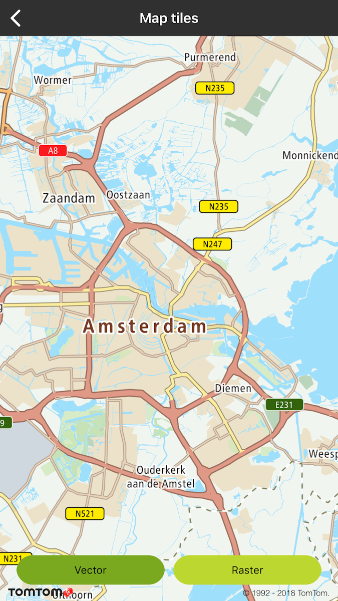

<Blockquote type="announcement" hasIcon>

In May 2020 methods used for switching to between vector and raster tiles got deprecated and will be
removed after one year. From that point to display raster tiles it will be required to reload the
style to one which contains raster layers. Before deprecation period is over map is still going to
be initialized with the style that contains Raster and Vector tiles. However to prepare yourself for
the migration please check how to init map that is
described [here](/maps-ios-sdk/documentation/map-display/documentation/map-initialization).

</Blockquote>

In order to display a map, you need to provide a map style file which includes information required
to render a map. Sources include information about types of tiles (e.g. raster or vector) and the
URL(s) for the tile service(s), for more information have look
at [Map Style Specification](/map-display-api/documentation/mapstyles/map-style-specification). The default map display in Maps SDK is based on vector tiles, so it utilizes a map style file
which sets the URL to Vector Tile endpoint. The default style file for the map and traffic display
is fetched from the Style Merger. It is also possible to display a map with raster tiles in Maps
SDK. In order to do that, you need to provide a map style defining the raster type and the raster
tiles endpoint URL. This style must be loaded into the Maps SDK. This example provides a simple map
JSON style file sheet that can be used to display Example raster tiles and shows how to use a style
in Maps SDK.

Allow your users to display the map in either raster or vector format:

- Raster tiles are served as images. They require less processing power and memory to render, but
  have a larger file size than vector tiles.
- Vector tiles take the form of data that describe map entries such as geographic points, forests,
  lakes, built up areas (as polygons), and roads (as lines). They are styled by means of a style
  sheet. Vector tiles can be scaled to different sizes without losing quality. The file size of
  vector tiles is smaller than that of raster tiles.

**Sample use case 1**: Your app is designed to use raster tiles for map display. You want to update
the app with the Example Map Display API raster tiles.

**Sample use case 2**: You want to take advantage of vector tile features such as map 2.5 D
perspective, custom map styles, etc.

**Sample use case 3**: Your app runs on devices with different capabilities. You want to use vector
tiles for map display on powerful devices and raster tiles on devices with less processing power.

Use the following code snippets in your app to display the map with raster or vector tiles.

<table>
  <tbody>
    <tr>
      <td>
        <ContentWrapper maxWidth="350px" objectFit="contain">
          

            
          

        </ContentWrapper>
        
Raster tiles.

        <Code>
          <pre class="swift">
            <code class="language-swift">
              {`let configuration = TTMapStyleConfigurationBuilder.create(withStyleURL: "asset://../../mapssdk-raster-layers.json").build()
mapView.styleManager.load(configuration, withCompletion: nil)`}
            </code>
          </pre>
          <pre class="obj-c">
            <code class="language-obj-c">
              {`TTMapStyleConfiguration *configuration = [[TTMapStyleConfigurationBuilder createWithStyleURL:@"asset://../../mapssdk-raster-layers.json"] build]
[self.mapView.styleManager loadStyleConfiguration:configuration withCompletion:nil];`}
            </code>
          </pre>
        </Code>
      </td>
      <td>
        <ContentWrapper maxWidth="350px" objectFit="contain">
          

            
          

        </ContentWrapper>
        
Vector tiles.

        <Code>
          <pre class="swift">
            <code class="language-swift">
              {`let configuration = TTMapStyleConfigurationBuilder.create(withStyleURL: "asset://../../vector_style.json").build()
mapView.styleManager.load(configuration, withCompletion: nil)`}
            </code>
          </pre>
          <pre class="obj-c">
            <code class="language-obj-c">
              {`TTMapStyleConfiguration *configuration = [[TTMapStyleConfigurationBuilder createWithStyleURL:@"asset://../../vector_style.json"] build];
[self.mapView.styleManager loadStyleConfiguration:configuration withCompletion:nil];`}
            </code>
          </pre>
        </Code>
      </td>
    </tr>
  </tbody>
</table>