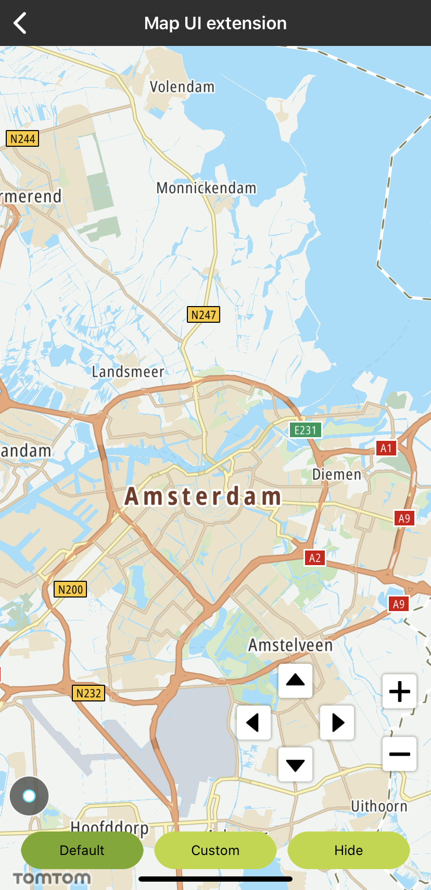
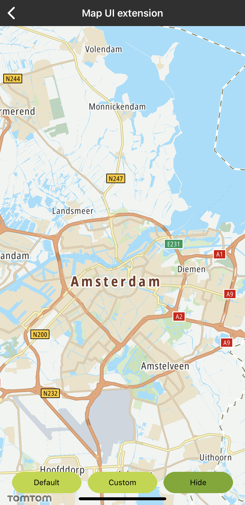
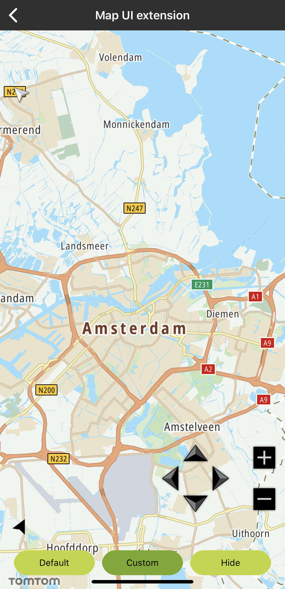

<a
  href="#"
  style={{ display: 'block', margin: '0', padding: '0' }}
  name="_map_ui_extensions"
></a>

Use default compass, current location buttons, zooming, and panning controls built into the Maps
SDK.

**Sample use case 1**: You want to provide your users with the compass, current location, and
panning and zooming controls so they can quickly center the map on their current location, set it to
display north at the top of the screen after rotating the map, and pan or zoom the map. You can use
the default controls provided with the Maps SDK.

**Sample use case 2**: You want to provide your users with the compass, current location, panning
and zooming controls and you want to use custom icons that are designed for your app style.

**Sample use case 3**: In some of the screens in your app, you want to remove the compass, current
location, and panning and zooming controls.

Since all ui elements are fully customizable because the Android view’s properties are exposed,
changing the default icons for them is straight forward:

<Code>

```swift
let customControlLeftButton = UIButton()
customControlLeftButton.setImage(UIImage(named: "arrow_left_custom"), for: .normal)
customControlLeftButton.setImage(UIImage(named: "arrow_left_highlighted_custom"), for: .highlighted)
controlView.controlView?.leftControlBtn = customControlLeftButton
```

```objectivec
UIButton *customControlLeftButton = [UIButton new]
[customControlLeftButton setImage:[UIImage imageNamed:@"arrow_left_custom"] forState:UIControlStateNormal];
[customControlLeftButton setImage:[UIImage imageNamed:@"arrow_left_highlighted_custom"] forState:UIControlStateHighlighted];
self.controlView.controlView.leftControlBtn = customControlLeftButton;
```

</Code>
<Code>

```swift
let customControlZoomInButton = UIButton()
customControlZoomInButton.setImage(UIImage(named: "zoom_in_custom"), for: .normal)
customControlZoomInButton.setImage(UIImage(named: "zoom_in_highlighted_custom"), for: .highlighted)
controlView.zoomView?.zoomIn = customControlZoomInButton
```

```objectivec
UIButton *customControlZoomInButton = [UIButton new];
[customControlZoomInButton setImage:[UIImage imageNamed:@"zoom_in_custom"] forState:UIControlStateNormal];
[customControlZoomInButton setImage:[UIImage imageNamed:@"zoom_in_highlighted_custom"] forState:UIControlStateHighlighted];
self.controlView.zoomView.zoomIn = customControlZoomInButton;
```

</Code>

<table>
  <tbody>
    <tr>
      <td>
        <ContentWrapper maxWidth="350px" objectFit="contain">
          <p>
            
          </p>
        </ContentWrapper>
        <p>Default ui extensions controls</p>
      </td>
      <td>
        <ContentWrapper maxWidth="350px" objectFit="contain">
          <p>
            
          </p>
        </ContentWrapper>
        <p>Default ui extensions controls - Hidden</p>
      </td>
    </tr>
    <tr>
      <td>
        <ContentWrapper maxWidth="350px" objectFit="contain">
          <p>
            
          </p>
        </ContentWrapper>
        <p>Custom ui extensions controls</p>
      </td>
      <td></td>
    </tr>
  </tbody>
</table>