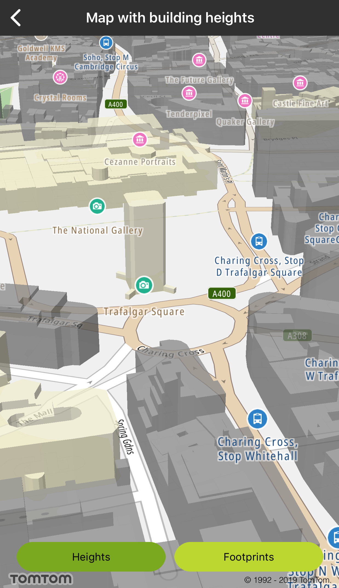
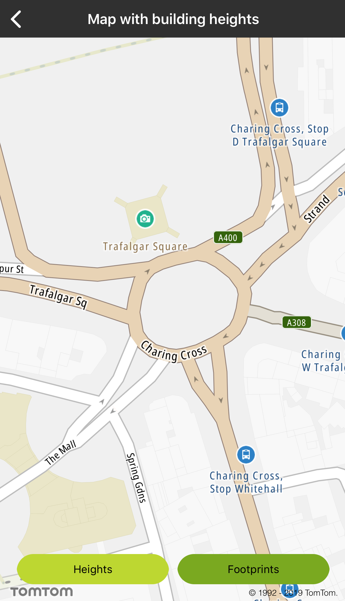

Allow your users to see the map either in 2.5D with the building heights enabled, or in 2D with
building footprints.

**Sample use case:** Your application provides the possibility to display sophisticated
visualization of the map with building heights (2.5D map) as well as display the map with building
footprints (2D map).

The building heights data are available in Vector Map Tiles. The default Example map styles enable
the display of building heights by default, but this can be disabled by switching off layers in the
style.

Have a look at the detailed documentation for more information in [Vector Map Tiles](/map-display-api/documentation/vector/tile)
and [Map style](/map-display-api/documentation/mapstyles/map-styles).

In order to disable the display of the building heights, you need to switch off corresponding layers
in the style. That means that the following layers would need to be switched off in the default
Example style: "Subway Station 3D", "Place of worship 3D", "Railway Station 3D", "Government
Administration Office 3D", "Other building 3D", "School building 3D", "Other town block 3D", "
Factory building 3D", "Hospital building 3D", "Hotel building 3D", and "Cultural Facility 3D. This
will work in runtime.

Use the following code snippets in your app to display building footprints (i.e., switch building
heights off):

<Code>

```swift
layers = mapView.styleManager.currentStyle.getLayersByRegexs(["Subway Station 3D",
                                                              "Place of worship 3D",
                                                              "Railway Station 3D",
                                                              "Government Administration Office 3D",
                                                              "Other building 3D",
                                                              "School building 3D",
                                                              "Other town block 3D",
                                                              "Factory building 3D",
                                                              "Hospital building 3D",
                                                              "Hotel building 3D",
                                                              "Cultural Facility 3D"])
layers.forEach { layer in
    layer.visibility = visibility
}
```

```objectivec
self.layers = [[self.mapView.styleManager currentStyle] getLayersByRegexs:[NSArray arrayWithObjects:@"Subway Station 3D", @"Place of worship 3D", @"Railway Station 3D", @"Government Administration Office 3D", @"Other building 3D", @"School building 3D", @"Other town block 3D",
                                                                                                    @"Factory building 3D", @"Hospital building 3D", @"Hotel building 3D", @"Cultural Facility 3D", nil]]
for (TTMapLayer *layer in layers) {
    layer.visibility = visibility;
}
```

</Code>

<table>
  <tbody>
    <tr>
      <td>
        <ContentWrapper maxWidth="350px" objectFit="contain">
          <p>
            
          </p>
        </ContentWrapper>
        <p>Switching the heights on</p>
      </td>
      <td>
        <ContentWrapper maxWidth="350px" objectFit="contain">
          <p>
            
          </p>
        </ContentWrapper>
        <p>Switching the heights off</p>
      </td>
    </tr>
  </tbody>
</table>