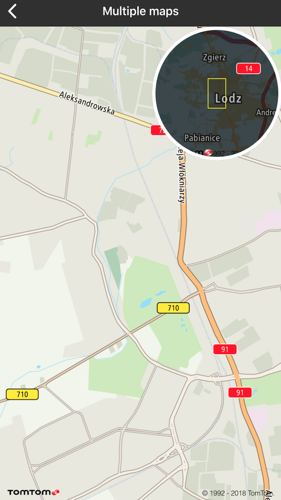

<a
  href="#"
  style={{ display: 'block', margin: '0', padding: '0' }}
  name="route-display"
></a>

Developers are not limited to only attaching a single map. You can put as many map objects as you
want on the same page without any issues.

**Sample use case:** You want to display two independent maps in your app.

If you want to create multiple maps on your project you need to perform the following actions.

Create two separate instances of the TTMapView using:

<Code>

```swift
let defaultStyle = TTMapStyleDefaultConfiguration()
let builder = TTMapConfigurationBuilder.create().withTrafficKey(Key.Traffic).withMapKey(Key.Map).withMapStyleConfiguration(defaultStyle)
let map = TTMapView(mapConfiguration: builder.build())
```

```objectivec
 TTMapStyleDefaultConfiguration *style = [[TTMapStyleDefaultConfiguration alloc] init]
    TTMapConfiguration *config = [[[[[TTMapConfigurationBuilder createBuilder] withMapKey:Key.Map] withTrafficKey:Key.Traffic] withMapStyleConfiguration:style] build];
TTMapView *mapView = [[TTMapView alloc] initWithMapConfiguration:config];
```

</Code>

The next step is to add a second map as a subview of the first map and then set up the proper
constraints:

<Code>

```swift
mapView.addSubview(secondMap)
let mapSize = super.mapView.bounds.width / 2
secondMap.translatesAutoresizingMaskIntoConstraints = false
secondMap.heightAnchor.constraint(equalToConstant: mapSize).isActive = true
secondMap.widthAnchor.constraint(equalToConstant: mapSize).isActive = true
secondMap.topAnchor.constraint(equalTo: self.mapView.topAnchor, constant: 5).isActive = true
secondMap.rightAnchor.constraint(equalTo: self.mapView.rightAnchor,constant: -5).isActive = true
secondMap.layer.cornerRadius = mapSize / 2
```

```objectivec
[self.mapView addSubview:self.secondMap];
CGFloat mapSize = self.mapView.bounds.size.width / 2;
self.secondMap.translatesAutoresizingMaskIntoConstraints = NO;
[[self.secondMap.heightAnchor constraintEqualToConstant:mapSize] setActive:YES];
[[self.secondMap.widthAnchor constraintEqualToConstant:mapSize] setActive:YES];
[[self.secondMap.topAnchor constraintEqualToAnchor:self.mapView.topAnchor constant:5] setActive:YES];
[[self.secondMap.rightAnchor constraintEqualToAnchor:self.mapView.rightAnchor constant:-5] setActive:YES];
self.secondMap.layer.cornerRadius = mapSize / 2;
```

</Code>

Finally, you can implement a delegate method from the first map view to update the second center
view:

<Code>

```swift
func mapView(_: TTMapView, onCameraChanged cameraPosition: TTCameraPosition) {
    secondMap.setCameraPosition(TTCameraPositionBuilder.create(withCameraPosition: coordinate).build())
 }
```

```objectivec
#pragma mark TTMapViewDelegate
- (void)mapView:(TTMapView *)mapView onCameraChanged:(TTCameraPosition *)cameraPosition {
    secondMap setCameraPosition:[[TTCameraPositionBuilder createWithCameraPosition:coordinate] build]];
}
```

</Code>
<ContentWrapper maxWidth="350px" objectFit="contain">



</ContentWrapper>