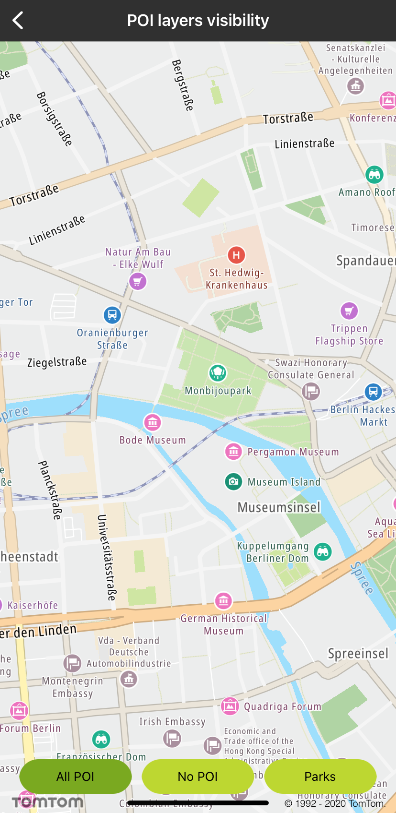
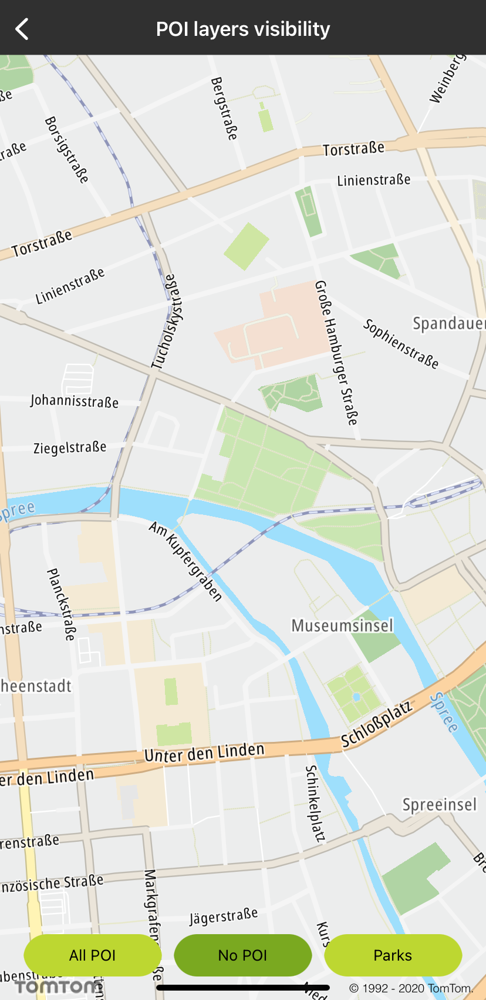
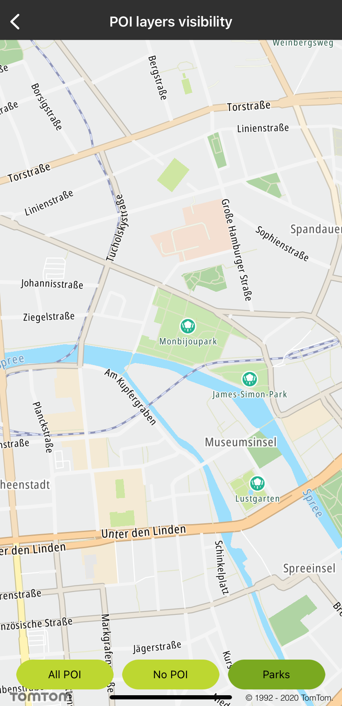

<a
  href="#"
  style={{ display: 'block', margin: '0', padding: '0' }}
  name="poi-visibility"
></a>

The POI layer is a database of certain POIs displayed on the map allowing you to display on the map
various categories of POI’s with corresponding labels and icons. As you can see in the documentation
of
the [POI layers service](/map-display-api/documentation/vector/tile),
as a user you can:

- Display a map with a layer which contains only certain, filtered kinds of POIs as a set of a label
  and icon.
- Turn on and off POI categories by means of category names.
- Separate the map layer, which can be used as an overlay to a basic map.
- Easily combine a POI layer with
  the [Place By ID](/search-api/documentation/place-by-id-service/place-by-id) (
  Search method) to display additional info, such as opening hours, address, etc.

**Sample use case:** You would like to plan a trip to Amsterdam and visit museums in the city
center. Thanks to POI layer filtering you would be able to filter on the map POIs from the Museum
category with corresponding labels and icons.

**Sample use case:** You would like to replace the default source layer of POI data provided by the
Maps SDK with POI categories chosen by you to achieve a clean and readable map including POIs
relevant to your business needs.

To show the layer containing POIs use the following code:

<Code>

```swift
mapView.poiDisplay.show()
```

```objectivec
[self.mapView.poiDisplay show]
```

</Code>

To hide the layer containing POIs use the following code:

<Code>

```swift
mapView.poiDisplay.hide()
```

```objectivec
[self.mapView.poiDisplay hide];
```

</Code>

To show the POIs whose categories match the provided category names use the following code:

<Code>

```swift
mapView.poiDisplay.show(["Park & Recreation Area"])
```

```objectivec
[self.mapView.poiDisplay show:@[ @"Park & Recreation Area" ]];
```

</Code>

<table>
  <tbody>
    <tr>
      <td>
        <ContentWrapper maxWidth="350px" objectFit="contain">
          <p>
            
          </p>
        </ContentWrapper>
        <p>All POI</p>
      </td>
      <td>
        <ContentWrapper maxWidth="350px" objectFit="contain">
          <p>
            
          </p>
        </ContentWrapper>
        <p>No POI</p>
      </td>
    </tr>
    <tr>
      <td>
        <ContentWrapper maxWidth="350px" objectFit="contain">
          <p>
            
          </p>
        </ContentWrapper>
        <p>Parks</p>
      </td>
      <td></td>
    </tr>
  </tbody>
</table>