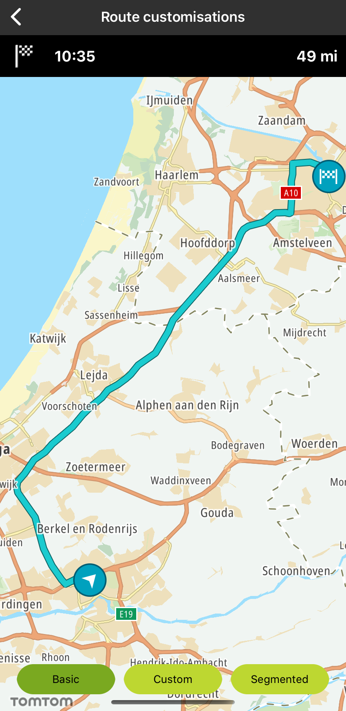
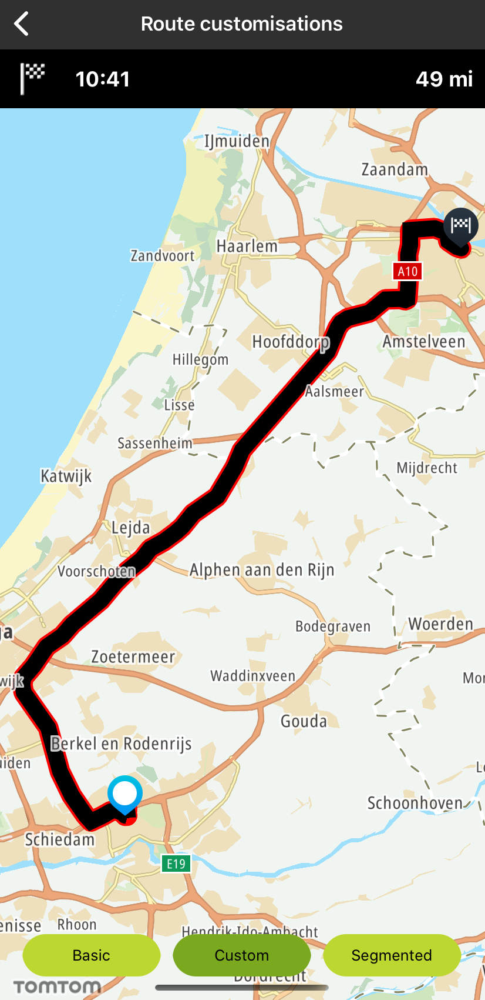
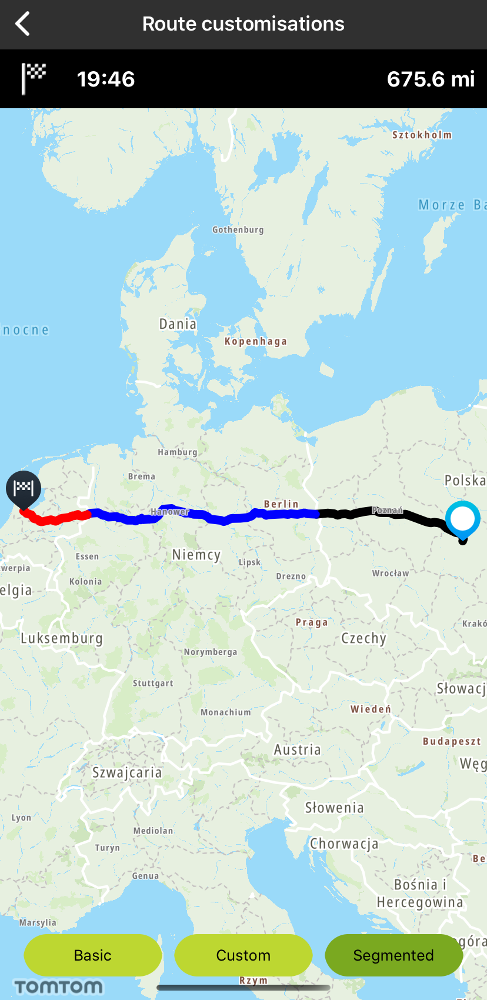

You can display a route on the map and customize its origin and destination icons. It is also
possible to specify the fill color, outline color, and width of the route.

**Sample use case**: When you add the route, you would like to highlight the starting and the
destination points. Also you would like to plan several routes simultaneously with different origin
and destination points and use different icons.

Prerequisites:

`TTMapView: The *mapView` object was created and configured. Route coordinates are prepared.

<a
  href="#"
  style={{ display: 'block', margin: '0', padding: '0' }}
  name="_origin_and_destination_icons_customization"
></a>

## Origin and destination icons customization

If you need to customize the start and destination icons, you should create the icons through the
UIImage class.

The icon can be created in the following ways:

<Code>

```swift
iconStart = UIImage(named: "Start")!
iconEnd = UIImage(named: "End")!
```

```objectivec
self.iconStart = [UIImage imageNamed:@"Start"]
self.iconEnd = [UIImage imageNamed:@"End"];
```

</Code>

<table>
  <tbody>
    <tr>
      <td>
        <ContentWrapper maxWidth="350px" objectFit="contain">
          <p>
            
          </p>
        </ContentWrapper>
        <p>Basic</p>
      </td>
    </tr>
    <tr>
      <td></td>
    </tr>
  </tbody>
</table>

<a
  href="#"
  style={{ display: 'block', margin: '0', padding: '0' }}
  name="_route_customization"
></a>

## Route customization

You can create a route with custom style properties like fill color, outline color, and width.
First, you need to create a RouteStyle object:

<Code>

```swift
routeStyle = TTMapRouteStyleBuilder()
    .withWidth(2.0)
    .withFill(.black)
    .withOutlineColor(.red)
    .build()
```

```objectivec
self.routeStyle = [[[[[TTMapRouteStyleBuilder new] withWidth:2.0] withFillColor:UIColor.blackColor] withOutlineColor:UIColor.redColor] build];
```

</Code>

Next, you need to pass the `mapRoute` object to
the `` addRoute`method of the `mapView.routeManager `` object, e.g.,:

<Code>

```swift
let mapRoute = TTMapRoute(coordinatesData: plannedRoute, with: routeStyle,
                          imageStart: iconStart, imageEnd: iconEnd)
mapView.routeManager.add(mapRoute)
```

```objectivec
TTMapRoute *mapRoute = [TTMapRoute routeWithCoordinatesData:plannedRoute withRouteStyle:self.routeStyle imageStart:self.iconStart imageEnd:self.iconEnd];
[self.mapView.routeManager addRoute:mapRoute];
```

</Code>

If you provide nil for `imageStart` or `imageEnd` there will be no icons on the route. If you don’t
call a style, then the default style will be applied.

<table>
  <tbody>
    <tr>
      <td>
        <ContentWrapper maxWidth="350px" objectFit="contain">
          <p>
            
          </p>
        </ContentWrapper>
        <p>Custom</p>
      </td>
    </tr>
    <tr>
      <td></td>
    </tr>
  </tbody>
</table>

<a
  href="#"
  style={{ display: 'block', margin: '0', padding: '0' }}
  name="_route_segmented_customization"
></a>

## Route segmented customization

You can create a route with segmented sections where each segment contains custom-style properties
like fill color, outline color, and width.

<Code>

```swift
// Section 1
let routeStyle1 = TTMapRouteStyleBuilder()
    .withWidth(1.0)
    .withFill(.black)
    .withOutlineColor(.black)
    .build()

let startPoint1 = plannedRoute.sections[0].startPointIndexValue
let endPoint1 = plannedRoute.sections[0].endPointIndexValue

var coordinatesSection1 = arrayOfCoordiantes(plannedRoute: plannedRoute, start: startPoint1, end: endPoint1)
let mapRoute = TTMapRoute(coordinates: &coordinatesSection1, count: UInt(coordinatesSection1.count), with: routeStyle1,
                          imageStart: iconStart, imageEnd: iconEnd)

// Section 2
let routeStyle2 = TTMapRouteStyleBuilder()
    .withWidth(1.0)
    .withFill(.blue)
    .withOutlineColor(.blue)
    .build()

let startPoint2 = plannedRoute.sections[1].startPointIndexValue
let endPoint2 = plannedRoute.sections[1].endPointIndexValue
var coordinatesSection2 = arrayOfCoordiantes(plannedRoute: plannedRoute, start: startPoint2, end: endPoint2)
mapRoute.addCoordinates(&coordinatesSection2, count: UInt(coordinatesSection2.count), with: routeStyle2)
```

```objectivec
// Section 1
TTMapRouteStyle *routeStyle1 = [[[[[TTMapRouteStyleBuilder new] withWidth:1.0] withFillColor:UIColor.blackColor] withOutlineColor:UIColor.blackColor] build];

NSInteger startPoint1 = plannedRoute.sections[0].startPointIndexValue;
NSInteger endPoint1 = plannedRoute.sections[0].endPointIndexValue;

CLLocationCoordinate2D coordinateArray[endPoint1 - startPoint1];
[self arrayOfCoordinates:plannedRoute withStart:startPoint1 withEnd:endPoint1 withArray:coordinateArray];

TTMapRoute *mapRoute = [TTMapRoute routeWithCoordinates:coordinateArray count:endPoint1 withRouteStyle:routeStyle1 imageStart:self.iconStart imageEnd:self.iconEnd];

// Section 2
TTMapRouteStyle *routeStyle2 = [[[[[TTMapRouteStyleBuilder new] withWidth:1.0] withFillColor:UIColor.blueColor] withOutlineColor:UIColor.blueColor] build];

NSInteger startPoint2 = plannedRoute.sections[1].startPointIndexValue;
NSInteger endPoint2 = plannedRoute.sections[1].endPointIndexValue;

CLLocationCoordinate2D coordinateArray2[endPoint2 - startPoint2];
[self arrayOfCoordinates:plannedRoute withStart:startPoint2 withEnd:endPoint2 withArray:coordinateArray2];

[mapRoute addCoordinates:coordinateArray2 count:endPoint2 - startPoint2 withRouteStyle:routeStyle2];
```

</Code>

<table>
  <tbody>
    <tr>
      <td>
        <ContentWrapper maxWidth="350px" objectFit="contain">
          <p>
            
          </p>
        </ContentWrapper>
        <p>Segmented</p>
      </td>
    </tr>
    <tr>
      <td></td>
    </tr>
  </tbody>
</table>