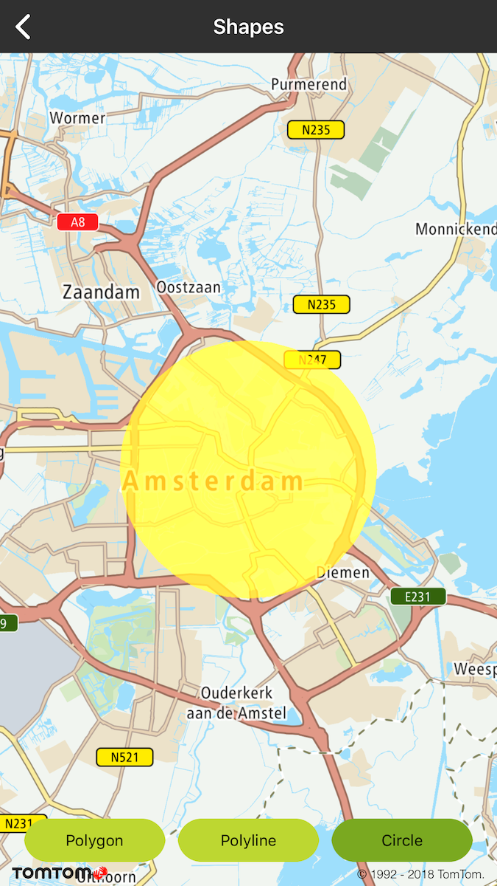
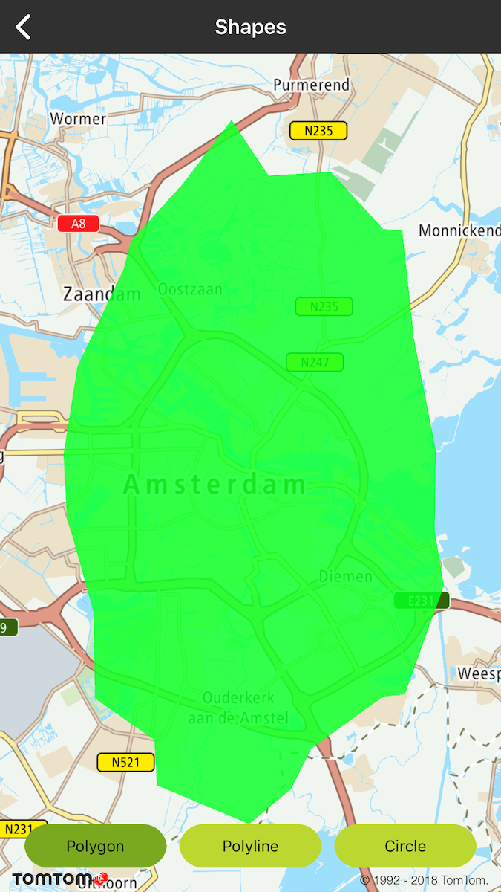
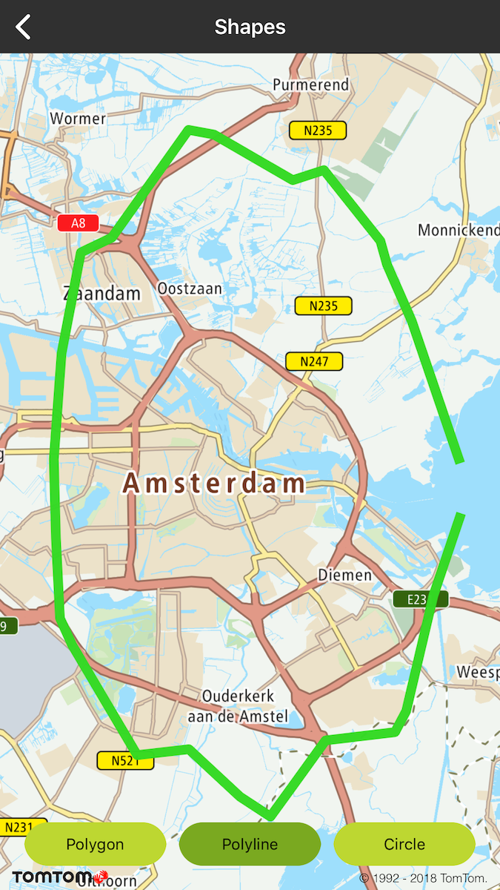

Allow your users to draw shapes like circles, polygons, and polylines on your map to mark different
areas on the map.

**Sample use case**: You are developing an app for a delivery company and need to illustrate ranges
of the transportation area around different cities. What you need to do, for example, is to render
circles around cities with radiuses indicating zones of deliveries. The details on the example
implementation of shapes rendering are described below.

A TTMapView supports several shape overlays. These are:

- TTCircle
- TTPolygon
- TTPolyline

Shape overlays are immutable i.e., once they have been created, their shapes cannot be changed (
although you may change their visibility and color). If you want to change a shape, you must remove
the existing shape and replace it with a new one.

It is the responsibility of the framework user to be conscientious about performance and how many
shape overlays they are using. You should use as few shapes as possible, and hide or dispose of ones
that are not being displayed. See the following code examples.

Code examples:

<Code>

```swift
let polygon = TTPolygon(coordinates: &coordiantes, count: UInt(pointsCount), opacity: 1, color: color, colorOutline: color)
mapView.annotationManager.add(polygon)
```

```objectivec
TTPolygon *polygon = [TTPolygon polygonWithCoordinates:coordinates count:pointsCount opacity:1 color:color colorOutline:color]
[self.mapView.annotationManager addOverlay:polygon];
```

</Code>
<Code>

```swift
let polyline = TTPolyline(coordinates: &coordiantes, count: UInt(pointsCount), opacity: 1, width: 8, color: color)
mapView.annotationManager.add(polyline)
```

```objectivec
TTPolyline *polyline = [TTPolyline polylineWithCoordinates:coordinates count:pointsCount opacity:1 width:8 color:color];
[self.mapView.annotationManager addOverlay:polyline];
```

</Code>
<Code>

```swift
let circle = TTCircle(center: TTCoordinate.AMSTERDAM(), radius: 5000, opacity: 1, width: 10, color: color, fill: true, colorOutlet: color)
mapView.annotationManager.add(circle)
```

```objectivec
TTCircle *circle = [TTCircle circleWithCenterCoordinate:[TTCoordinate AMSTERDAM] radius:5000 opacity:1 width:10 color:color fill:YES colorOutlet:color];
[self.mapView.annotationManager addOverlay:circle];
```

</Code>

<table>
  <tbody>
    <tr>
      <td>
        <ContentWrapper maxWidth="350px" objectFit="contain">
          <p>
            
          </p>
        </ContentWrapper>
        <p>Circle</p>
      </td>
      <td>
        <ContentWrapper maxWidth="350px" objectFit="contain">
          <p>
            
          </p>
        </ContentWrapper>
        <p>Polygon</p>
      </td>
    </tr>
    <tr>
      <td>
        <ContentWrapper maxWidth="350px" objectFit="contain">
          <p>
            
          </p>
        </ContentWrapper>
        <p>Polyline</p>
      </td>
      <td></td>
    </tr>
  </tbody>
</table>

<a
  href="#"
  style={{ display: 'block', margin: '0', padding: '0' }}
  name="clickable-shapes"
></a>

# Click delegate

You can implement an observable of shape-clicked event. You can do that with the global delegate
TTAnnotationDelegate for all shapes that have to be registered on TTAnnotationManager as in the
following examples:

Maps SDK allows to observe a shape-selected event. There is one global delegate TTAnnotationDelegate
for all shapes that has to be registered on TTAnnotationManager as follows.

<Code>

```swift
mapView.annotationManager.delegate = self
```

```objectivec
self.mapView.annotationManager.delegate = self;
```

</Code>
<Code>

```swift
func annotationManager(_: TTAnnotationManager, touchUp _: TTPolyline) {
    // called when polyline clicked
}
```

```objectivec
- (void)annotationManager:(id<TTAnnotationManager>)manager touchUpPolyline:(TTPolyline *)polyline {
    // called when polyline clicked
}
```

</Code>
<Code>

```swift
func annotationManager(_: TTAnnotationManager, touchUp _: TTPolygon) {
    // called when polygon clicked
}
```

```objectivec
- (void)annotationManager:(id<TTAnnotationManager>)manager touchUpPolygon:(TTPolygon *)polygon {
    // called when polygon clicked
}
```

</Code>
<Code>

```swift
func annotationManager(_: TTAnnotationManager, touchUp _: TTCircle) {
    // called when circle clicked
}
```

```objectivec
- (void)annotationManager:(id<TTAnnotationManager>)manager touchUpCircle:(TTCircle *)circle {
    // called when circle clicked
}
```

</Code>