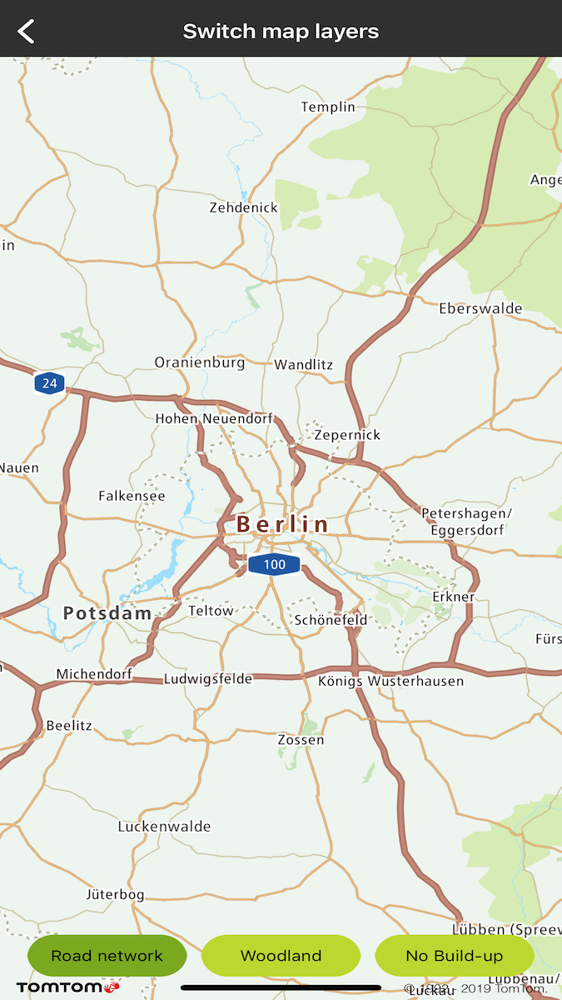
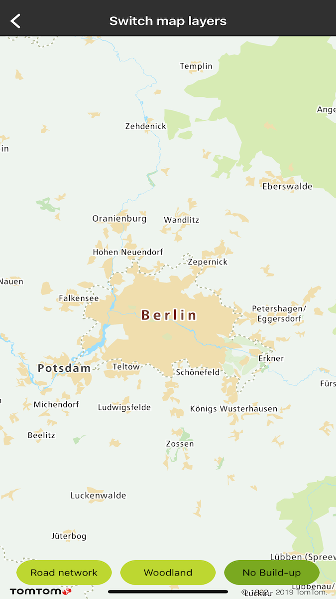

Allow your users to dynamically toggle the visibility of map entities. You can hide map layers to
get the level of detail you need and highlight the layers that are important for your use case.

**Sample use case:** You want to provide a clear map view for driving that focuses on the road
network in your app. You can achieve this by switching off some map layers e.g., woodland, build-up
areas, etc. You can turn these layers back on at run time to bring back the details for a better map
viewing experience.

The following articles provide more information on map layer visibility and map layers available in
the default style: [Map layers](/maps-ios-sdk/documentation/map-display/documentation/map-layers),
and [Default style](/maps-ios-sdk/documentation/map-display/documentation/default-style).

You can retrieve all layers available in the style or only those that match a provided regex. To
filter, you can use the layer ID or source layer ID properties, as shown in the following examples:

<table>
  <tbody>
    <tr>
      <td>
        <ContentWrapper maxWidth="350px" objectFit="contain">
          

            
          

        </ContentWrapper>
        
Map Road network layers

        <Code>
          <pre class="swift">
            <code class="language-swift">
              {'layers = currentStyle.getLayersBySourceLayerRegexs([".*[rR]oad.*", ".*[mM]otorway.*"])'}
            </code>
          </pre>
          <pre class="obj-c">
            <code class="language-obj-c">
              {'layers = [self.currentStyle getLayersBySourceLayerRegexs:@[ @".*[rR]oad.*", @".*[mM]otorway.*" ]]'}
            </code>
          </pre>
        </Code>
      </td>
      <td>
        <ContentWrapper maxWidth="350px" objectFit="contain">
          

            
          

        </ContentWrapper>
        
Map woodland layers

        <Code>
          <pre class="swift">
            <code class="language-swift">
              {'layers = currentStyle.getLayersBySourceLayerRegex("Woodland.*")'}
            </code>
          </pre>
          <pre class="obj-c">
            <code class="language-obj-c">
              {'layers = [self.currentStyle getLayersBySourceLayerRegex:@"Woodland.*"];'}
            </code>
          </pre>
        </Code>
      </td>
    </tr>
    <tr>
      <td>
        <ContentWrapper maxWidth="350px" objectFit="contain">
          

            
          

        </ContentWrapper>
        
Map No Build-Up layers

        <Code>
          <pre class="swift">
            <code class="language-swift">
              {'layers = currentStyle.getLayersBySourceLayerRegex("Built-up area")'}
            </code>
          </pre>
          <pre class="obj-c">
            <code class="language-obj-c">
              {'layers = [self.currentStyle getLayersBySourceLayerRegex:@"Built-up area"];'}
            </code>
          </pre>
        </Code>
      </td>
      <td></td>
    </tr>
  </tbody>
</table>