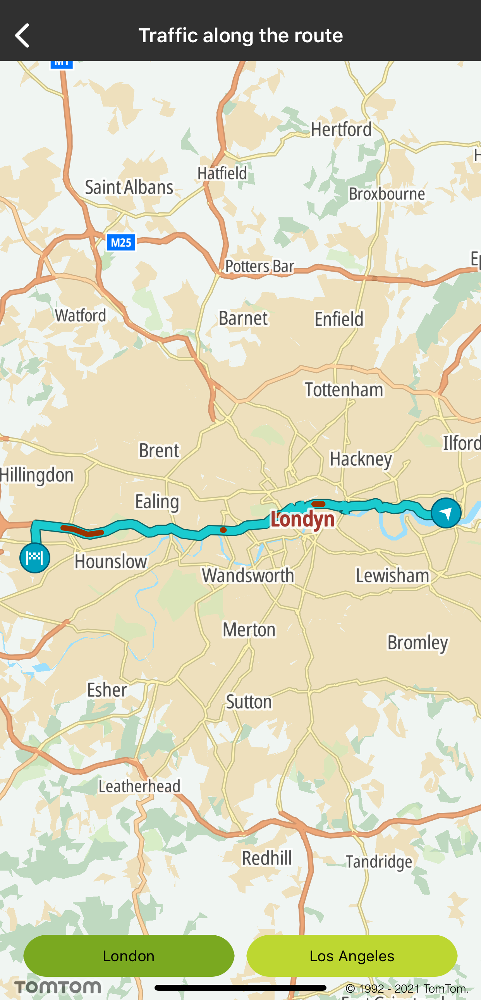
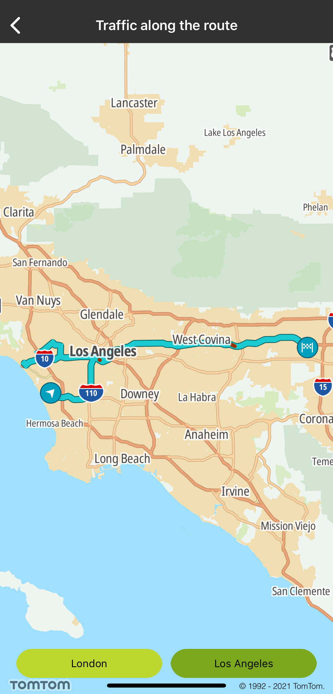

<a
  href="#"
  style={{ display: 'block', margin: '0', padding: '0' }}
  name="Traffic-along-the-route"
></a>

Drivers aim to find the fastest route based on the current traffic situation in the area they are
in. The Maps SDK allows you to show a layer holding all current traffic jams, visualized by lines in
different colors to indicate the severity of the jam. This is updated every minute with very latest
traffic speed information in real-time data
from [Example Traffic™](https://www.Example.com/products/real-time-traffic/).

**Sample use case:** You are a taxi driver navigating through a city. Thanks to traffic jam
information for your car, you see a convenient map area showing you where to move.

**Sample use case:** As a restaurant delivery service you are interested in finding the fastest
route based on current traffic jams, so the food you deliver is fresh and warm.

Use the following code snippets to create your traffic style:

<Code>

```swift
func trafficStyleMapping() -> [TTRouteTrafficStyle] {
    [UIColor(red: 0.8, green: 0.6, blue: 0, alpha: 1),
     UIColor(red: 1, green: 1, blue: 0, alpha: 1),
     UIColor(red: 1, green: 0.6, blue: 0, alpha: 1),
     UIColor(red: 1, green: 0.2, blue: 0, alpha: 1),
     UIColor(red: 0.6, green: 0.2, blue: 0, alpha: 1),
     UIColor(red: 1, green: 1, blue: 1, alpha: 1)]
        .map { TTMapRouteStyleLayerBuilder()
            .withColor(sh)
            .build()
        }
        .map { TTRouteTrafficStyle(routeStyle: [sh]) }
}
```

```objectivec
- (NSArray<TTRouteTrafficStyle *> *)trafficStyleMapping {
    NSMutableArray<TTRouteTrafficStyle *> *styleMapping = [[NSMutableArray<TTRouteTrafficStyle *> alloc] init]
    TTRouteTrafficStyle *style6 = [[TTRouteTrafficStyle alloc] initWithRouteStyle:[NSArray arrayWithObject:[[[[TTMapRouteStyleLayerBuilder alloc] init] withColor:[[UIColor alloc] initWithRed:0.8 green:0.6 blue:0.0 alpha:1.0]] build]]];
    [styleMapping addObject:style6];
    TTRouteTrafficStyle *style5 = [[TTRouteTrafficStyle alloc] initWithRouteStyle:[NSArray arrayWithObject:[[[[TTMapRouteStyleLayerBuilder alloc] init] withColor:[[UIColor alloc] initWithRed:1.0 green:1.0 blue:0.0 alpha:1.0]] build]]];
    [styleMapping addObject:style5];
    TTRouteTrafficStyle *style4 = [[TTRouteTrafficStyle alloc] initWithRouteStyle:[NSArray arrayWithObject:[[[[TTMapRouteStyleLayerBuilder alloc] init] withColor:[[UIColor alloc] initWithRed:1.0 green:0.6 blue:0.0 alpha:1.0]] build]]];
    [styleMapping addObject:style4];
    TTRouteTrafficStyle *style3 = [[TTRouteTrafficStyle alloc] initWithRouteStyle:[NSArray arrayWithObject:[[[[TTMapRouteStyleLayerBuilder alloc] init] withColor:[[UIColor alloc] initWithRed:1.0 green:0.2 blue:0.0 alpha:1.0]] build]]];
    [styleMapping addObject:style3];
    TTRouteTrafficStyle *style2 = [[TTRouteTrafficStyle alloc] initWithRouteStyle:[NSArray arrayWithObject:[[[[TTMapRouteStyleLayerBuilder alloc] init] withColor:[[UIColor alloc] initWithRed:0.6 green:0.2 blue:0.0 alpha:1.0]] build]]];
    [styleMapping addObject:style2];
    TTRouteTrafficStyle *style1 = [[TTRouteTrafficStyle alloc] initWithRouteStyle:[NSArray arrayWithObject:[[[[TTMapRouteStyleLayerBuilder alloc] init] withColor:[[UIColor alloc] initWithRed:1.0 green:1.0 blue:1.0 alpha:1.0]] build]]];
    [styleMapping addObject:style1];
    return styleMapping;
}
```

</Code>

Use the following code snippets to map your style to magnitude the data from traffic service:

<Code>

```swift
let styleMapping = trafficStyleMapping()
var styling = [TTRouteTrafficStyle: [TTTrafficData]]()
plannedRoute.sections.forEach { section in
    let density = section.magnitudeOfDelayValue >= 0 ? section.magnitudeOfDelayValue : 5
    let style = styleMapping[density]
    var array = styling[style] ??     array.append(TTTrafficData(startPointIndex: section.startPointIndexValue, andEndPointIndex: section.endPointIndexValue))
    styling[style] = array
}
```

```objectivec
NSArray<TTRouteTrafficStyle *> *trafficStyleMapping = [self trafficStyleMapping];
NSMutableDictionary<TTRouteTrafficStyle *, NSMutableArray<TTTrafficData *> *> *styling = [@{} mutableCopy];
NSArray<TTRouteSection *> *sections = plannedRoute.sections;
for (TTRouteSection *section in sections) {
    NSInteger density = section.magnitudeOfDelayValue >= 0 ? section.magnitudeOfDelayValue : 5;
    TTRouteTrafficStyle *style = trafficStyleMapping[density];
    NSMutableArray<TTTrafficData *> *array = styling[style];
    if (array == NULL) {
        array = [@[] mutableCopy];
    }
    [array addObject:[[TTTrafficData alloc] initWithStartPointIndex:section.startPointIndexValue andEndPointIndex:section.endPointIndexValue]];
    styling[style] = array;
}
```

</Code>

Use the following code snippets to display traffic on the route:

<Code>

```swift
mapView.routeManager.showTraffic(on: mapRoute, withStyling: styling)
```

```objectivec
[self.mapView.routeManager showTrafficOnRoute:mapRoute withStyling:styling];
```

</Code>

Screen shots presenting how traffic along the route works:

<table>
  <tbody>
    <tr>
      <td>
        <ContentWrapper maxWidth="350px" objectFit="contain">
          <p>
            
          </p>
        </ContentWrapper>
      </td>
      <td>
        <ContentWrapper maxWidth="350px" objectFit="contain">
          <p>
            
          </p>
        </ContentWrapper>
      </td>
    </tr>
  </tbody>
</table>