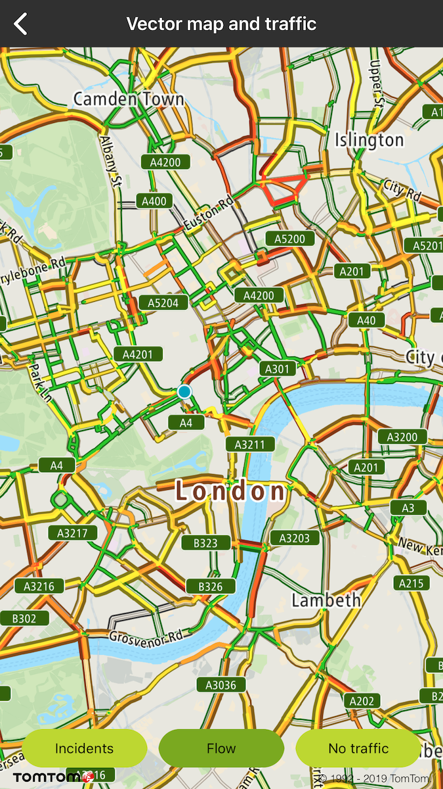
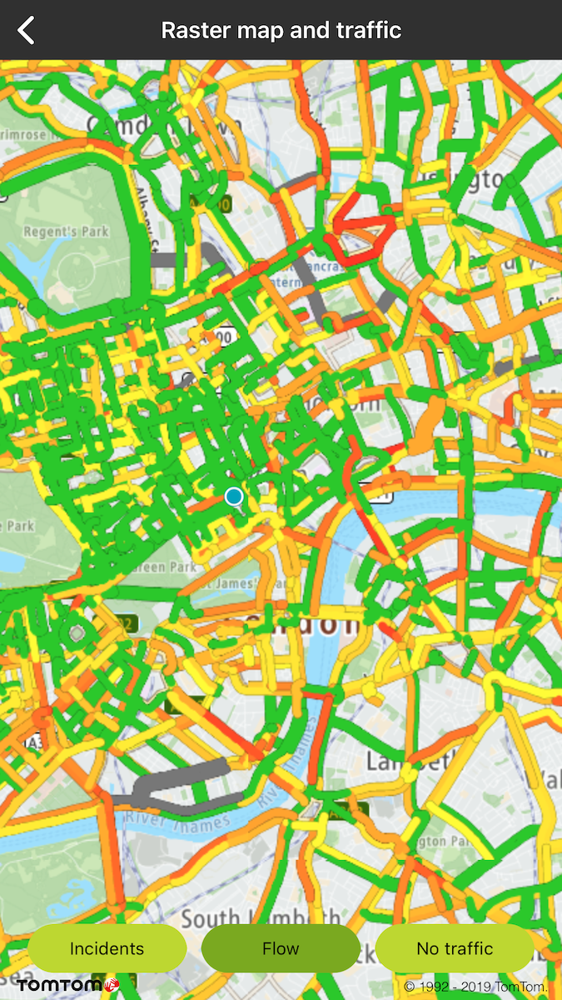
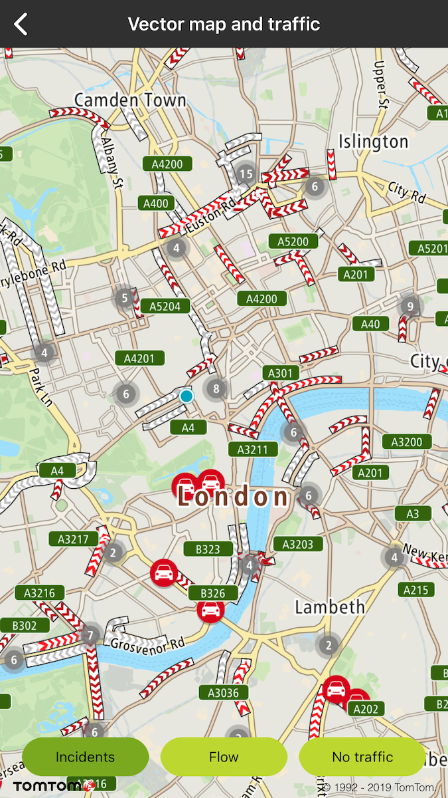
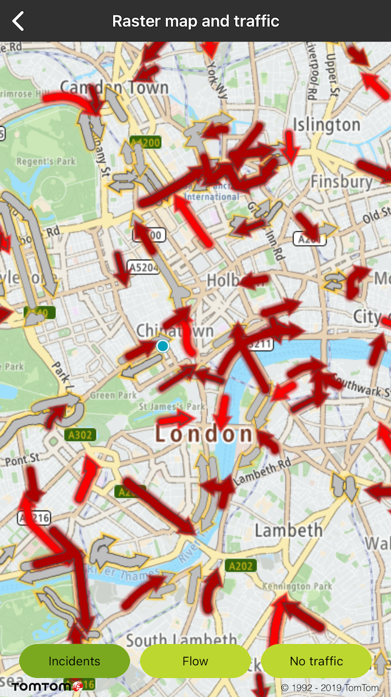
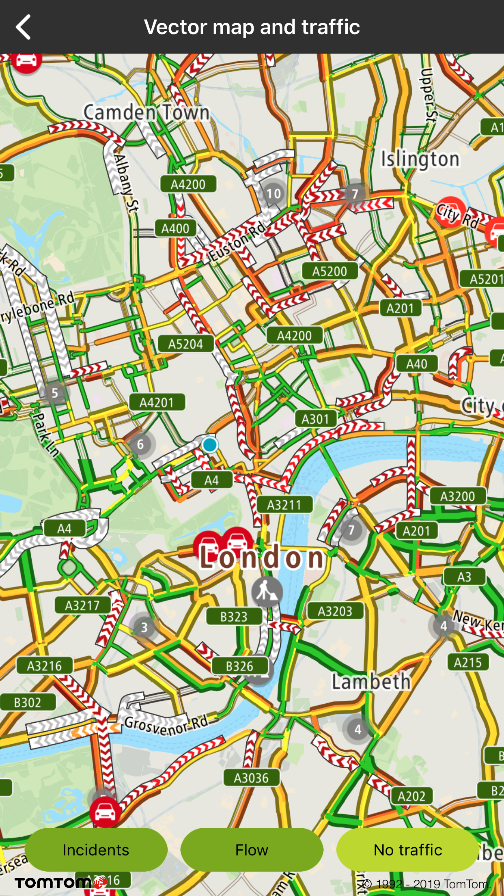

Give your users the ability to see real time traffic in your mobile apps.

With Traffic API Flow tiles your users will have information about congestion, the speed of traffic
on different road segments, and the difference between that speed and the free-flow speed on the
same road segments. You can find more information and details about Traffic API Flow tile parameters
on [Online Vector Traffic Flow tiles](/traffic-api/documentation/traffic-flow/vector-flow-tiles)
,
or [Online Raster Traffic Flow tiles](/traffic-api/documentation/traffic-flow/raster-flow-tiles).

To turn on/off traffic flow or incidents use these methods:

<Code>

```swift
mapView.trafficIncidentsOn = true
mapView.trafficFlowOn = true
```

```objectivec
self.mapView.trafficIncidentsOn = YES
self.mapView.trafficFlowOn = YES;
```

</Code>

<a
  href="#"
  style={{ display: 'block', margin: '0', padding: '0' }}
  name="_vector_traffic_flow_tiles_delegate"
></a>

# Vector Traffic Flow Tiles Delegate

Additionally, you can get details about the specific traffic flow or incident of the road fragment (
e.g., current speed, travel times, etc.) from
the [Flow Segment Data](documentation/traffic-api/documentation/traffic-flow/flow-segment-data.md)
service which is integrated in the Maps SDK. This service is designed to work alongside the traffic
to support clickable flow and incidents data visualizations. This is handled for you in the Maps
SDK. The SDK provides default implementation of **trafficDelegate** which is **
TTMapTrafficDelegateDefault**.

<Code>

```swift
mapView.trafficDelegate = TTMapTrafficDelegateDefault()
```

```objectivec
self.mapView.trafficDelegate = [[TTMapTrafficDelegateDefault alloc] init];
```

</Code>

By the default implementation, when you click on the specific traffic incident, a balloon with
details is shown for incident flows:

<Code>

```swift
let callout = TTMapTrafficCalloutFactory.create(with: trafficIncidentPoi)
mapView.display(callout, atPosition: coordinate)
```

```objectivec
TTMapTrafficCallout* callout = [TTMapTrafficCalloutFactory createWithIncidentPoi:trafficIncidentPoi];
[mapView displayTrafficCallout:callout atPosition:position];
```

</Code>

The default implementation of an incident click listener zooms the map when the traffic cluster is
clicked:

<Code>

```swift
let newZoom = mapView.zoom + 1
mapView.closeTrafficCallout()
if(newZoom < mapView.maxZoom) {
  mapView.center(on: position, withZoom: newZoom)
}
```

```objectivec
double newZoom = mapView.zoom + 1;
[mapView closeTrafficCallout];
if(newZoom < mapView.maxZoom) {
    [mapView centerOnCoordinate:position withZoom:newZoom];
}
```

</Code>

<a
  href="#"
  style={{ display: 'block', margin: '0', padding: '0' }}
  name="_traffic_type_style"
></a>

# Traffic type style

<Blockquote type="announcement" hasIcon>

I In May 2020 methods used for switching between vector and raster tiles got deprecated and will be
removed after one year. From that point to display raster tiles it will be required to reload the
style to one which contains raster layers. Before deprecation period is over map is still going to
be initialized with the style that contains raster and vector tiles. However to prepare yourself for
the migration please check how to init map that is
described [here](/maps-ios-sdk/documentation/map-display/documentation/map-initialization).

</Blockquote>

When Maps SDK is launched with a style containing raster sources for Traffic Flow appropriately set
according to style definition then you can switch to Raster Traffic The available traffic flow
styles are the following:

<Code>

```swift
.relative,
.absolute,
.relativeDelay,
.reducedSensitivity
```

```objectivec
TTRasterStyleRelative,
TTRasterStyleAbsolute,
TTRasterStyleRelativeDelay,
TTRasterStyleReducedSensitivity
```

</Code>

<table>
  <tbody>
    <tr>
      <td>
        <ContentWrapper maxWidth="350px" objectFit="contain">
          <p>
            
          </p>
        </ContentWrapper>
        <p>Traffic vector flow layer on vector map</p>
      </td>
      <td>
        <ContentWrapper maxWidth="350px" objectFit="contain">
          <p>
            
          </p>
        </ContentWrapper>
        <p>Traffic raster flow shown on raster map</p>
      </td>
    </tr>
    <tr>
      <td>
        <ContentWrapper maxWidth="350px" objectFit="contain">
          <p>
            
          </p>
        </ContentWrapper>
        <p>Traffic vector incidents layer on vector map</p>
      </td>
      <td>
        <ContentWrapper maxWidth="350px" objectFit="contain">
          <p>
            
          </p>
        </ContentWrapper>
        <p>Traffic raster incidents layer on vector map</p>
      </td>
    </tr>
    <tr>
      <td>
        <ContentWrapper maxWidth="350px" objectFit="contain">
          <p>
            
          </p>
        </ContentWrapper>
        <p>Traffic vector incidents and vector flow layer on vector map</p>
      </td>
      <td>
        <ContentWrapper maxWidth="350px" objectFit="contain">
          <p>
            
          </p>
        </ContentWrapper>
        <p>Traffic raster incidents and raster flow layer on raster map</p>
      </td>
    </tr>
  </tbody>
</table>