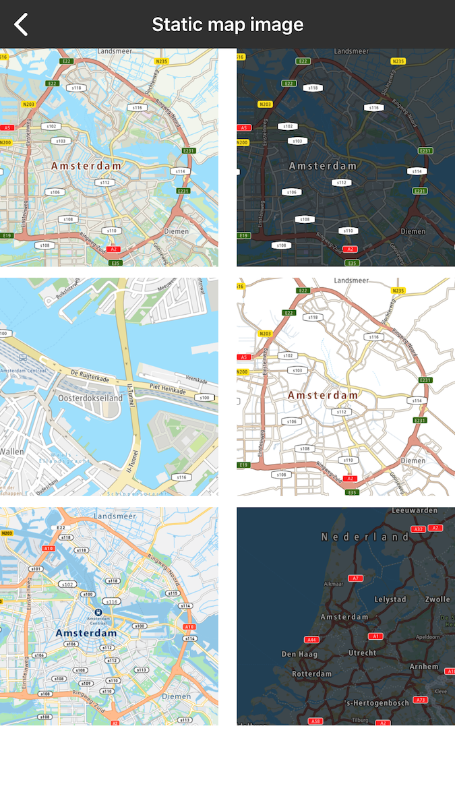
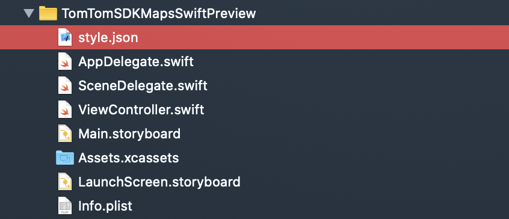

<a
  href="#"
  style={{ display: 'block', margin: '0', padding: '0' }}
  name="_map_extensions"
></a>

# Map Extensions

Have a look at our map extensions to make development more concise and pleasant.

<a
  href="#"
  style={{ display: 'block', margin: '0', padding: '0' }}
  name="ui-extensions"
></a>

## Map UI Extensions

The iOS Maps SDK provides the following built-in UI views:

- Compass button
- Current location button
- Panning controls
- Zooming controls

You can toggle the visibility of these views using the UiSettings class. Changes made on this class
are immediately reflected on the map. Each UI element has a predefined style that determines its
position relative to the edge of the map. This style can be overridden to provide a custom position,
adjust size, or replace default colors. It is also possible to alter these parameters in runtime by
modifying the view’s LayoutParams.

<a
  href="#"
  style={{ display: 'block', margin: '0', padding: '0' }}
  name="_getting_started"
></a>

## Getting started

TTControlView class is a part of ExampleOnlieSDKMapsUIExtensions framework. To be able to use it, add
this framework to Podfile as follows:

```objectivec
pod 'ExampleOnlineSDKMapsUIExtensions'
```

The next step is to add TTControlView on top of TTMapView with the same size, either through
constraints or a frame, and then to make a relation between these views.

<Code>

```swift
controlView.mapView = mapView
```

```objectivec
controlView.mapView = self.mapView
```

</Code>

<a
  href="#"
  style={{ display: 'block', margin: '0', padding: '0' }}
  name="_compass"
></a>

### Compass

By default, the compass button is enabled and located at the top left corner of the map: "MapView".
The compass only appears when the map orientation is different than zero (‘North' position). When
the user clicks on the compass button, the map orientation is set to zero and the compass
disappears.

<table>
  <tbody>
    <tr>
      <td>
        <ContentWrapper maxWidth="50px" objectFit="contain">
          <p>
            
          </p>
        </ContentWrapper>
        <p>Default</p>
      </td>
      <td>
        <ContentWrapper maxWidth="50px" objectFit="contain">
          <p>
            
          </p>
        </ContentWrapper>
        <p>Pressed</p>
      </td>
    </tr>
    <tr>
      <td>
        <ContentWrapper maxWidth="50px" objectFit="contain">
          <p>
            
          </p>
        </ContentWrapper>
        <p>North up</p>
      </td>
      <td></td>
    </tr>
  </tbody>
</table>

- To disable the compass button:

<Code>

```swift
controlView.compassButton?.isHidden = true
```

```objectivec
self.controlView.compassButton.hidden = YES;
```

</Code>

- To enable the compass button:

<Code>

```swift
controlView.initDefaultCompassButton()
```

```objectivec
[self.controlView initDefaultCompassButton];
```

</Code>

- To override the default style:

<Code>

```swift
controlView.setCompassButton(customCompassButton, withDefaultConstraints: true)
```

```objectivec
[self.controlView setCenterButton:customCompassButton withDefaultConstraints:YES];
```

</Code>

<a
  href="#"
  style={{ display: 'block', margin: '0', padding: '0' }}
  name="_current_location"
></a>

### Current location

By default, the current location button is enabled and placed in the bottom-left corner of the
map: "MapView". The current location button appears only when the map center position on the screen
is different from the user’s current location. When the user clicks the current location button, the
map location is set to the user’s location and the button disappears. The default action for the
button centers the map on the user’s location if "MapView" has been set up to show the current
position on 'YES'.

<table>
  <tbody>
    <tr>
      <td>
        <ContentWrapper maxWidth="50px" objectFit="contain">
          <p>
            
          </p>
        </ContentWrapper>
        <p>Default</p>
      </td>
      <td>
        <ContentWrapper maxWidth="50px" objectFit="contain">
          <p>
            
          </p>
        </ContentWrapper>
        <p>Pressed</p>
      </td>
    </tr>
  </tbody>
</table>

- To disable the current location button:

<Code>

```swift
controlView.centerButton?.isHidden = true
```

```objectivec
self.controlView.centerButton.hidden = YES;
```

</Code>

- To enable the current location button:

<Code>

```swift
controlView.initDefaultCenterButton()
```

```objectivec
[self.controlView initDefaultCenterButton];
```

</Code>

- To override the default style:

<Code>

```swift
controlView.setCenter(customCurrentLocationButton, withDefaultConstraints: true)
```

```objectivec
[self.controlView setCenterButton:customCurrentLocationButton withDefaultConstraints:YES];
```

</Code>

<a
  href="#"
  style={{ display: 'block', margin: '0', padding: '0' }}
  name="_panning_controls"
></a>

### Panning controls

By default, the panning controls view is disabled and it is placed vertically in the center and
horizontally on right-side of the map: "MapView". The default action for the view is to move the map
in a desired direction.

<table>
  <tbody>
    <tr>
      <td>
        <ContentWrapper maxWidth="50px" objectFit="contain">
          <p>
            
          </p>
        </ContentWrapper>
        <ContentWrapper maxWidth="50px" objectFit="contain">
          <p>
            
          </p>
        </ContentWrapper>
        <p>Pan down</p>
      </td>
      <td>
        <ContentWrapper maxWidth="50px" objectFit="contain">
          <p>
            
          </p>
        </ContentWrapper>
        <ContentWrapper maxWidth="50px" objectFit="contain">
          <p>
            
          </p>
        </ContentWrapper>
        <p>Pan left</p>
      </td>
    </tr>
    <tr>
      <td>
        <ContentWrapper maxWidth="50px" objectFit="contain">
          <p>
            
          </p>
        </ContentWrapper>
        <ContentWrapper maxWidth="50px" objectFit="contain">
          <p>
            
          </p>
        </ContentWrapper>
        <p>Pan right</p>
      </td>
      <td>
        <ContentWrapper maxWidth="50px" objectFit="contain">
          <p>
            
          </p>
        </ContentWrapper>
        <ContentWrapper maxWidth="50px" objectFit="contain">
          <p>
            
          </p>
        </ContentWrapper>
        <p>Pan up</p>
      </td>
    </tr>
  </tbody>
</table>

- To enable the panning controls:

<Code>

```swift
controlView.initDefaultTTPanControlView()
```

```objectivec
[self.controlView initDefaultTTPanControlView];
```

</Code>

- To disable the panning controls:

<Code>

```swift
controlView.controlView?.isHidden = true
```

```objectivec
self.controlView.controlView.hidden = YES;
```

</Code>

\* To override the default style:

<Code>

```swift
controlView.controlView?.leftControlBtn = customControlLeftButton
```

```objectivec
self.controlView.controlView.leftControlBtn = customControlLeftButton;
```

</Code>

<a
  href="#"
  style={{ display: 'block', margin: '0', padding: '0' }}
  name="_zooming_controls"
></a>

### Zooming controls

By default, the zooming controls view is disabled and it is placed vertically in the center and
horizontally on right-side of the map: "MapView". The default action for the view is to zoom in or
zoom out the map.

<table>
  <tbody>
    <tr>
      <td>
        <ContentWrapper maxWidth="50px" objectFit="contain">
          <p>
            
          </p>
        </ContentWrapper>
        <ContentWrapper maxWidth="50px" objectFit="contain">
          <p>
            
          </p>
        </ContentWrapper>
        <p>Zoom in</p>
      </td>
      <td>
        <ContentWrapper maxWidth="50px" objectFit="contain">
          <p>
            
          </p>
        </ContentWrapper>
        <ContentWrapper maxWidth="50px" objectFit="contain">
          <p>
            
          </p>
        </ContentWrapper>
        <p>Zoom out</p>
      </td>
    </tr>
  </tbody>
</table>

- To enable the zooming controls:

<Code>

```swift
controlView.initDefaultTTZoom()
```

```objectivec
[self.controlView initDefaultTTZoomView];
```

</Code>

- To disable the zooming controls:

<Code>

```swift
controlView.zoomView?.isHidden = true
```

```objectivec
self.controlView.zoomView.hidden = YES;
```

</Code>

- To override the default style:

<Code>

```swift
controlView.zoomView?.zoomIn = customControlZoomInButton
```

```objectivec
self.controlView.zoomView.zoomIn = customControlZoomInButton;
```

</Code>

== Api Reference Map UI
Extensions [API reference for Map UI Extensions](https://developer.Example.com/assets/downloads/mapssdk/APIReferences/APIDocMapsuiextensions_2.4.714/index.html)

<a
  href="#"
  style={{ display: 'block', margin: '0', padding: '0' }}
  name="static-image"
></a>

## Static Map Image

Allow your user to render a user-defined rectangular image, containing a map section.

For more details, please
visit [Static Map Image documentation](https://developer.Example.com/maps-api/maps-api-documentation-raster/static-image)

**Sample use case 1:** Your app is designed to use simple map. You do not want to show the entire
map, just some part of it to show and mark something simple. You don’t have to download the whole
ExampleOnlineSDKMaps library which is much heavier compared to this library.

To use this library, add the following dependency to the Podfile file:

```objectivec
pod 'ExampleOnlineSDKMapsStaticImage'
```

Example of displaying static map:

<Code>

```swift
let query = TTStaticImageQueryBuilder.withCenter(TTCoordinate.AMSTERDAM())
    .withLayer(.basic)
    .withStyle(.main)
    .withExt(.PNG)
    .withHeight(512)
    .withWidth(512)
    .build()
```

```objectivec
TTStaticImageQuery *query = [[[[[[[TTStaticImageQueryBuilder withCenter:[TTCoordinate AMSTERDAM]] withLayer:TTLayerTypeBasic] withStyle:TTStyleTypeMain] withExt:TTExtTypePNG] withHeight:512] withWidth:512] build];
```

</Code>

<table>
  <tbody>
    <tr>
      <td>
        <ContentWrapper maxWidth="512px" objectFit="contain">
          <p>
            
          </p>
        </ContentWrapper>
        <p>Sample image retrieved from the static map service.</p>
      </td>
      <td></td>
    </tr>
    <tr>
      <td>
        <ContentWrapper maxWidth="512px" objectFit="contain">
          <p>
            
          </p>
        </ContentWrapper>
        <p>Examples of static map images.</p>
      </td>
      <td></td>
    </tr>
  </tbody>
</table>

<a
  href="#"
  style={{ display: 'block', margin: '0', padding: '0' }}
  name="_api_reference_static_map_image"
></a>

# Api Reference Static Map Image

[API reference for Static Map Image](https://developer.Example.com/assets/downloads/mapssdk/APIReferences/APIDocMapsStaticImage_2.4.714/index.html)

<a
  href="#"
  style={{ display: 'block', margin: '0', padding: '0' }}
  name="styles-extensions"
></a>

## Map Styles Extensions

The Example Maps SDK gives you the ability to use either online or offline styles in your mobile
application.

- If you choose to use offline styles, they will be imported to your app with the Maps SDK package.
  Thanks to that, the styles will already be included in your app at download time. The styles are
  added to the Maps SDK package by default.
- If you choose to use online styles, they will be downloaded into your application when the map is
  displayed for the first time. Thanks to that, your mobile app size is smaller at the app’s
  download time so your app downloadable is lighter. In this case you need to exclude offline styles
  from the SDK.

<a
  href="#"
  style={{ display: 'block', margin: '0', padding: '0' }}
  name="_offline_styles"
></a>

### Offline styles

To use the offline style framework, no actions are required because offline styles are attached to
the map by default. To use the offline style library, no actions are required because offline styles
are attached to the map by default i.e. the offline style framework 'ExampleOnlineSDKMapsStyle' will
be added automatically while fetching 'ExampleOnlineSDKMaps'.

```code
pod 'ExampleOnlineSDKMaps'
```

If offline styles are not attached to the project, nor online style is setup for the map, a black
screen will render in mapView.

<a
  href="#"
  style={{ display: 'block', margin: '0', padding: '0' }}
  name="_online_styles"
></a>

### Online styles

To exclude offline styles from the ExampleOnlineSDKMaps framework, use an exclude declaration when
the ExampleOnlineSDKMaps framework is declared as shown in the following code example.

```code
pod 'ExampleOnlineSDKMaps/Online'
```

When offline styles are excluded, the online styles should be set up.

<Code>

```swift
let mapStyleConfiguration = TTMapStyleDefaultConfiguration()
let mapConfig = TTMapConfigurationBuilder.create().withMapStyleConfiguration(mapStyleConfiguration).build()
let mapView = TTMapView(mapConfiguration: mapConfig)
```

```objectivec
TTMapStyleDefaultConfiguration *style = [[TTMapStyleDefaultConfiguration alloc] init];
TTMapConfiguration *config = [[[[[TTMapConfigurationBuilder createBuilder] withMapKey:Key.Map] withTrafficKey:Key.Traffic] withMapStyleConfiguration:style] build];
TTMapView *mapView = [[TTMapView alloc] initWithMapConfiguration:config];
```

</Code>

    self.view = mapView;
    self.mapView = mapView;

You can set up online styles in `TTMapView`:

<Code>

```swift
let mapStyleConfiguration = TTMapStyleConfiguration(styleURL: "<style json>")
let mapConfig = TTMapConfigurationBuilder.create().withMapStyleConfiguration(mapStyleConfiguration).build()
let mapView = TTMapView(mapConfiguration: mapConfig)
```

```objectivec
TTMapStyleConfiguration *mapStyleConfiguration = [[TTMapStyleConfiguration alloc] initWithStyleURL:@"<style json>"];    TTMapConfiguration *mapConfig = [[[TTMapConfigurationBuilder createBuilder] withMapStyleConfiguration:mapStyleConfiguration] build];
TTMapView *mapView = [[TTMapView alloc] initWithMapConfiguration:mapConfig];
```

</Code>

<a
  href="#"
  style={{ display: 'block', margin: '0', padding: '0' }}
  name="_styling_from_source"
></a>

### Styling from source

You can use your offline style files in a similar manner to online hosted ones. You need just to
pass a file path to the JSON file in your project as styleUrl.

<Blockquote type="announcement" hasIcon>

If you want to use `style.json` located in the main project catalog,
use: `"asset://../../style.json"`

</Blockquote>

<ContentWrapper maxWidth="350px" objectFit="contain">



</ContentWrapper>