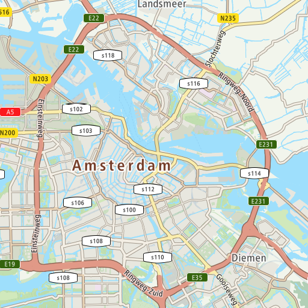
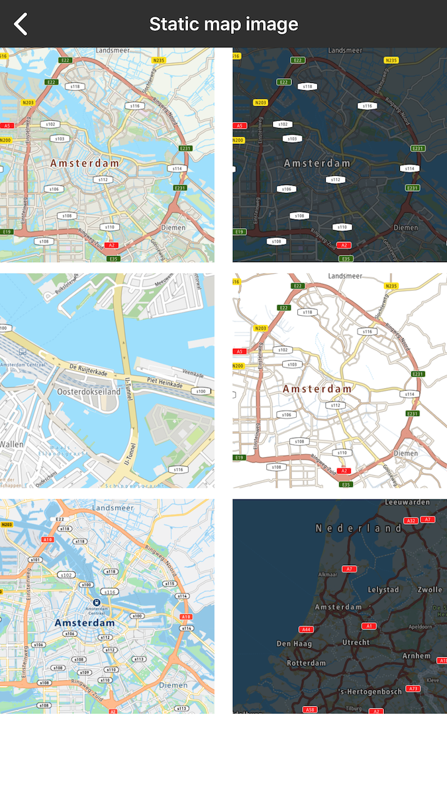

<a
  href="#"
  style={{ display: 'block', margin: '0', padding: '0' }}
  name="static-image"
></a>

Allow your user to render a user-defined rectangular image, containing a map section.

For more details, please
visit [Static Map Image documentation](https://developer.Example.com/maps-api/maps-api-documentation-raster/static-image)

**Sample use case 1:** Your app is designed to use simple map. You do not want to show the entire
map, just some part of it to show and mark something simple. You don’t have to download the whole
ExampleOnlineSDKMaps library which is much heavier compared to this library.

To use this library, add the following dependency to the Podfile file:

```objectivec
pod 'ExampleOnlineSDKMapsStaticImage'
```

Example of displaying static map:

<Code>

```swift
let query = TTStaticImageQueryBuilder.withCenter(TTCoordinate.AMSTERDAM())
    .withLayer(.basic)
    .withStyle(.main)
    .withExt(.PNG)
    .withHeight(512)
    .withWidth(512)
    .build()
```

```objectivec
TTStaticImageQuery *query = [[[[[[[TTStaticImageQueryBuilder withCenter:[TTCoordinate AMSTERDAM]] withLayer:TTLayerTypeBasic] withStyle:TTStyleTypeMain] withExt:TTExtTypePNG] withHeight:512] withWidth:512] build]
```

</Code>

<table>
  <tbody>
    <tr>
      <td>
        <ContentWrapper maxWidth="512px" objectFit="contain">
          <p>
            
          </p>
        </ContentWrapper>
        <p>Sample image retrieved from the static map service.</p>
      </td>
      <td></td>
    </tr>
    <tr>
      <td>
        <ContentWrapper maxWidth="512px" objectFit="contain">
          <p>
            
          </p>
        </ContentWrapper>
        <p>Examples of static map images.</p>
      </td>
      <td></td>
    </tr>
  </tbody>
</table>

<a
  href="#"
  style={{ display: 'block', margin: '0', padding: '0' }}
  name="_api_reference_static_map_image"
></a>

# Api Reference Static Map Image

[API reference for Static Map Image](https://developer.Example.com/assets/downloads/mapssdk/APIReferences/APIDocMapsStaticImage_2.4.714/index.html)