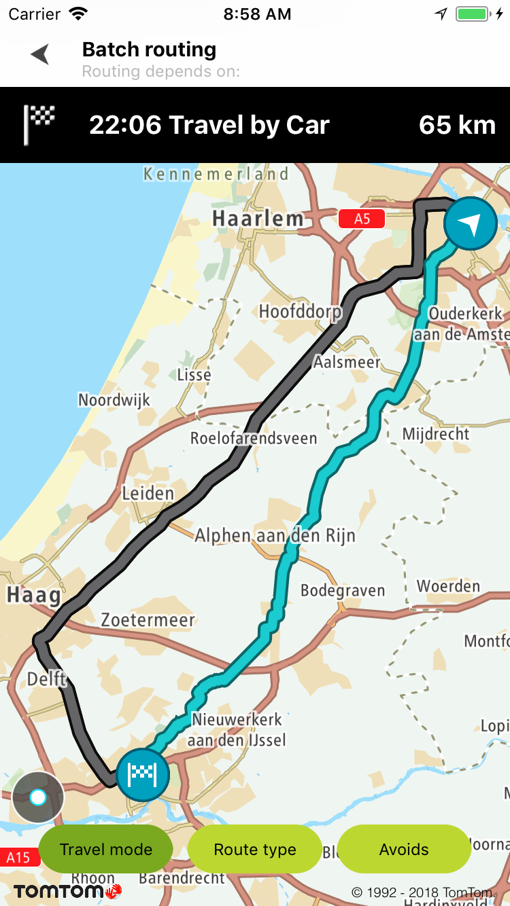
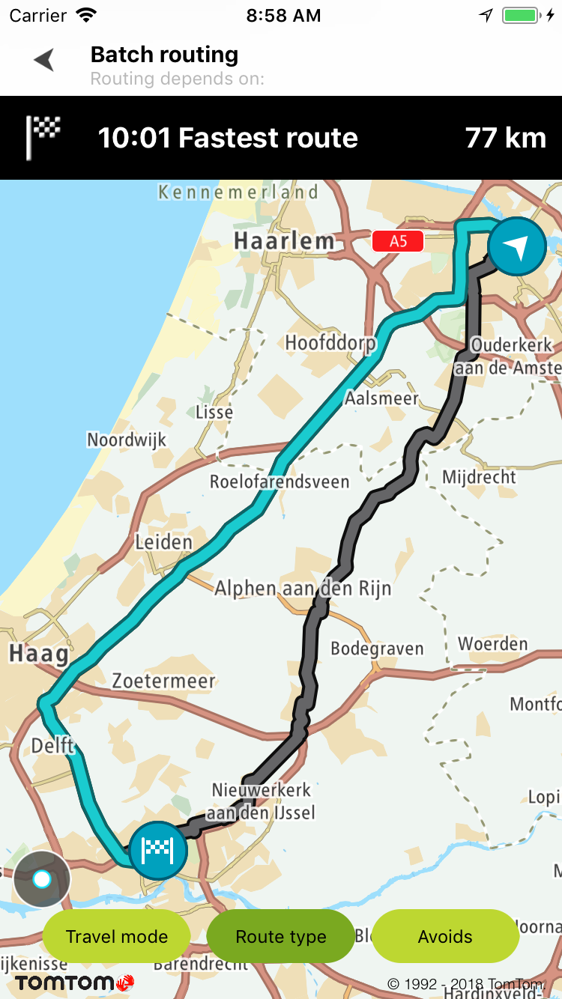
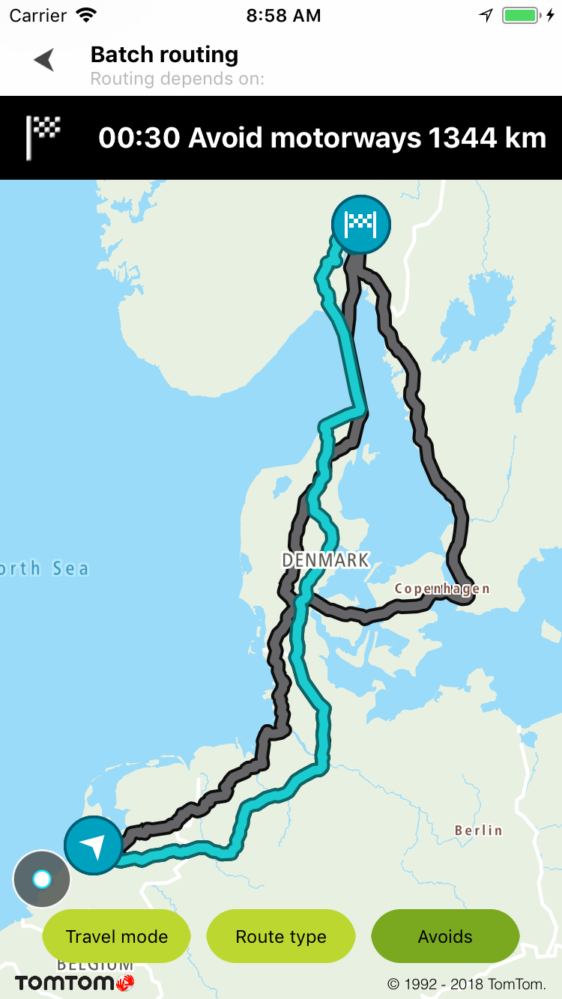

<a
  href="#"
  style={{ display: 'block', margin: '0', padding: '0' }}
  name="barch-routing"
></a>

Allow your users to send multiple synchronous routing requests with Batch Routing components. You
can mix different types of routing requests to compare them in an easy way.

Batch Routing components described use
the [Online Batch Routing API](/routing-api/documentation/batch-routing/synchronous-batch)
, so you can find all details about it in the service documentation.

**Sample use case:** You are preparing for a trip and you would like to choose the most optimal
route for your travel. You would like to compare the ETA and distances for routes depending on
travel modes, route types, or avoids.

Also, you can adjust the Batch Request with other parameters described in
the [Online Batch Routing API](/routing-api/documentation/batch-routing/synchronous-batch)
or JavaDocs of this SDK under the Api reference section.

The example below shows multiple routes requested in the batch. Each example sends three requests in
one batch. All examples allow a user to compare routes visually on the map, their ETAs, and
distances by clicking a chosen route.

- The Travel mode example shows three routes: The route by car, the route by truck, and the route as
  a pedestrian.
- The Route type example shows three routes: The fastest route, the shortest route, and the most eco
  route.
- The Avoids example shows three routes: the avoid-motorways route, the avoid-ferries route, and the
  avoid-toll roads.

Use the following code sample to implement a similar use case.

To request a batch query create a `TTBatchRouteQuery`:

<Code>

```swift
let batchQuery = TTBatchRouteQueryBuilder.createRouteQuery(queryCar)
    .add(queryTruck)
    .add(queryPedestrain)
    .build()
```

```objectivec
TTBatchRouteQuery *batchQuery = [[[[TTBatchRouteQueryBuilder createRouteQuery:queryCar] addRouteQuery:queryTruck] addRouteQuery:queryPedestrain] build]
```

</Code>

and pass it to the Routing API:

<Code>

```swift
batchRoute = TTBatchRoute(key: Key.Routing)
batchRoute.delegate = self
batchRoute.batchRoute(with: batchQuery)
```

```objectivec
self.batchRoute = [[TTBatchRoute alloc] initWithKey:Key.Routing];
self.batchRoute.delegate = self;
[self.batchRoute batchRouteWithQuery:batchQuery];
```

</Code>

Setup of the common params for the Batch Routing query:

<Code>

```swift
let queryPedestrain = TTRouteQueryBuilder.create(withDest: TTCoordinate.ROTTERDAM(), andOrig: TTCoordinate.AMSTERDAM())
    .withComputeBestOrder(true)
    .withTraffic(true)
    .withTravelMode(TTOptionTravelMode.pedestrian)
    .build()
```

```objectivec
TTRouteQuery *queryPedestrain = [[[[[TTRouteQueryBuilder createWithDest:[TTCoordinate ROTTERDAM] andOrig:[TTCoordinate AMSTERDAM]] withComputeBestOrder:YES] withTraffic:YES] withTravelMode:TTOptionTravelModePedestrian] build];
```

</Code>

The result can be observed with TTBatchRouteResponseDelegate:

<Code>

```swift
func batch(_: TTBatchRoute, completedWith response: TTBatchRouteResponse) {
    response.visit(self)
    displayRouteOverview()
}
func batch(_: TTBatchRoute, failedWithError responseError: TTResponseError) {
}
func visitRoute(_ response: TTRouteResult) {
    let mapRoute = TTMapRoute(coordinatesData: response.routes.first!,
                              with: TTMapRouteStyle.defaultInactive(),
                              imageStart: TTMapRoute.defaultImageDeparture(),
                              imageEnd: TTMapRoute.defaultImageDestination())
    mapRoute.extraData = response.routes.first?.summary
    mapView.routeManager.add(mapRoute)
    progress.hide()
}
```

```objectivec
- (void)batch:(TTBatchRoute *_Nonnull)route completedWithResponse:(TTBatchRouteResponse *_Nonnull)response {
    [response visit:self];
    UIEdgeInsets insets = UIEdgeInsetsMake(30 * UIScreen.mainScreen.scale, 10 * UIScreen.mainScreen.scale, 30 * UIScreen.mainScreen.scale, 10 * UIScreen.mainScreen.scale);
    self.mapView.contentInset = insets;
    [self.mapView.routeManager showAllRoutesOverview];
}
- (void)batch:(TTBatchRoute *_Nonnull)route failedWithError:(TTResponseError *_Nonnull)responseError {
}
- (void)visitRoute:(TTRouteResult *)response {
    TTMapRoute *mapRoute = [TTMapRoute routeWithCoordinatesData:response.routes.firstObject withRouteStyle:TTMapRouteStyle.defaultInactiveStyle imageStart:TTMapRoute.defaultImageDeparture imageEnd:TTMapRoute.defaultImageDestination];
    mapRoute.extraData = response.routes.firstObject.summary;
    [self.mapView.routeManager addRoute:mapRoute];
    [self.progress hide];
}
```

</Code>

<table>
  <tbody>
    <tr>
      <td>
        <ContentWrapper maxWidth="350px" objectFit="contain">
          <p>
            
          </p>
        </ContentWrapper>
        <p>Travel modes: car, truck, pedestrian</p>
      </td>
      <td>
        <ContentWrapper maxWidth="350px" objectFit="contain">
          <p>
            
          </p>
        </ContentWrapper>
        <p>Route type: fastest, shortest, eco</p>
      </td>
    </tr>
    <tr>
      <td>
        <ContentWrapper maxWidth="350px" objectFit="contain">
          <p>
            
          </p>
        </ContentWrapper>
        <p>Avoids: motorways, ferries, toll roads</p>
      </td>
      <td></td>
    </tr>
  </tbody>
</table>

You can select a route and get information about ETA and distances.