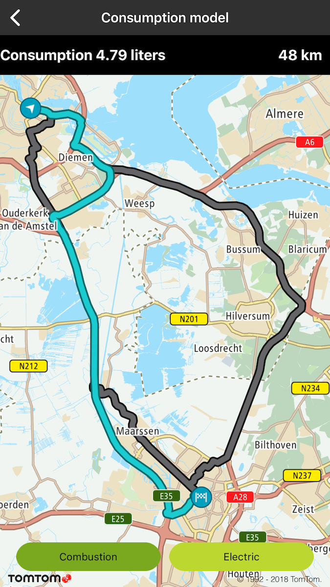
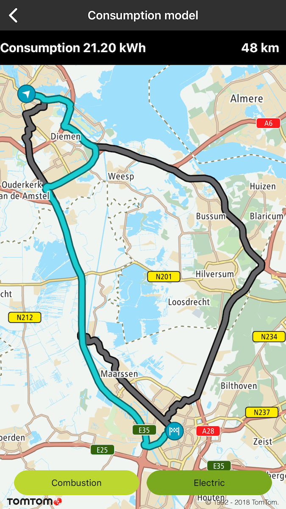

<a
  href="#"
  style={{ display: 'block', margin: '0', padding: '0' }}
  name="Consumption-Model"
></a>

Allow your user to utilise the vehicle-specific consumption model when requesting a new route. The
consumption model can be calculated based on a number of Routing API parameters for two vehicle
types: combustion or electric. The output will contain the additional field fuelConsumptionInLiters
or batteryConsumptionInkWh.

**Sample use case:** You are planning a journey and you want to select the most optimal route in
terms of fuel/energy consumption.

To request a route and calculate the consumption model for a combustion vehicle:

<Code>

```swift
style = ETAView.ETAViewStyle.consumptionLiters
var speedConsumptionInLiters: [TTSpeedConsumption] = [TTSpeedConsumptionMake(10, 6.5),
                                                      TTSpeedConsumptionMake(30, 7.0),
                                                      TTSpeedConsumptionMake(50, 8.0),
                                                      TTSpeedConsumptionMake(70, 8.4),
                                                      TTSpeedConsumptionMake(90, 7.7),
                                                      TTSpeedConsumptionMake(120, 7.5),
                                                      TTSpeedConsumptionMake(150, 9.0)]
let query = TTRouteQueryBuilder.create(withDest: TTCoordinate.UTRECHT(), andOrig: TTCoordinate.AMSTERDAM())
    .withMaxAlternatives(2)
    .withVehicleWeight(1600)
    .withCurrentFuel(inLiters: 50.0)
    .withCurrentAuxiliaryPower(inLitersPerHour: 0.2)
    .withFuelEnergyDensity(inMJoulesPerLiter: 34.2)
    .withAccelerationEfficiency(0.33)
    .withDecelerationEfficiency(0.33)
    .withUphillEfficiency(0.33)
    .withDownhillEfficiency(0.33)
    .withVehicleEngineType(.combustion)
    .withSpeedConsumption(inLitersPairs: &speedConsumptionInLiters, count: UInt(speedConsumptionInLiters.count))
    .build()
routePlanner.plan(with: query)
```

```objectivec
self.style = ETAViewStyleConsumptionLiters
TTSpeedConsumption speedConsumptionInLiters[7];
speedConsumptionInLiters[0] = TTSpeedConsumptionMake(10, 6.5);
speedConsumptionInLiters[1] = TTSpeedConsumptionMake(30, 7.0);
speedConsumptionInLiters[2] = TTSpeedConsumptionMake(50, 8.0);
speedConsumptionInLiters[3] = TTSpeedConsumptionMake(70, 8.4);
speedConsumptionInLiters[4] = TTSpeedConsumptionMake(90, 7.7);
speedConsumptionInLiters[5] = TTSpeedConsumptionMake(120, 7.5);
speedConsumptionInLiters[6] = TTSpeedConsumptionMake(150, 9.0);
TTRouteQuery *query = [[[[[[[[[[[[[TTRouteQueryBuilder createWithDest:[TTCoordinate UTRECHT] andOrig:[TTCoordinate AMSTERDAM]] withMaxAlternatives:2] withVehicleWeight:1600] withCurrentFuelInLiters:50.0] withCurrentAuxiliaryPowerInLitersPerHour:0.2] withFuelEnergyDensityInMJoulesPerLiter:34.2]
    withAccelerationEfficiency:0.33] withDecelerationEfficiency:0.33] withUphillEfficiency:0.33] withDownhillEfficiency:0.33] withVehicleEngineType:TTOptionVehicleEngineTypeCombustion] withSpeedConsumptionInLitersPairs:speedConsumptionInLiters count:7] build];
[self.routePlanner planRouteWithQuery:query];
```

</Code>

To request a route and calculate the consumption model for an electric vehicle:

<Code>

```swift
style = ETAView.ETAViewStyle.consumptionKWh
var speedConsumptionInkWh: [TTSpeedConsumption] = [TTSpeedConsumptionMake(10, 5.0),
                                                   TTSpeedConsumptionMake(30, 10.0),
                                                   TTSpeedConsumptionMake(50, 15.0),
                                                   TTSpeedConsumptionMake(70, 20.0),
                                                   TTSpeedConsumptionMake(90, 25.0),
                                                   TTSpeedConsumptionMake(120, 30.0)]
let query = TTRouteQueryBuilder.create(withDest: TTCoordinate.UTRECHT(), andOrig: TTCoordinate.AMSTERDAM())
    .withMaxAlternatives(2)
    .withVehicleWeight(1600)
    .withCurrentChargeInkWh(43)
    .withMaxChargeInkWh(85)
    .withAuxiliaryPowerInkW(1.7)
    .withAccelerationEfficiency(0.33)
    .withDecelerationEfficiency(0.33)
    .withUphillEfficiency(0.33)
    .withDownhillEfficiency(0.33)
    .withVehicleEngineType(.electric)
    .withSpeedConsumptionInkWhPairs(&speedConsumptionInkWh, count: UInt(speedConsumptionInkWh.count))
    .build()
routePlanner.plan(with: query)
```

```objectivec
self.style = ETAViewStyleConsumptionKWh;
TTSpeedConsumption speedConsumptionInkWh[6];
speedConsumptionInkWh[0] = TTSpeedConsumptionMake(10, 5.0);
speedConsumptionInkWh[1] = TTSpeedConsumptionMake(30, 10.0);
speedConsumptionInkWh[2] = TTSpeedConsumptionMake(50, 15.0);
speedConsumptionInkWh[3] = TTSpeedConsumptionMake(70, 20.0);
speedConsumptionInkWh[4] = TTSpeedConsumptionMake(90, 25.0);
speedConsumptionInkWh[5] = TTSpeedConsumptionMake(120, 30.0);
TTRouteQuery *query = [[[[[[[[[[[[[TTRouteQueryBuilder createWithDest:[TTCoordinate UTRECHT] andOrig:[TTCoordinate AMSTERDAM]] withMaxAlternatives:2] withVehicleWeight:1600] withCurrentChargeInkWh:43] withMaxChargeInkWh:85] withAuxiliaryPowerInkW:1.7] withAccelerationEfficiency:0.33]
    withDecelerationEfficiency:0.33] withUphillEfficiency:0.33] withDownhillEfficiency:0.33] withVehicleEngineType:(TTOptionVehicleEngineTypeElectric)] withSpeedConsumptionInkWhPairs:speedConsumptionInkWh count:6] build];
[self.routePlanner planRouteWithQuery:query];
```

</Code>

<table>
  <tbody>
    <tr>
      <td>
        <ContentWrapper maxWidth="350px" objectFit="contain">
          <p>
            
          </p>
        </ContentWrapper>
        <p>Combustion</p>
      </td>
      <td>
        <ContentWrapper maxWidth="350px" objectFit="contain">
          <p>
            
          </p>
        </ContentWrapper>
        <p>Electric</p>
      </td>
    </tr>
  </tbody>
</table>