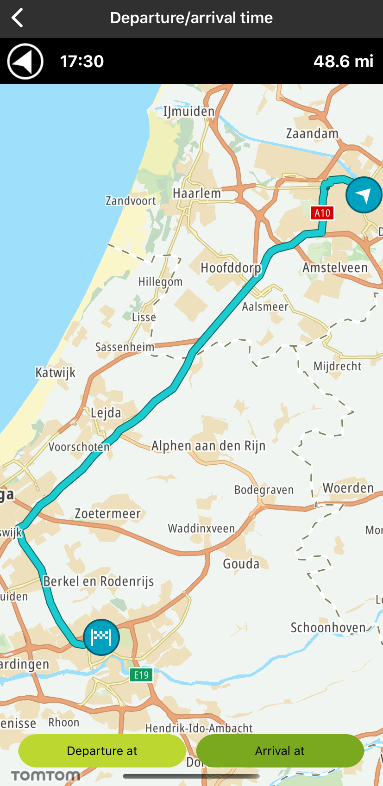
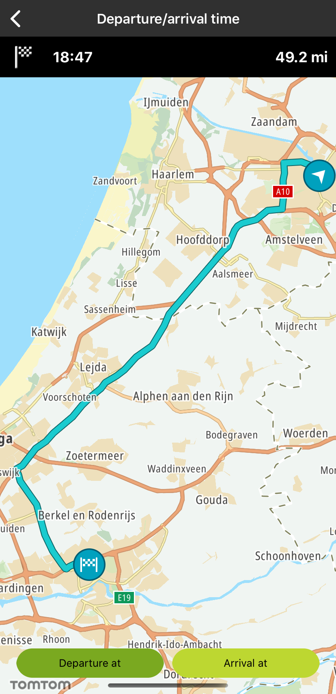

<a
  href="#"
  style={{ display: 'block', margin: '0', padding: '0' }}
  name="departure-arrival"
></a>

Allow your users to plan a route for a specific arrival or departure time so they can use this
information to adjust their commute plans.

**Sample use case**: You have a busy schedule and need to carefully plan your day. You use the "
arrive at" option to learn when you need to leave in order to be at a specific place at a specific
time. You then use "depart at" to know your ETA for your next appointment.

In the following example you can see a sample implementation using the arrive at and depart at
parameters for a trip from Amsterdam to Rotterdam. The example uses a standard date/time picker
widget.

<Code>

```swift
let query = TTRouteQueryBuilder.create(withDest: TTCoordinate.ROTTERDAM(), andOrig: TTCoordinate.AMSTERDAM())
    .withDepartAt(date)
    .build()
self.routePlanner.plan(with: query)
```

```objectivec
TTRouteQuery *query = [[[TTRouteQueryBuilder createWithDest:[TTCoordinate ROTTERDAM] andOrig:[TTCoordinate AMSTERDAM]] withDepartAt:date] build]
[weakSelf.routePlanner planRouteWithQuery:query];
```

</Code>
<Code>

```swift
let query = TTRouteQueryBuilder.create(withDest: TTCoordinate.ROTTERDAM(), andOrig: TTCoordinate.AMSTERDAM())
    .withArriveAt(date)
    .build()
self.routePlanner.plan(with: query)
```

```objectivec
TTRouteQuery *query = [[[TTRouteQueryBuilder createWithDest:[TTCoordinate ROTTERDAM] andOrig:[TTCoordinate AMSTERDAM]] withArriveAt:date] build];
[weakSelf.routePlanner planRouteWithQuery:query];
```

</Code>

<table>
  <tbody>
    <tr>
      <td>
        <ContentWrapper maxWidth="350px" objectFit="contain">
          <p>
            
          </p>
        </ContentWrapper>
        <p>Deprature at</p>
      </td>
      <td>
        <ContentWrapper maxWidth="350px" objectFit="contain">
          <p>
            
          </p>
        </ContentWrapper>
        <p>Arrival at</p>
      </td>
    </tr>
  </tbody>
</table>