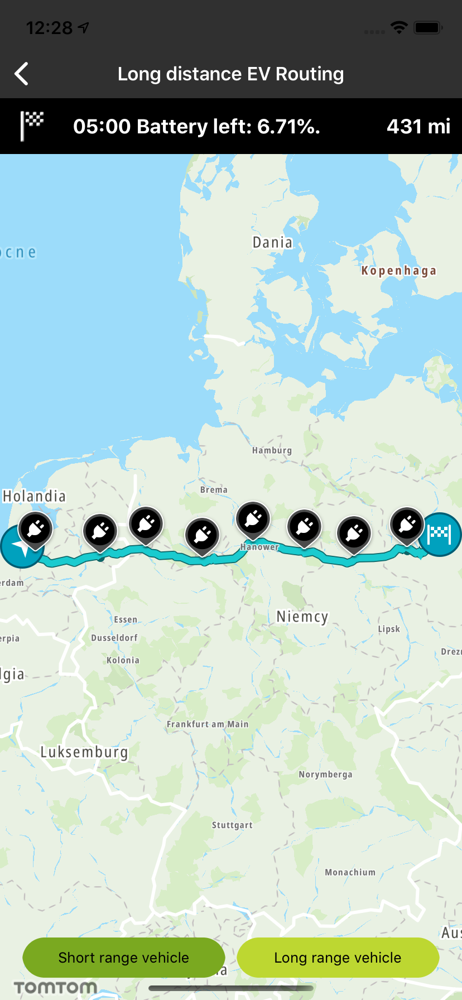
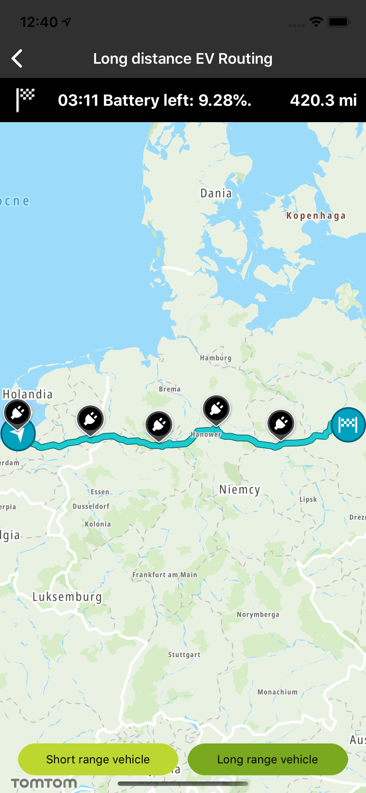

<a
  href="#"
  style={{ display: 'block', margin: '0', padding: '0' }}
  name="ev-routing"
></a>

Plan a route between a given origin and destination that automatically includes charging stops along
the way with Long Distance EV Routing API that is available in Maps SDK. Long Distance EV Routing
automatically adds charging stops to your route based on a number of parameters specific for your
electric car and driving behavior. Have a look at the detailed documentation Long Distance EV
Routing [Long Distance EV Routing](/routing-api/documentation/extended-routing/long-distance-ev-routing). Long Distance EV Routing can be used in variety of use cases that will help users of your app to
plan routes for their electric cars to avoid car charging anxiety and enjoy peaceful driving. We
prepared a few examples of such use cases.

**Sample use case:** You would like to plan a long route for your electric car that will take into
consideration charging stops. Thanks to that, you will know in advance when you need to stop to
charge your car. Also, you will be able to estimate how much energy will be consumed during the
trip. Using Example Long Distance EV Routing you will be provided also with energy-efficient route
with accurate battery consumption calculations, even considering the route profile and expected
traffic.

**Sample use case:** You would like to see how much battery you have left when arriving at a stop so
that you can find out what the options are if you need an alternative charger.

In order to plan an EV route, you need to set the vehicle parameters in your app such as vehicle
weight, vehicle length, vehicle height and others. For your convenience we have created predefined
examples of vehicle objects representing prototypical EV with different ranges defining how far will
they really go on a single charge. This will help you to easily try out Long Distance EV Routing
functionality without specifying all the detailed parameters defining the particular vehicle model.

Example showing a possible vehicle definition for a short range vehicle.

<Code>

```swift
let origin = TTCoordinate.AMSTERDAM()
let destination = TTCoordinate.BERLIN()
let vehicle = ElectricVehicle.shortRange
let route = RouteOptions.fastestWithoutTraffic
let chargeSchema = ShortRangeChargingSchema()
evPlanner.planRoute(origin: origin, destination: destination, electricVehicle: vehicle, route: route, charging: chargeSchema) { [weak self] routes, _ in
    guard let self = self else { return }
    if let route = routes?.first {
        self.drawRoute(route, vehicle: vehicle)
        self.drawChargingStation(route)
    } else {
        self.handleNoRoutesFound()
    }
}
```

```objectivec
CLLocationCoordinate2D origin = [TTCoordinate AMSTERDAM]
CLLocationCoordinate2D destination = [TTCoordinate BERLIN];
ElectricVehicle *vehicle = [ElectricVehicle shortRange];
RouteOptions *routeOptions = [RouteOptions fastestWithoutTraffic];
__weak LongDistanceEVRoutingViewController *weakSelf = self;
ShortRangeChargingSchema *shortRange = [[ShortRangeChargingSchema alloc] init];
```

</Code>

    ```objectivec
    [self.routePlanner planRouteWithOrigin:origin
                               destination:destination
                           electricVehicle:vehicle
                                     route:routeOptions
                                  charging:shortRange
                                completion:^(NSArray<FullRouteEV *> *_Nullable result, NSError *_Nullable error) {
                                  LongDistanceEVRoutingViewController *strongSelf = weakSelf;
                                  if (strongSelf != NULL) {
                                      if (result != NULL && result.count > 0) {
                                          [strongSelf displayRoute:result[0] forVehicle:vehicle];
                                          [strongSelf drawChargingStation:result[0]];
                                      } else {
                                          [strongSelf handleNoRoutesFound];
                                      }
                                  }
                                }];
    ```

Example showing a possible vehicle definition for a long range vehicle.

```swift
let origin = TTCoordinate.AMSTERDAM()
let destination = TTCoordinate.BERLIN()
let vehicle = ElectricVehicle.longRange
let route = RouteOptions.fastestWithoutTraffic
let chargeSchema = LongRangeChargingSchema()
```

```objectivec
evPlanner.planRoute(origin: origin, destination: destination, electricVehicle: vehicle, route: route, charging: chargeSchema) { [weak self] routes, _ in
        guard let self = self else { return }
        if let route = routes?.first {
            self.drawRoute(route, vehicle: vehicle)
            self.drawChargingStation(route)
        } else {
            self.handleNoRoutesFound()
        }
    }
```

```objectivec
CLLocationCoordinate2D origin = [TTCoordinate AMSTERDAM];
CLLocationCoordinate2D destination = [TTCoordinate BERLIN];
ElectricVehicle *vehicle = [ElectricVehicle longRange];
RouteOptions *routeOptions = [RouteOptions fastestWithoutTraffic];
LongRangeChargingSchema *shortRange = [[LongRangeChargingSchema alloc] init];
```

```objectivec
__weak LongDistanceEVRoutingViewController *weakSelf = self;

    [self.routePlanner planRouteWithOrigin:origin
                               destination:destination
                           electricVehicle:vehicle
                                     route:routeOptions
                                  charging:shortRange
                                completion:^(NSArray<FullRouteEV *> *_Nullable result, NSError *_Nullable error) {
                                  LongDistanceEVRoutingViewController *strongSelf = weakSelf;
                                  if (strongSelf != NULL) {
                                      if (result != NULL && result.count > 0) {
                                          [strongSelf displayRoute:result[0] forVehicle:vehicle];
                                          [strongSelf drawChargingStation:result[0]];
                                      } else {
                                          [strongSelf handleNoRoutesFound];
                                      }
                                  }
                                }];
```

Screenshots presenting how the long EV distance routing functionality works.

<table>
  <tbody>
    <tr>
      <td>
        <ContentWrapper maxWidth="350px" objectFit="contain">
          <p>
            
          </p>
        </ContentWrapper>
        <p>Short Range</p>
      </td>
      <td>
        <ContentWrapper maxWidth="350px" objectFit="contain">
          <p>
            
          </p>
        </ContentWrapper>
        <p>Long Range</p>
      </td>
    </tr>
  </tbody>
</table>