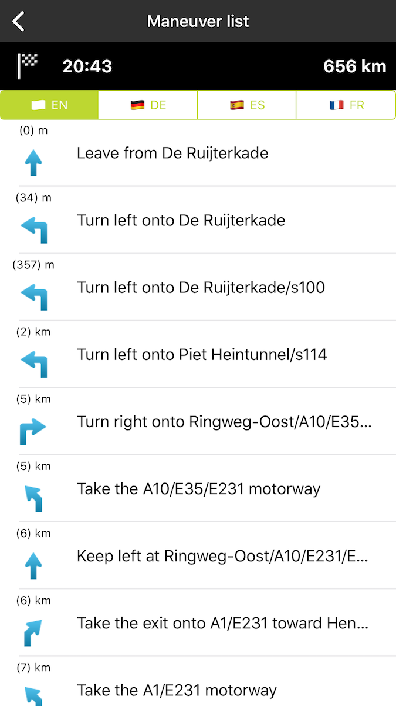
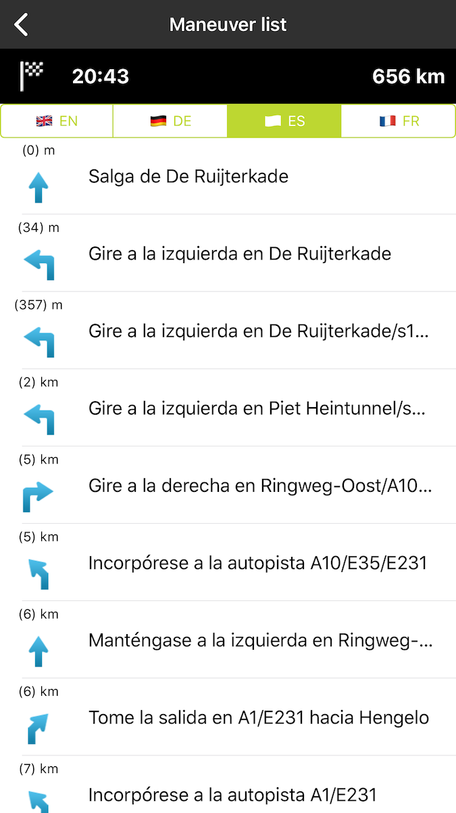

Serve your users with a list of maneuvers (driving instructions), providing turn by turn information
for every maneuver. You can get the maneuvers in different languages to internationalize your app.

**Sample use case**: You are planning a journey and you want to have the list of maneuvers so you
can look them up en route.

In the following example you can see an implementation of a maneuver list that is available in
English, German, Spanish, and French.

<Code>

```swift
let query = TTRouteQueryBuilder.create(withDest: TTCoordinate.BERLIN(), andOrig: TTCoordinate.AMSTERDAM())
    .withInstructionsType(.text)
    .withLang(language)
    .build()
routePlanner.plan(with: query)
```

```objectivec
TTRouteQuery *query = [[[[TTRouteQueryBuilder createWithDest:[TTCoordinate BERLIN] andOrig:[TTCoordinate AMSTERDAM]] withInstructionsType:TTOptionInstructionsTypeText] withLang:language] build]
[self.routePlanner planRouteWithQuery:query];
```

</Code>

<table>
  <tbody>
    <tr>
      <td>
        <ContentWrapper maxWidth="350px" objectFit="contain">
          <p>
            
          </p>
        </ContentWrapper>
        <p>Maneuver list in English</p>
      </td>
      <td>
        <ContentWrapper maxWidth="350px" objectFit="contain">
          <p>
            
          </p>
        </ContentWrapper>
        <p>Maneuver list in Spanish</p>
      </td>
    </tr>
  </tbody>
</table>