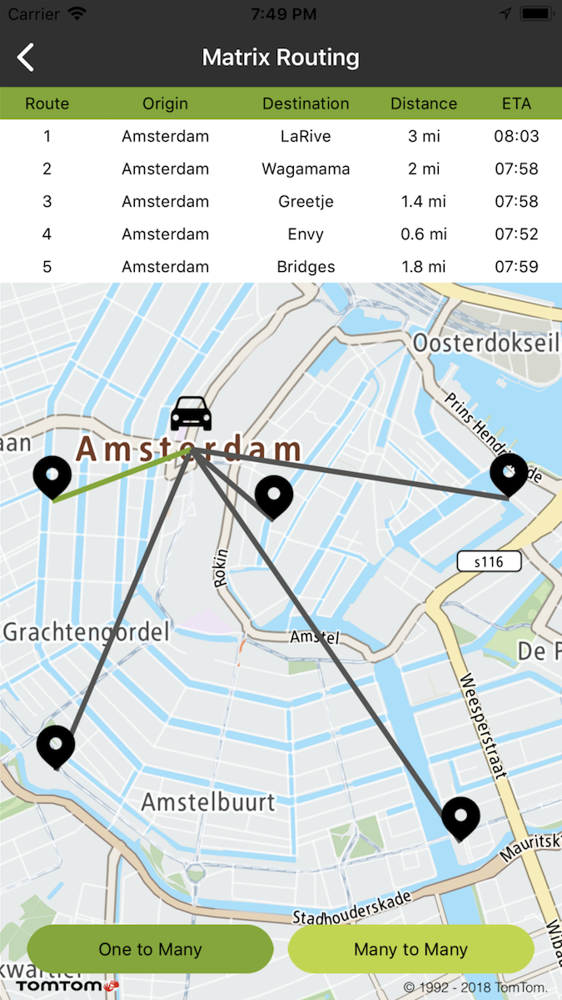
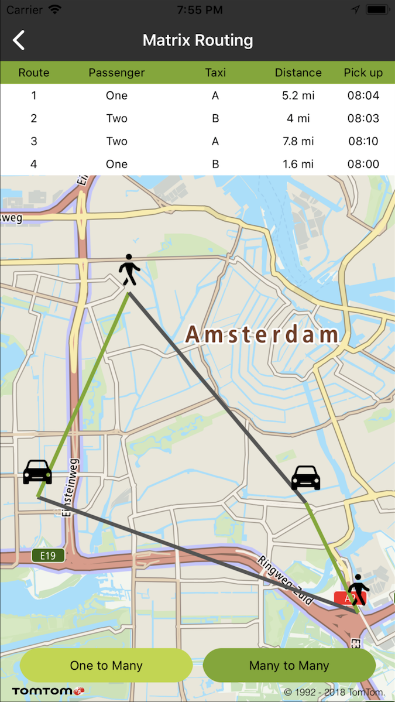

Allow your users to send multiple synchronous routing requests with Matrix Routing components. You
can calculate a matrix of route summaries for a set of routes defined with origin and destination
locations to compare them in an easy way.

Matrix Routing SDK components use
the [Online Matrix Routing API](/routing-api/documentation/matrix-routing/synchronous-matrix)
so you can find all details about it in the service documentation.

The set of origins and the set of destinations can be thought of as the column and row headers of a
table, and each cell in the table contains the costs of routing from the origin to the destination
for that cell. There are generally three types of use cases for Matrix Routing:

- 1-to-many = from one origin (e.g., your current location) to many destinations (e.g., POIs)
- many-to-many = from many origins (e.g., taxis) to many destinations (e.g., passengers)
- many-to-1 = from many origins (e.g., ambulances) to one destination (e.g., patient)

Try out the following use cases in your app.

**Sample use case:** (One to many) I know a few restaurants and I would like to know which one I can
get to the fastest.

    1 origin – Amsterdam, 5 restaurants in Amsterdam. The shortest ETA is the active route.

<table>
  <tbody>
    <tr>
      <td>
        <ContentWrapper maxWidth="350px" objectFit="contain">
          <p>
            
          </p>
        </ContentWrapper>
        <p>One to Many</p>
      </td>
      <td></td>
    </tr>
  </tbody>
</table>

**Sample use case:** (Many to many) There are a few taxis and a few passengers to pick up. You would
like to compare ETAs for each pairs/passengers taxis to choose the most optimal combination.

    2 origins (taxies) and 2 (destinations) passengers. Render all routes for all taxies. The active routes are the ones with the shortest ETA for each pair.

<table>
  <tbody>
    <tr>
      <td>
        <ContentWrapper maxWidth="350px" objectFit="contain">
          <p>
            
          </p>
        </ContentWrapper>
        <p>Many to Many</p>
      </td>
      <td></td>
    </tr>
  </tbody>
</table>

Use the following code sample to implement a similar use case.

To request a matrix query create a `MatrixRoutingQuery`:

<Code>

```swift
let query = TTMatrixRouteQueryBuilder.create(withOrigin: TTCoordinate.PASSENGER_ONE(),
                                             withDestination: TTCoordinate.TAXI_ONE())
    .addOrigin(TTCoordinate.PASSENGER_TWO())
    .addDestination(TTCoordinate.TAXI_TWO())
    .build()
```

```objectivec
TTMatrixRouteQuery *query = [[[[[[TTMatrixRouteQueryBuilder createWithOrigin:TTCoordinate.AMSTERDAM_CENTER_LOCATION withDestination:TTCoordinate.AMSTERDAM_RESTAURANT_BRIDGES] addDestination:TTCoordinate.AMSTERDAM_RESTAURANT_GREETJE] addDestination:TTCoordinate.AMSTERDAM_RESTAURANT_LA_RIVE]
    addDestination:TTCoordinate.AMSTERDAM_RESTAURANT_WAGAMAMA] addDestination:TTCoordinate.AMSTERDAM_RESTAURANT_ENVY] build]
```

</Code>

and pass it to the Routing API:

<Code>

```swift
matrixRouting.matrixRoute(with: query)
```

```objectivec
[self.matrix matrixRouteWithQuery:query];
```

</Code>

The result can be acquired by delegate or by completion block:

<Code>

```swift
func matrix(_: TTMatrixRoute, completedWith response: TTMatrixRouteResponse) {
}
func matrix(_: TTMatrixRoute, completedWith responseError: TTResponseError) {
}
```

```objectivec
- (void)matrix:(TTMatrixRoute *)matrix completedWithResponse:(TTMatrixRouteResponse *)response {
}
- (void)matrix:(TTMatrixRoute *)matrix completedWithResponseError:(TTResponseError *)responseError {
}
```

</Code>

You can obtain a detailed summary of every route in a matrix (e.g., ETA, delay, distances).