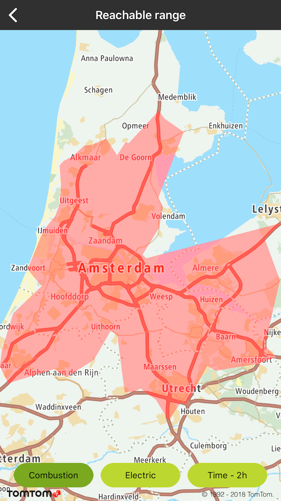
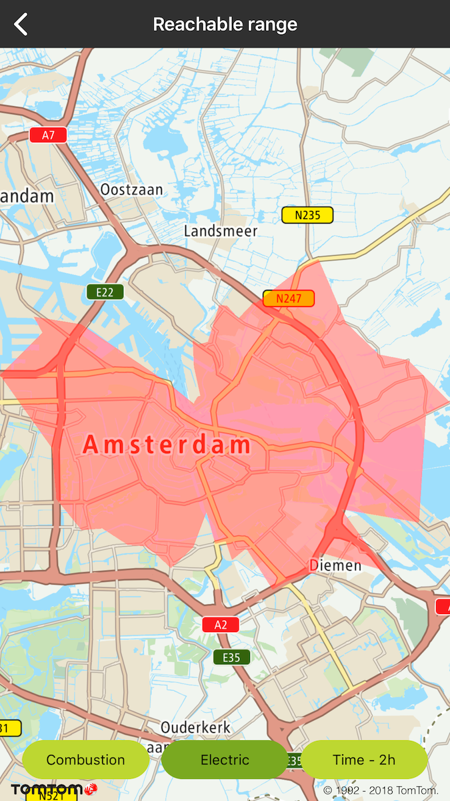
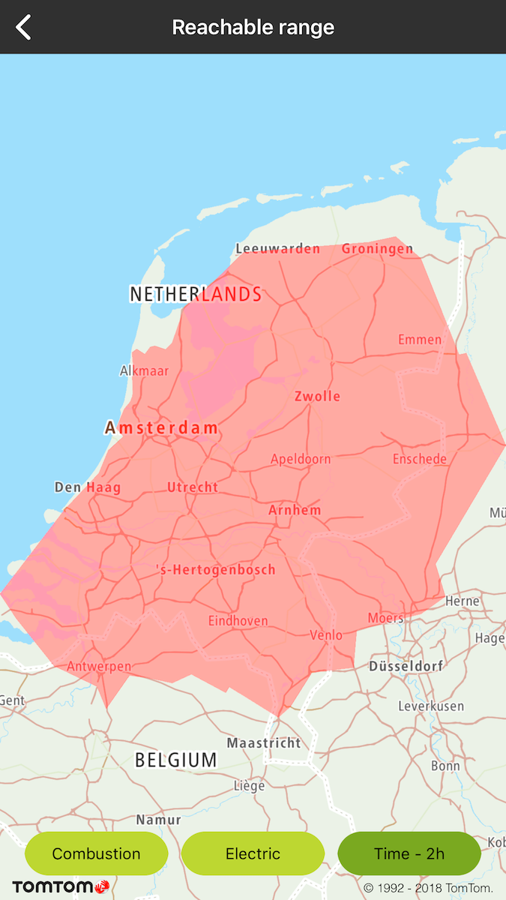
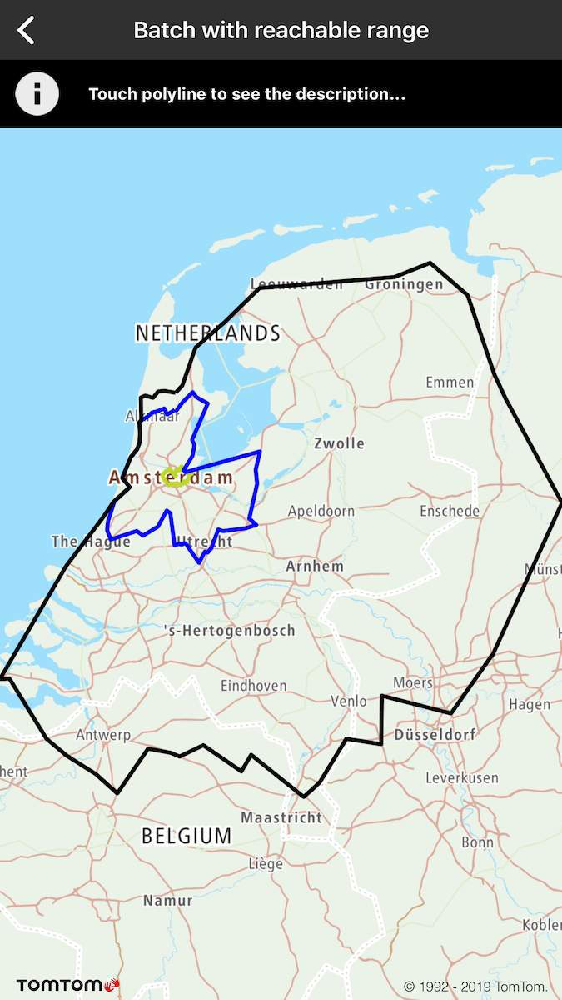

The Reachable Range component calculates a set of locations that can be reached from the origin
point. It optimizes for routes with a given route type (e.g., fastest, eco, etc.) but limits the
range to the given budget and consumption parameters. It
uses [Calculate Reachable Range API](/routing-api/documentation/routing/calculate-reachable-range)
where you can find all details in the service documentation.

**Sample use case:** You are preparing for a trip and you would like to check how far you can drive
on your battery or tank, or within a specific time limit so you can plan your journey.

The following example shows a number of points that are reachable based on one of the specified
models for: \* Combustion engine \* Electric engine \* Time-2h limit on an electric car (time budget
model is available for both electric and combustion engines)

Use the following code sample to implement a similar use case.

To request a reachable range create a ReachableRangeQuery:

<Code>

```swift
let query = TTReachableRangeQueryBuilder.create(withCenterLocation: TTCoordinate.AMSTERDAM())
    .withSpeedConsumption(inLitersPairs: &speedConsumption, count: UInt(speedConsumption.count))
    .withVehicleWeight(1600)
    .withCurrentFuel(inLiters: 43)
    .withFuelEnergyDensity(inMJoulesPerLiter: 34.2)
    .withCurrentAuxiliaryPower(inLitersPerHour: 1.7)
    .withAccelerationEfficiency(0.33)
    .withDecelerationEfficiency(0.33)
    .withUphillEfficiency(0.33)
    .withDownhillEfficiency(0.33)
    .withVehicleEngineType(.combustion)
    .withFuelBudget(inLiters: 5)
    .build()
```

```objectivec
TTSpeedConsumption consumption[1]
consumption[0] = TTSpeedConsumptionMake(50, 6.3);
TTReachableRangeQuery *query = [[[[[[[[[[[[[TTReachableRangeQueryBuilder createWithCenterLocation:[TTCoordinate AMSTERDAM]] withSpeedConsumptionInLitersPairs:consumption count:1] withVehicleWeight:1600] withCurrentFuelInLiters:43] withFuelEnergyDensityInMJoulesPerLiter:34.2]
    withCurrentAuxiliaryPowerInLitersPerHour:1.7] withAccelerationEfficiency:0.33] withDecelerationEfficiency:0.33] withUphillEfficiency:0.33] withDownhillEfficiency:0.33] withVehicleEngineType:TTOptionVehicleEngineTypeCombustion] withFuelBudgetInLiters:5] build];
```

</Code>

The result can be observed with TTReachableRangeDelegate:

<Code>

```swift
func reachableRange(_: TTReachableRange, completedWithResult response: TTReachableRangeResponse) {
}
```

```objectivec
- (void)reachableRange:(TTReachableRange *)range completedWithResult:(TTReachableRangeResponse *)response {
}
```

</Code>
<Code>

```swift
func reachableRange(_: TTReachableRange, completedWith responseError: TTResponseError) {
}
```

```objectivec
- (void)reachableRange:(TTReachableRange *)range completedWithResponseError:(TTResponseError *)responseError {
}
```

</Code>

<table>
  <tbody>
    <tr>
      <td>
        <ContentWrapper maxWidth="350px" objectFit="contain">
          <p>
            
          </p>
        </ContentWrapper>
        <p>Fuel budget: 5 liters</p>
      </td>
      <td>
        <ContentWrapper maxWidth="350px" objectFit="contain">
          <p>
            
          </p>
        </ContentWrapper>
        <p>Energy budget: 5 kWh</p>
      </td>
    </tr>
    <tr>
      <td>
        <ContentWrapper maxWidth="350px" objectFit="contain">
          <p>
            
          </p>
        </ContentWrapper>
        <p>Time budget: 2h</p>
      </td>
      <td></td>
    </tr>
  </tbody>
</table>

You can use the output of the returned set of locations for other interacting use cases e.g.,
searching for places on the route to one (many) reachable point(s) with Search along the route, or
within the polygon boundaries with the Geometry search features of the Maps SDK.

**Sample use case:** You are preparing a trip for the weekend and you want to check how far you can
get by electric car, electric car with time budget, and non-electric car.

To achieve this, first you have to create a compound query:

<Code>

```swift
let batchQuery = TTBatchRouteQueryBuilder.createReachableRangeQuery(queryFactory.createReachableRangeQueryForElectric())
    .add(queryFactory.createReachableRangeQueryForCombustion())
    .add(queryFactory.createReachableRangeQueryForElectricLimitTo2Hours())
    .build()
batchRoute.batchRoute(with: batchQuery)
```

```objectivec
TTBatchRouteQuery *batchQuery = [[[[TTBatchRouteQueryBuilder createReachableRangeQuery:[self.queryFactory createReachableRangeQueryForElectric]] addReachableRangeQuery:[self.queryFactory createReachableRangeQueryForCombustion]]
    addReachableRangeQuery:[self.queryFactory createReachableRangeQueryForElectricLimitTo2Hours]] build];
[self.batchRoute batchRouteWithQuery:batchQuery];
```

</Code>

This example shows how Reachable Range calculations for multiple vehicle types and time budgets can
be retrieved with a single Request to the Batch Routing service. For each vehicle type, you can see
how its type and time budget will affect ranges returned as a result. These ranges are then
visualised as polylines on the map. You can obtain the description of each reachable range by
clicking the polylines.

<table>
  <tbody>
    <tr>
      <td>
        <ContentWrapper maxWidth="350px" objectFit="contain">
          <p>
            
          </p>
        </ContentWrapper>
        <p>
          Three possible reachable ranges from Amsterdam by electric car,
          combustion, and electric car with time budget for 2 hours
        </p>
      </td>
      <td></td>
    </tr>
  </tbody>
</table>