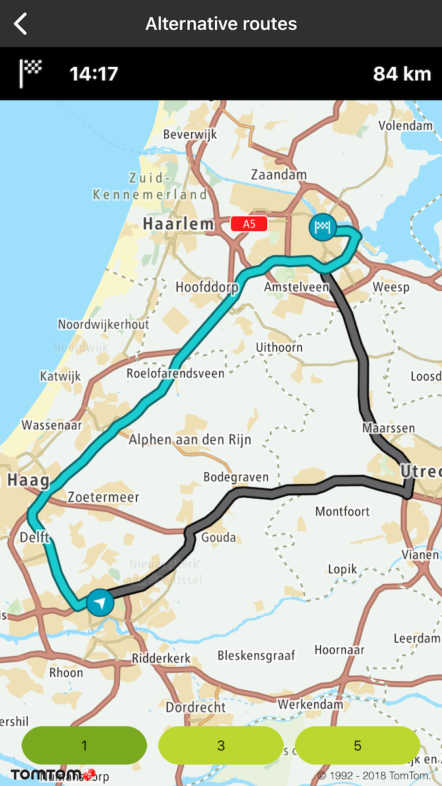
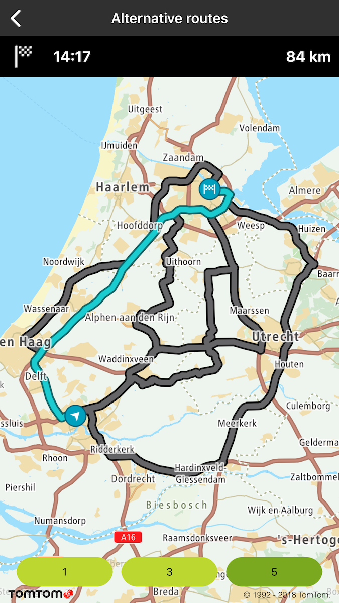

Allow your users to check different routing alternatives so they can choose the one they prefer.

**Sample use case**: You are preparing a road trip and would like to see different route options to
choose one that is both optimal for your trip and suits your road trip preferences.

In the following example you can see an implementation of alternative routes using a clickable route
object. Click the route to get its ETA and the distance between its origin and destination.

<Code>

```swift
let mapRoute = TTMapRoute(coordinatesData: planedRoute,
                          with: TTMapRouteStyle.defaultActive(),
                          imageStart: TTMapRoute.defaultImageDeparture(),
                          imageEnd: TTMapRoute.defaultImageDestination())
mapView.routeManager.add(mapRoute)
mapRoute.extraData = planedRoute.summary
```

```objectivec
TTMapRoute *mapRoute = [TTMapRoute routeWithCoordinatesData:planedRoute withRouteStyle:TTMapRouteStyle.defaultActiveStyle imageStart:TTMapRoute.defaultImageDeparture imageEnd:TTMapRoute.defaultImageDestination]
[self.mapView.routeManager addRoute:mapRoute];
mapRoute.extraData = planedRoute.summary;
```

</Code>

<table>
  <tbody>
    <tr>
      <td>
        <ContentWrapper maxWidth="350px" objectFit="contain">
          <p>
            
          </p>
        </ContentWrapper>
        <p>One alternative</p>
      </td>
      <td>
        <ContentWrapper maxWidth="350px" objectFit="contain">
          <p>
            
          </p>
        </ContentWrapper>
        <p>Five alternatives</p>
      </td>
    </tr>
  </tbody>
</table>