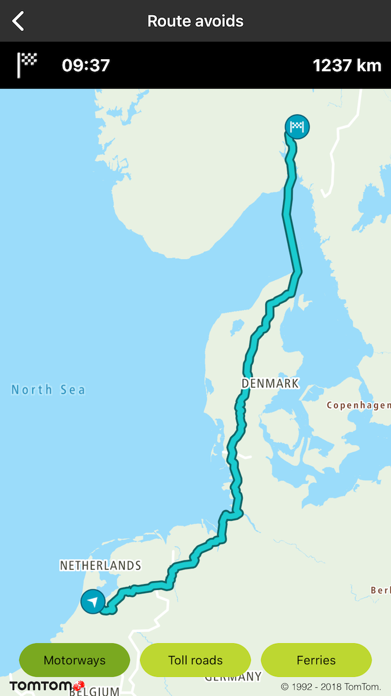
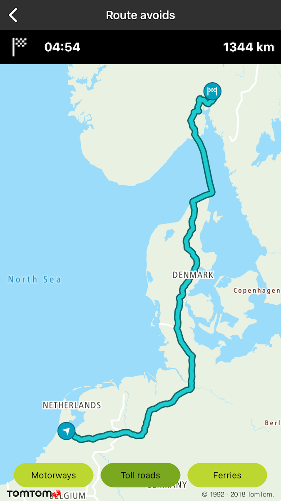
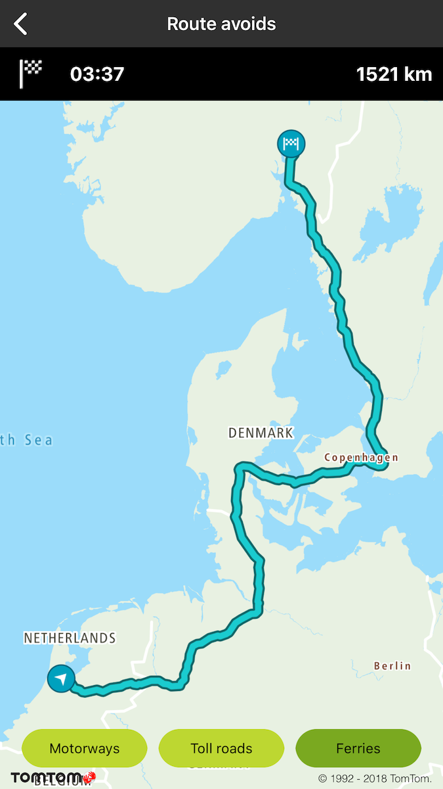
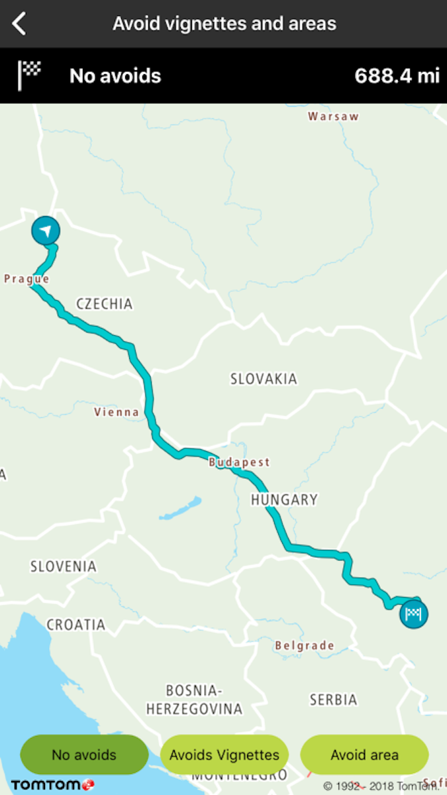
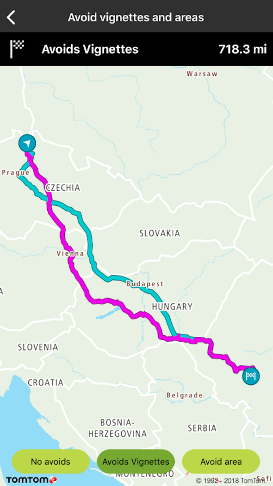
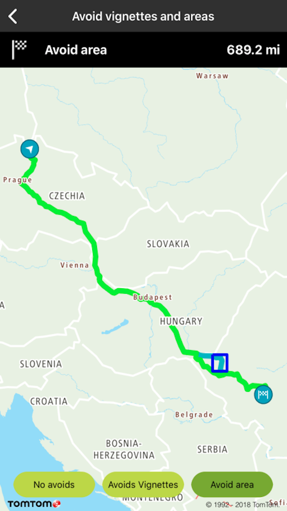

Allow your users to plan a route that avoids things like toll roads, motorways, ferries, unpaved
roads, carpool lanes, and roads that they have already taken.

**Sample use case**: You plan a trip between the Example offices in Amsterdam and Oslo. You would
like to check how much time you gain by taking a ferry, and how much more time it will take to drive
if you don’t use those motorways, so you can take the best route.

You can use parameters like:

- tollRoads
- motorways
- ferries
- unpavedRoads
- carpools
- alreadyUsedRoads

<Code>

```swift
let query = TTRouteQueryBuilder.create(withDest: TTCoordinate.OSLO(), andOrig: TTCoordinate.AMSTERDAM())
    .withAvoidType(.motorways)
    .build()
routePlanner.plan(with: query)
```

```objectivec
TTRouteQuery *query = [[[TTRouteQueryBuilder createWithDest:[TTCoordinate OSLO] andOrig:[TTCoordinate AMSTERDAM]] withAvoidType:TTOptionTypeAvoidMotorways] build]
[self.routePlanner planRouteWithQuery:query];
```

</Code>

<table>
  <tbody>
    <tr>
      <td>
        <ContentWrapper maxWidth="350px" objectFit="contain">
          <p>
            
          </p>
        </ContentWrapper>
        <p>Route avoid motorways</p>
      </td>
      <td>
        <ContentWrapper maxWidth="350px" objectFit="contain">
          <p>
            
          </p>
        </ContentWrapper>
        <p>Route avoid toll roads</p>
      </td>
    </tr>
    <tr>
      <td>
        <ContentWrapper maxWidth="350px" objectFit="contain">
          <p>
            
          </p>
        </ContentWrapper>
        <p>Route avoid ferries</p>
      </td>
      <td></td>
    </tr>
  </tbody>
</table>

**Sample use case**: You plan a trip from A to B and you know that on your way there are vignettes.
Additionally, there is an area which has very high traffic. You want to avoid both vignettes and the
specified area.

To avoid vignettes:

<Code>

```swift
let vignettesArray = ["HUN", "CZE", "SVK"]
dispatchGroup.enter()
let query2 = TTRouteQueryBuilder.create(withDest: TTCoordinate.ROMANIA(), andOrig: TTCoordinate.CZECH_REPUBLIC())
    .withTraffic(false)
    .withAvoidVignettesArray(vignettesArray)
    .build()
```

```objectivec
NSArray<NSString *> *vignettesArray = @[ @"HUN", @"CZE", @"SVK" ];
TTRouteQuery *query2 = [[[[TTRouteQueryBuilder createWithDest:TTCoordinate.ROMANIA andOrig:TTCoordinate.CZECH_REPUBLIC] withTraffic:NO] withAvoidVignettesArray:vignettesArray] build];
```

</Code>

To avoid an area:

<Code>

```swift
let boundingBox = TTLatLngBounds(seBounds: TTCoordinate.ARAD_TOP_LEFT_NEIGHBORHOOD(), nwBounds: TTCoordinate.ARAD_BOTTOM_RIGHT_NEIGHBORHOOD())
var boundingBoxArray = [boundingBox]
let query2 = TTRouteQueryBuilder.create(withDest: TTCoordinate.ROMANIA(), andOrig: TTCoordinate.CZECH_REPUBLIC())
    .withAvoidArea(&boundingBoxArray, count: UInt(boundingBoxArray.count))
    .withTraffic(false)
    .build()
```

```objectivec
TTLatLngBounds boundingBox[1];
boundingBox[0] = TTLatLngBoundsMake([TTCoordinate ARAD_TOP_LEFT_NEIGHBORHOOD], [TTCoordinate ARAD_BOTTOM_RIGHT_NEIGHBORHOOD]);
TTRouteQuery *query2 = [[[[TTRouteQueryBuilder createWithDest:TTCoordinate.ROMANIA andOrig:TTCoordinate.CZECH_REPUBLIC] withTraffic:NO] withAvoidArea:boundingBox count:1] build];
```

</Code>

<table>
  <tbody>
    <tr>
      <td>
        <ContentWrapper maxWidth="350px" objectFit="contain">
          <p>
            
          </p>
        </ContentWrapper>
        <p>Route no avoids</p>
      </td>
      <td>
        <ContentWrapper maxWidth="350px" objectFit="contain">
          <p>
            
          </p>
        </ContentWrapper>
        <p>Route avoid vignettes</p>
      </td>
    </tr>
    <tr>
      <td>
        <ContentWrapper maxWidth="350px" objectFit="contain">
          <p>
            
          </p>
        </ContentWrapper>
        <p>Route avoid area</p>
      </td>
      <td></td>
    </tr>
  </tbody>
</table>