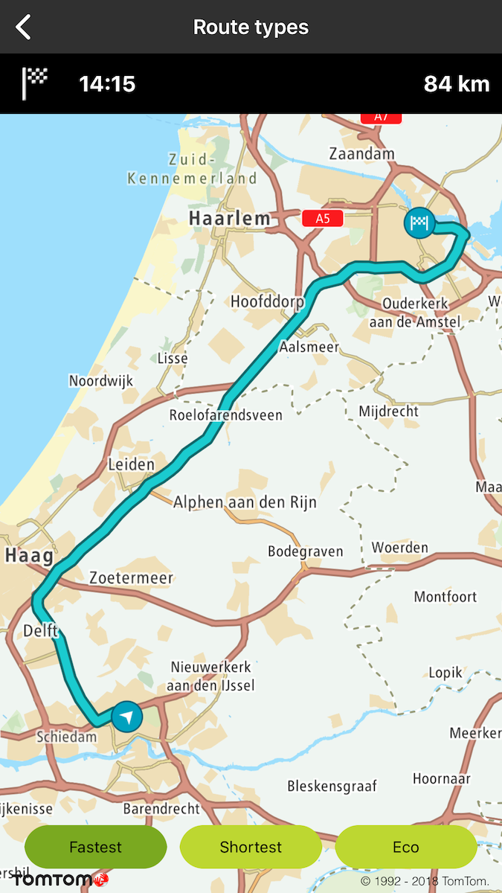
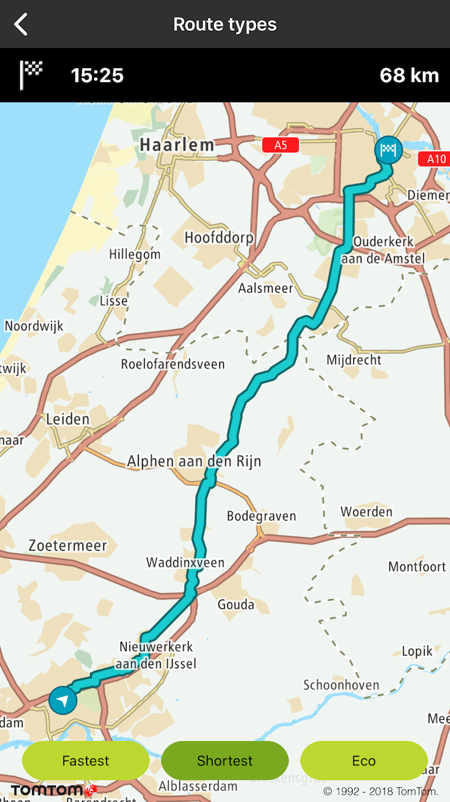
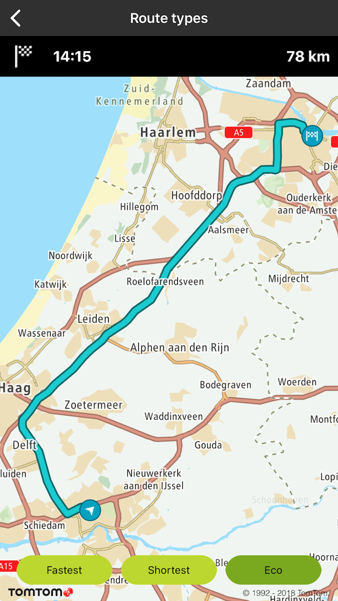

Allow your users to plan a route that will be the fastest, shortest, most thrilling, or greenest.

**Sample use case**: You plan a trip from Amsterdam to Rotterdam and want to compare ETAs for
different types of routes to choose the best fit for your preferences.

We can use types like:

- Fastest
- Shortest
- Easiest

<Code>

```swift
let query = TTRouteQueryBuilder.create(withDest: TTCoordinate.AMSTERDAM(), andOrig: TTCoordinate.ROTTERDAM())
    .withRouteType(.fastest)
    .build()
routePlanner.plan(with: query)
```

```objectivec
TTRouteQuery *query = [[[TTRouteQueryBuilder createWithDest:[TTCoordinate AMSTERDAM] andOrig:[TTCoordinate ROTTERDAM]] withRouteType:TTOptionTypeRouteFastest] build]
[self.routePlanner planRouteWithQuery:query];
```

</Code>

<table>
  <tbody>
    <tr>
      <td>
        <ContentWrapper maxWidth="350px" objectFit="contain">
          <p>
            
          </p>
        </ContentWrapper>
        <p>Route type fastest</p>
      </td>
      <td>
        <ContentWrapper maxWidth="350px" objectFit="contain">
          <p>
            
          </p>
        </ContentWrapper>
        <p>Route type shortest</p>
      </td>
    </tr>
    <tr>
      <td>
        <ContentWrapper maxWidth="350px" objectFit="contain">
          <p>
            
          </p>
        </ContentWrapper>
        <p>Route type eco</p>
      </td>
      <td></td>
    </tr>
  </tbody>
</table>