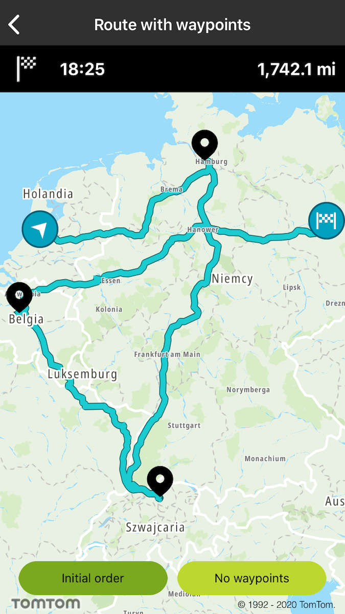
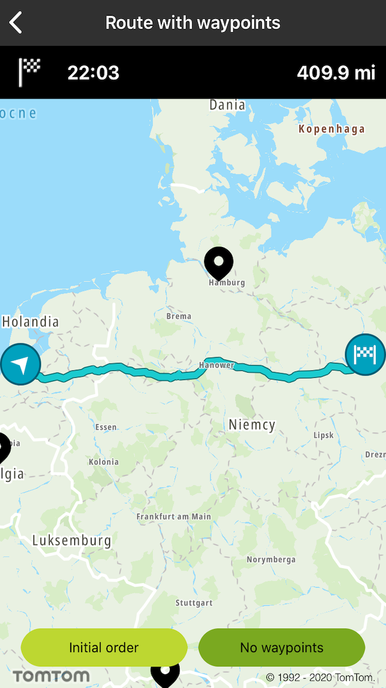

<a
  href="#"
  style={{ display: 'block', margin: '0', padding: '0' }}
  name="route-with-waypoints"
></a>

Allow your users to plan a route with up to 50 waypoints.

**Sample use case**: You plan a trip from the Example office in Amsterdam to their office in Berlin.
There are a few places that you would like to visit during the drive. You would like to use your app
to plan your route so it includes the places you would like to visit on the way, and check the total
distance and ETA as well as see the entire route on the map.

<Code>

```swift
let query = TTRouteQueryBuilder.create(withDest: TTCoordinate.BERLIN(), andOrig: TTCoordinate.AMSTERDAM())
    .withWayPoints(&waypoints, count: UInt(waypoints.count))
    .build()
routePlanner.plan(with: query)
```

```objectivec
TTRouteQuery *query = [[[TTRouteQueryBuilder createWithDest:[TTCoordinate BERLIN] andOrig:[TTCoordinate AMSTERDAM]] withWayPoints:self.waypoints count:3] build]
[self.routePlanner planRouteWithQuery:query];
```

</Code>

<table>
  <tbody>
    <tr>
      <td>
        <ContentWrapper maxWidth="350px" objectFit="contain">
          <p>
            
          </p>
        </ContentWrapper>
        <p>Initial order</p>
      </td>
      <td>
        <ContentWrapper maxWidth="350px" objectFit="contain">
          <p>
            
          </p>
        </ContentWrapper>
        <p>No waypoints</p>
      </td>
    </tr>
  </tbody>
</table>