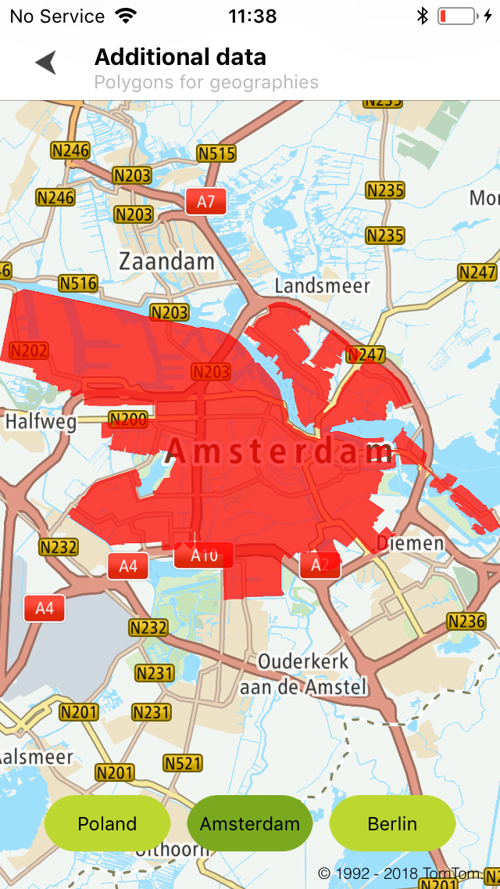
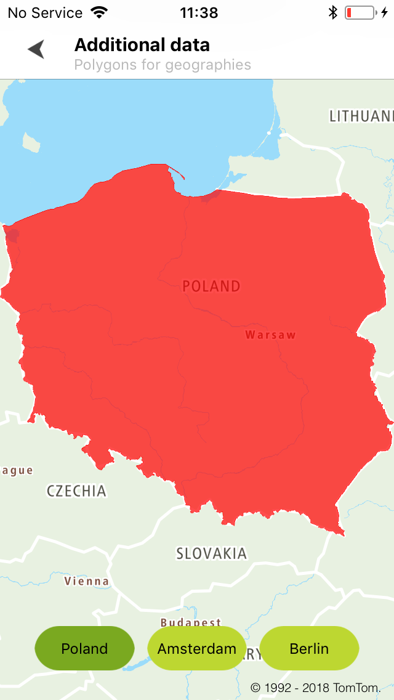

Allow your users to request a set of extra entities, like a city or country outline, previously
retrieved from the Search API service. For more information, refer to
the [Additional Data service](/search-api/documentation/additional-data-service/additional-data)
documentation.

**Sample use case:** You want to apply colors to geographic-boundary areas such as countries,
cities, or districts.

Use the following code to try this in your app:

<Code>

```swift
func search(_: TTSearch, completedWith response: TTSearchResponse) {
    guard let result = response.results.first else {
        return
    }
    guard let additionalData = result.additionalDataSources else {
        return
    }
    guard let geometryData = additionalData.geometryDataSource else {
        return
    }
    let query = TTAdditionalDataSearchQueryBuilder.create(with: geometryData).build()
    searchAdditionalData.additionalDataSearch(with: query)
}
func additionalDataSearch(_: TTAdditionalDataSearch, completedWith response: TTAdditionalDataSearchResponse) {
    progress.hide()
    guard let result = response.results.first else {
        return
    }
    let visitor = PolygonAdditionalDataVisitior()
    result.visitGeoJSONResult(visitor)
    var mapPolygons: [TTPolygon] =     for lineString in visitor.lineStrings {
        let mapPolygon = TTPolygon(coordinatesData: lineString, opacity: 0.7, color: TTColor.Red(), colorOutline: TTColor.Red())
        mapPolygons.append(mapPolygon)
        mapView.annotationManager.add(mapPolygon)
    }
    mapView.zoom(toCoordinatesDataCollection: mapPolygons)
}
```

```objectivec
- (void)search:(TTSearch *)search completedWithResponse:(TTSearchResponse *)response {
    TTSearchResult *result = response.results.firstObject
    if (!result) {
        return;
    }
    TTAdditionalDataSources *additionalData = result.additionalDataSources;
    if (!additionalData) {
        return;
    }
    TTGeometryDataSource *geometryData = additionalData.geometryDataSource;
    if (!geometryData) {
        return;
    }
    TTAdditionalDataSearchQuery *query = [[TTAdditionalDataSearchQueryBuilder createWithDataSource:geometryData] build];
    [self.searchAdditionalData additionalDataSearchWithQuery:query];
}
- (void)additionalDataSearch:(TTAdditionalDataSearch *)additionalDataSearch completedWithResponse:(TTAdditionalDataSearchResponse *)response {
    [self.progress hide];
    TTAdditionalDataSearchResult *result = response.results.firstObject;
    if (!result) {
        return;
    }
    PolygonAdditionalDataVisitior *visitor = [PolygonAdditionalDataVisitior new];
    [result visitGeoJSONResult:visitor];
    NSMutableArray<TTPolygon *> *mapPolygons = [NSMutableArray new];
    for (TTGeoJSONLineString *lineString in visitor.lineStrings) {
        TTPolygon *mapPolygon = [TTPolygon polygonWithCoordinatesData:lineString opacity:0.7 color:[TTColor Red] colorOutline:[TTColor Red]];
        [mapPolygons addObject:mapPolygon];
        [self.mapView.annotationManager addOverlay:mapPolygon];
    }
    [self.mapView zoomToCoordinatesDataCollection:mapPolygons];
}
```

</Code>

Sample views utilizing entities retrieved from the Additional Data service:

<table>
  <tbody>
    <tr>
      <td>
        <ContentWrapper maxWidth="350px" objectFit="contain">
          <p>
            
          </p>
        </ContentWrapper>
        <p>Boundaries for Amsterdam</p>
      </td>
      <td>
        <ContentWrapper maxWidth="350px" objectFit="contain">
          <p>
            
          </p>
        </ContentWrapper>
        <p>Boundaries for Poland</p>
      </td>
    </tr>
  </tbody>
</table>